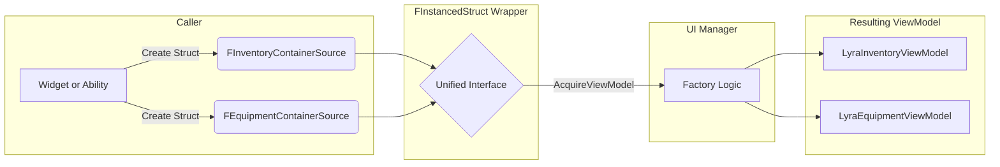
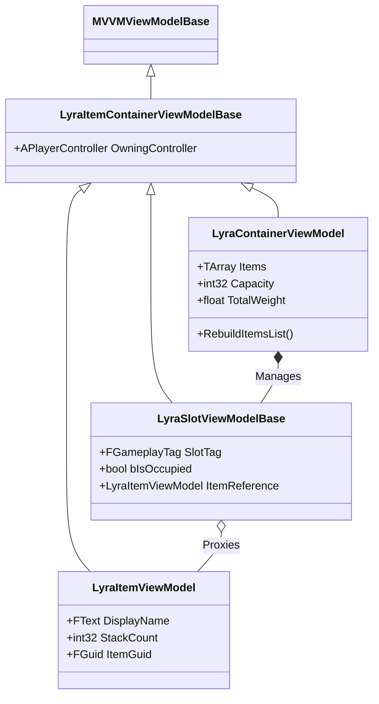

# Core Architecture & Data Structures

Before a single widget is drawn on screen, the system must solve a fundamental problem: **Data Inconsistency**.

In a complex game, items live in many different places:

1. **Inventory:** A dynamic array of structs (`TArray<FLyraInventoryEntry>`).
2. **Equipment:** A map of Tags to Instances (`TMap<FGameplayTag, FAppliedEquipmentEntry>`).
3. **Attachments:** A hierarchical tree relative to a parent item.
4. **Vendors:** A static data asset or a replicated actor component.

If we wrote a separate UI widget for each of these, we would end up with `W_InventorySlot`, `W_EquipmentSlot`, and `W_VendorSlot` repeating the same drag-and-drop logic three times.

This system solves that via **Polymorphism**. We abstract the specific implementation details of the container away from the UI, providing a unified interface for the visual layer.

### The Polymorphic Source

The heart of this abstraction is the **Container Source Descriptor**.

Instead of passing a raw pointer (like `ULyraInventoryManagerComponent*`) to the UI, we pass a lightweight, polymorphic struct wrapped in an `FInstancedStruct`. This descriptor acts as a "Key" that tells the UI Manager exactly what kind of data it is looking at, without the UI Manager needing to know the implementation details.


Each Item Containers has a Slot Source Description using `FAbilityData_SourceItem` . This is not what this page is discussing. This page is referring to the `FLyraContainerSourceBase` . The former is for slot descriptions while the latter is for container descriptions.


#### The Abstraction Flow

The UI Manager exposes a single function: `AcquireViewModel(Source)`. It doesn't care if the source is a backpack or a weapon attachment point. It simply asks the Source to generate the correct ViewModel.

By decoupling the _request_ for UI from the _creation_ of the UI, we allow plugins (like a Tetris Inventory or a Crafting System) to define their own Sources and ViewModels without modifying the core UI Manager.

### The ViewModel Hierarchy

Once a Source is resolved, it creates a **ViewModel**. This is the object your UMG widgets actually bind to.

The hierarchy is split into two distinct branches to separate **Global Container Logic** from **Specific Item Logic**.

#### Class Diagram

#### Key Design Decision: Slots vs. Items

A common mistake in Unreal UI is binding a widget directly to an Item Data object. This causes the **"Null Binding" Problem**:

> _If an inventory slot is empty, the Item Data object is null. If the object is null, the UMG widget has nothing to bind to, causing errors or requiring complex visibility logic in Blueprints._

We solve this by separating the **Slot** from the **Item**.

| Feature              | **Slot ViewModel** (`LyraSlotViewModelBase`)                                                         | **Item ViewModel** (`LyraItemViewModel`)                                           |
| -------------------- | ---------------------------------------------------------------------------------------------------- | ---------------------------------------------------------------------------------- |
| **Lifecycle**        | **Permanent.** Created when the container opens. Exists even if empty.                               | **Transient.** Created only when an item exists. Destroyed when removed.           |
| **Responsibility**   | Represents the _space_ (e.g., "Primary Weapon Slot"). Handles focus, selection, and drag highlights. | Represents the _data_ (e.g., "Rifle"). Handles Icon, Name, Description, and Stats. |
| **Binding Strategy** | Bind your Widget to this. It acts as a proxy.                                                        | The Slot VM holds a reference to this.                                             |
| **Empty State**      | `bIsOccupied = false`. Still valid to bind.                                                          | `nullptr`.                                                                         |

When you look at the `ULyraSlotViewModelBase`, you will notice it duplicates properties like `ItemIcon` and `StackCount`. These are **Proxy Properties**.

1. If an Item is present, the Slot copies the Item's data into these properties.
2. If the Slot is empty, the Slot sets these properties to safe defaults (e.g., transparent image, 0 count).

**This ensures your UMG widgets never have to check `IsValid` on the item.** They simply bind to `Slot.ItemIcon`, and it "just works."

### In This Section

We will now break down these concepts into their specific implementations:

* [**Polymorphic Container Sources**](polymorphic-container-sources.md)
  * A deep dive into `FLyraContainerSourceBase`, hashing for cache lookups, and how `FInstancedStruct` handles type safety.
* [The MVVM Pattern](mvvm.md)
  * Why we use Model-View-ViewModel architecture, how it differs from direct component binding, and the benefits for both Blueprint and C++ developers.
* [Data Flow & Reactivity](dataflow-and-reactivity.md)
  * How `FieldNotify` propagates data changes to the UI efficiently, the reactive loop from backend to widget, and stable identity for preserving selection state.
* [The Window Model](the-window-model.md)
  *   Why the system uses multiple draggable windows instead of a single panel, how sessions organize window lifecycles, and cross-window navigation.

