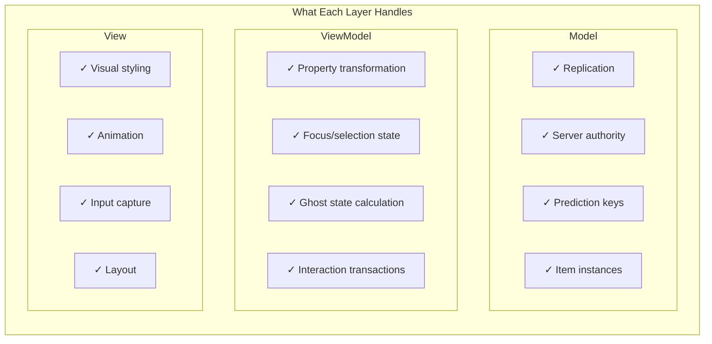

# MVVM

MVVM (Model-View-ViewModel) is an architectural pattern that separates your UI into three distinct layers. If you've ever had spaghetti code where your widget is directly reading from your inventory component, doing calculations, handling input, AND updating visuals, MVVM is the cure.

***

## The Three Layers

```mermaid
flowchart LR
    subgraph Model ["Model (Backend)"]
        direction TB
        M1[Inventory Component]
        M2[Equipment Component]
        M3[Item Instances]
    end

    subgraph ViewModel ["ViewModel"]
        direction TB
        VM1[Container ViewModel]
        VM2[Item ViewModel]
        VM3[Interaction ViewModel]
    end

    subgraph View ["View (Widgets)"]
        direction TB
        V1[Window Shell]
        V2[List/Tile Panel]
        V3[Item Entry Widget]
    end

    Model -->|"Data changes"| ViewModel
    ViewModel -->|"Notifies"| View
    View -->|"User input"| ViewModel
    ViewModel -->|"Commands"| Model
```



<table><thead><tr><th width="142.6363525390625">Layer</th><th>Responsibility</th><th>Examples</th></tr></thead><tbody><tr><td><strong>Model</strong></td><td>Owns the real data, handles authority/replication</td><td><code>ULyraInventoryManagerComponent</code>, <code>ULyraInventoryItemInstance</code></td></tr><tr><td><strong>ViewModel</strong></td><td>Transforms data for display, exposes bindable properties</td><td><code>ULyraContainerViewModel</code>, <code>ULyraItemViewModel</code></td></tr><tr><td><strong>View</strong></td><td>Renders visuals, captures user input</td><td><code>ULyraInventoryListPanel</code>, item entry widgets</td></tr></tbody></table>

***

## Why Not Just Bind Directly to Components?

You _could_ have your widget directly read from `ULyraInventoryManagerComponent`. Here's why that becomes painful:

### The Direct Binding Problem

```cpp
// In your widget...
void UMyInventoryWidget::UpdateSlot(int32 SlotIndex)
{
    // Get the component
    auto* InvComp = GetOwningPlayer()->FindComponentByClass<ULyraInventoryManagerComponent>();

    // Get the item entry
    const FLyraInventoryEntry* Entry = InvComp->GetEntryAtSlot(SlotIndex);

    // Get the item
    if (Entry && Entry->Instance)
    {
        // Get the definition
        if (auto* IconFrag = Entry->Instance->FindFragment<UInventoryFragment_Icon>())
        {
            IconImage->SetBrushFromTexture(IconFrag->Icon);
        }

        // Calculate display values
        int32 StackCount = Entry->StackCount;
        float Weight = Entry->Instance->GetWeight() * StackCount;

        // Update more widgets...
    }
    else
    {
        // Handle empty slot differently...
    }
}
```

Problems:

* Widget knows too much about backend structure
* Null checks everywhere
* No automatic updates, you need to call this manually
* Empty slots need special handling
* Hard to reuse for equipment, attachments, vendors, etc.

### The ViewModel Solution

```cpp
// ViewModel does the heavy lifting once
void ULyraItemViewModel::UpdateFromItemInstance()
{
    if (ItemInstance.IsValid())
    {
        // All the fragment lookups happen here
        UE_MVVM_SET_PROPERTY_VALUE(DisplayName, ItemInstance->GetDisplayName());
        UE_MVVM_SET_PROPERTY_VALUE(Icon, ItemInstance->GetIcon());
        UE_MVVM_SET_PROPERTY_VALUE(TotalWeight, ItemInstance->GetWeight() * StackCount);
        // ... etc
    }
}

// Widget just binds to clean properties
// In Blueprint: Bind IconImage.Brush to ItemViewModel.Icon
// That's it. Automatic updates when Icon changes.
```

***

## The ViewModel as Translator

Think of the ViewModel as a translator between the backend's language and the UI's language:

| Backend Says                                  | ViewModel Translates To                                       |
| --------------------------------------------- | ------------------------------------------------------------- |
| `FLyraInventoryEntry` with `Instance` pointer | `ULyraItemViewModel` with `DisplayName`, `Icon`, `StackCount` |
| Entry might be null (empty slot)              | `ULyraSlotViewModel` always exists, `bIsOccupied = false`     |
| `FPredictionKey` with complex state           | Simple `bIsGhost` boolean                                     |
| Equipment slot identified by `FGameplayTag`   | `ULyraEquipmentSlotViewModel` with `SlotDisplayName`          |

***

## Separation of Concerns in Practice




The Golden Rule: Views should never need to know about `FPredictionKey`, `FGameplayTag` slot identifiers, or how replication works. ViewModels translate all of that into simple, bindable properties.


***

## Benefits You Get for Free



### Automatic UI Updates

When the backend changes, ViewModels update, and Views automatically refresh, no manual `Refresh()` calls needed.



### Same ViewModel, Different Views

The same `ULyraItemViewModel` can power:

* A detailed tooltip
* A compact grid slot
* A list entry with stats
* A drag preview



### Testability

ViewModels can be unit tested without spinning up widgets. Set properties, verify state.



### Blueprint-Friendly

UMG View Binding works directly with ViewModel properties. Designers can iterate on UI without touching C++.



***

## Key Classes

| Class                             | Role                                                    |
| --------------------------------- | ------------------------------------------------------- |
| `ULyraItemContainerViewModelBase` | Base for all container-related ViewModels               |
| `ULyraContainerViewModel`         | Base for containers (inventory, equipment, attachments) |
| `ULyraItemViewModel`              | Represents a single item                                |
| `ULyraSlotViewModelBase`          | Represents a slot (always exists, even when empty)      |
| `ULyraInteractionViewModel`       | Handles drag/drop, modals, transactions                 |
| `ULyraItemContainerUIManager`     | Creates and caches ViewModels                           |

***

## Next Steps

Now that you understand the pattern, let's see how data actually flows through these layers in [Data Flow & Reactivity](dataflow-and-reactivity.md).
