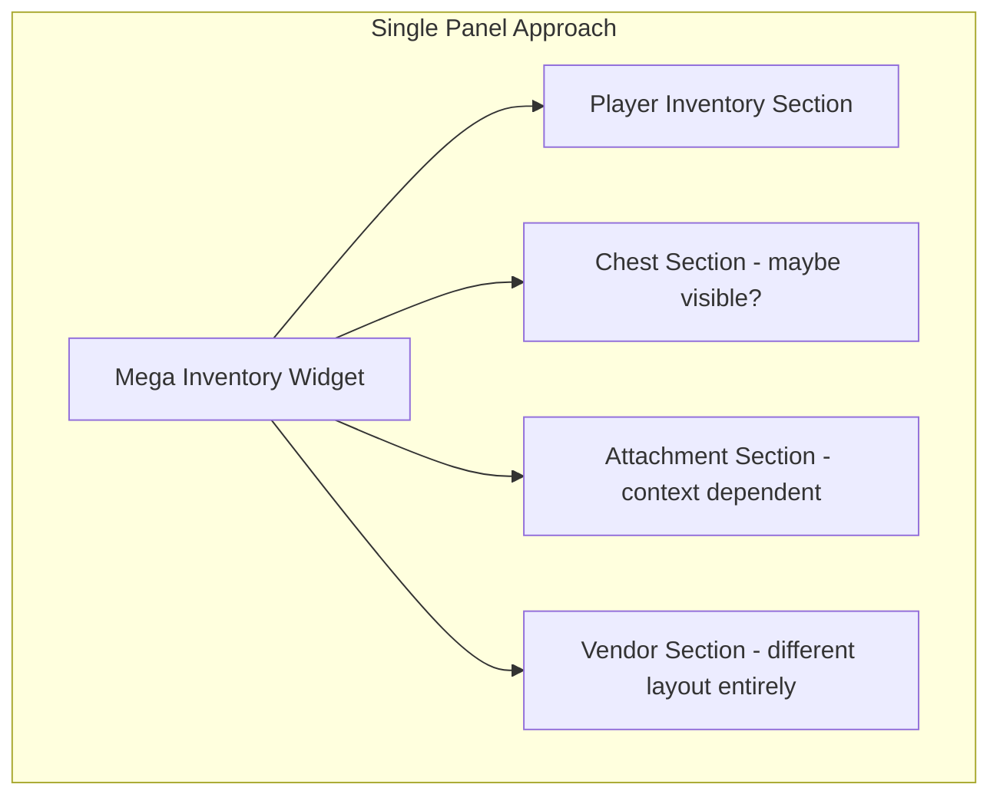
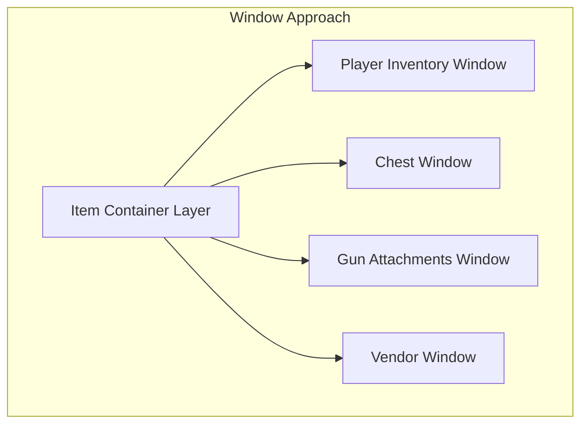
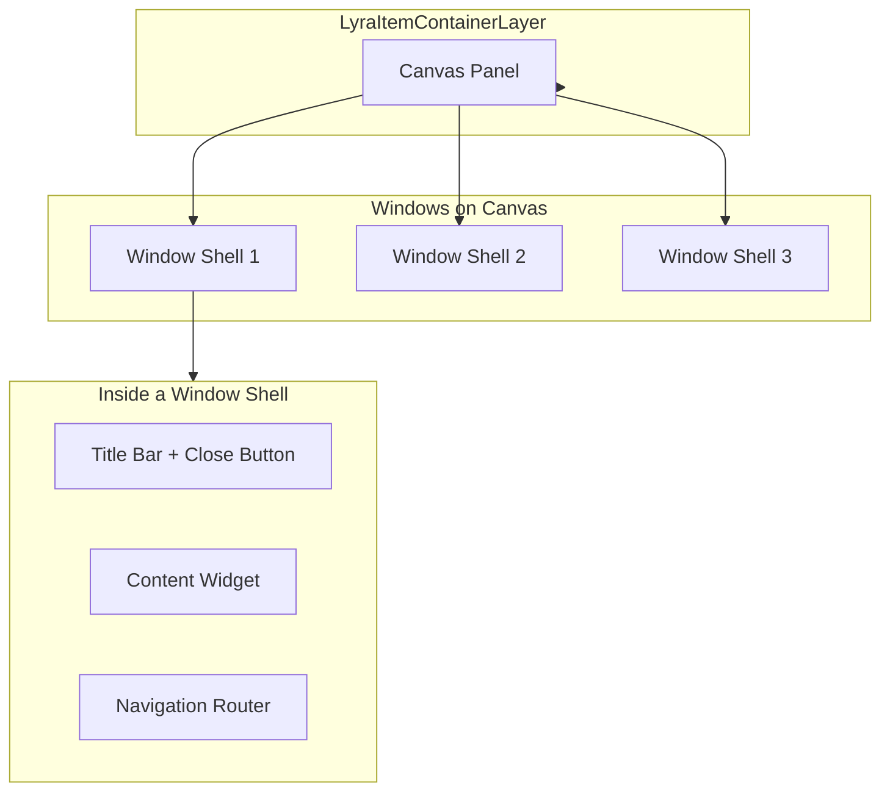
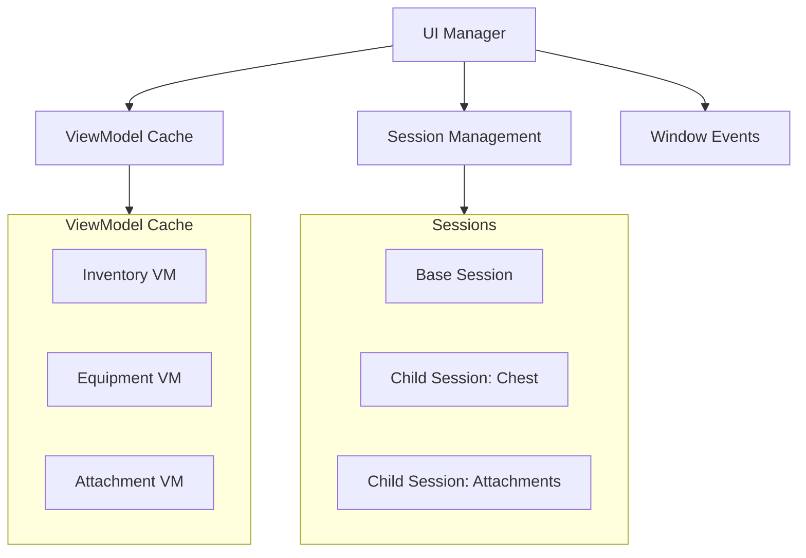
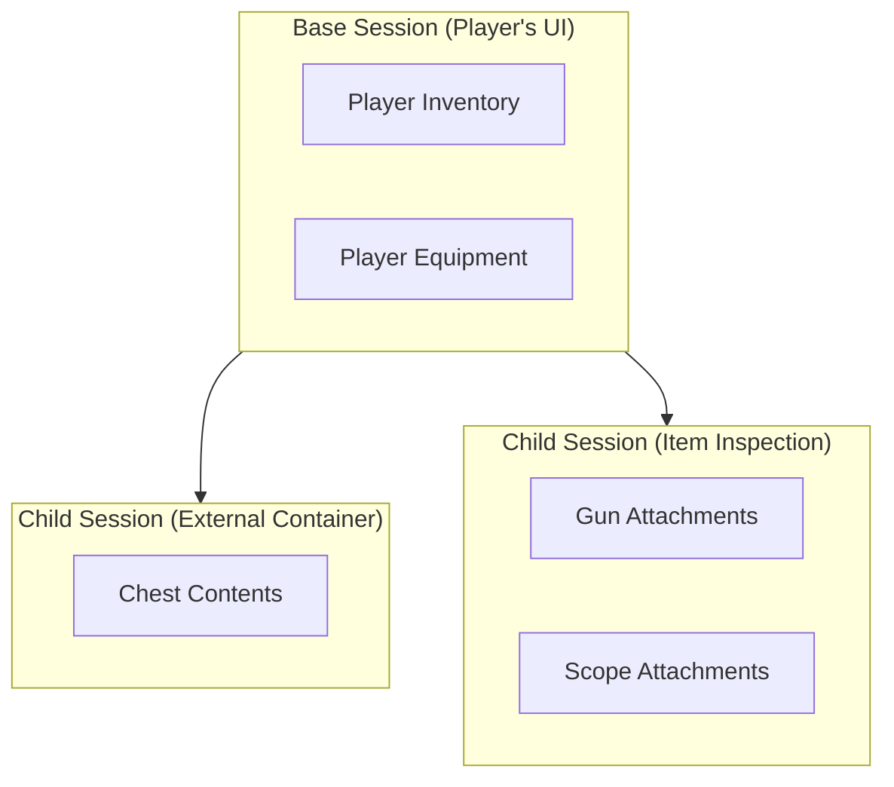
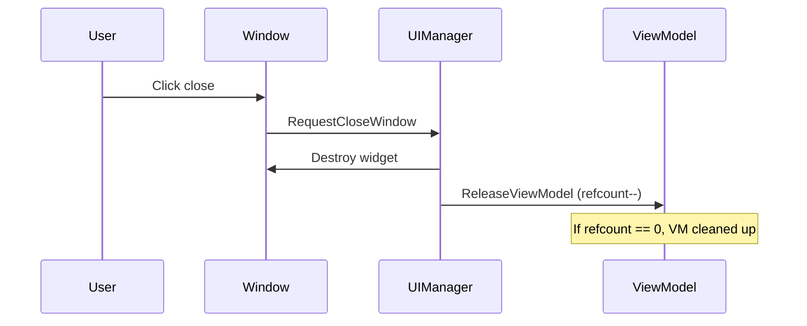
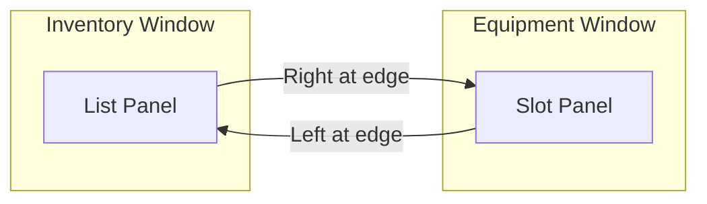
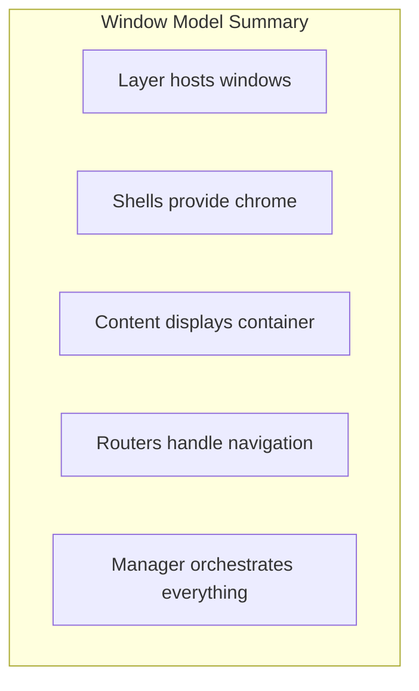

# The Window Model

Why does this system use multiple draggable windows instead of one big inventory panel? This page explains the architectural decision and how it enables flexibility you can't get with a single-widget approach.

***

### The Single Panel Problem

Imagine a typical inventory scenario:

> Player opens their inventory, then opens a chest, then inspects the attachments on their gun, then opens a vendor shop.

With a single-panel approach, you need:

* One mega-widget that handles all these cases
* Complex state machines for what's currently visible
* Hardcoded layouts that can't adapt
* Navigation logic that varies by context



**The result**: A 3,000-line widget class that's terrifying to modify.

***

### The Window Solution

Instead, each container gets its own window. Windows can be:

* Opened and closed independently
* Dragged and repositioned
* Focused and navigated between
* Styled differently per container type



**Each window is simple** because it only handles one container. The complexity is distributed.

***

### Window Architecture



#### Key Components

| Component                        | Role                                                                                                                     |
| -------------------------------- | ------------------------------------------------------------------------------------------------------------------------ |
| **LyraItemContainerLayer**       | The canvas that hosts all windows. An activatable widget that manages window creation, dragging, and z-order.            |
| **LyraItemContainerWindowShell** | The window frame—title bar, close button, drag handle. Contains a content widget.                                        |
| **Content Widget**               | The actual container display (list panel, tile panel, or custom). Implements `ILyraItemContainerWindowContentInterface`. |
| **LyraNavigationRouter**         | Per-window navigation handler. Routes keyboard/gamepad input to the right panel.                                         |

***

### The UI Manager: Conductor of the Orchestra

`ULyraItemContainerUIManager` orchestrates the whole system:



#### What the UI Manager Does



Creates and caches ViewModels — One ViewModel per container, reused across windows.



Manages sessions — Groups related windows together.



Handles lifecycle events — Item destroyed? Close its attachment window.



Provides shared ViewModels — `InteractionViewModel` for drag/drop is shared.



***

### Sessions: Grouping Related Windows

A **session** is a logical grouping of windows that belong together. When the session closes, all its windows close.



**Use cases:**

| Session Type                  | Contains                        | Closes When                                |
| ----------------------------- | ------------------------------- | ------------------------------------------ |
| **Base Session**              | Player inventory, equipment     | Player closes inventory UI                 |
| **Child Session (Container)** | Chest, vendor, crafting station | Player moves away, container closes        |
| **Child Session (Item)**      | Attachment windows for an item  | Item is destroyed, moved, or parent closes |

***

### Window Lifecycle

#### Opening a Window

```cpp
// Request to open a window
FLyraWindowOpenRequest Request;
Request.WindowType = WindowTypeTag;           // Tag identifying content widget class
Request.SourceDesc = ContainerSource;         // Polymorphic container source
Request.SessionHandle = ParentSession;        // Which session to add to
Request.Placement = EWindowPlacement::Auto;   // Where to put it

UIManager->RequestOpenWindow(Request);
```



UI Manager creates (or reuses) a ViewModel for the container.



Creates the window shell.



Creates the content widget.



Initializes content with ViewModel.



Registers with window manager for navigation.



#### Closing a Window

Windows can close:

* **Manually** — User clicks close button
* **Session close** — Parent session closes
* **Item destruction** — Item tracked by window is destroyed
* **Access revoked** — Player moves away from chest



***

### Cross-Window Navigation

Players can navigate between windows using keyboard/gamepad:



#### How It Works



Panel reaches navigation edge (e.g., pressing Right at rightmost item).



Panel broadcasts `OnEdgeReached` to its router.



Router checks for neighbor panel in same window.



If none, asks `WindowManager` for neighbor window.



WindowManager uses screen geometry to find adjacent window.



Focus transfers to that window's appropriate panel.



```cpp
// Window Manager finds geometric neighbors
ULyraItemContainerWindowShell* FindNeighborWindow(
    ULyraItemContainerWindowShell* FromWindow,
    EUINavigation Direction
);
```


**Why geometry-based?** Because windows can be dragged anywhere. The system doesn't assume a fixed layout, it calculates neighbors based on actual screen positions.


***

### Why This Design?

| Benefit           | How Windows Enable It                                                  |
| ----------------- | ---------------------------------------------------------------------- |
| **Flexibility**   | Add/remove windows dynamically for any container                       |
| **Reusability**   | Same window shell for inventory, equipment, attachments, vendors       |
| **Navigation**    | Unified cross-window navigation without hardcoding                     |
| **Sessions**      | Clean lifecycle management, close a session, close all related windows |
| **Extensibility** | New container type? Just create new content widget                     |

***

### Summary



* **Layer** (`LyraItemContainerLayer`) — Canvas hosting windows
* **Shell** (`LyraItemContainerWindowShell`) — Window frame with drag, close, title
* **Content** — Container-specific display widget
* **Router** (`LyraNavigationRouter`) — Per-window keyboard/gamepad navigation
* **Manager** (`LyraItemContainerUIManager`) — ViewModel factory, session manager, lifecycle handler

***
