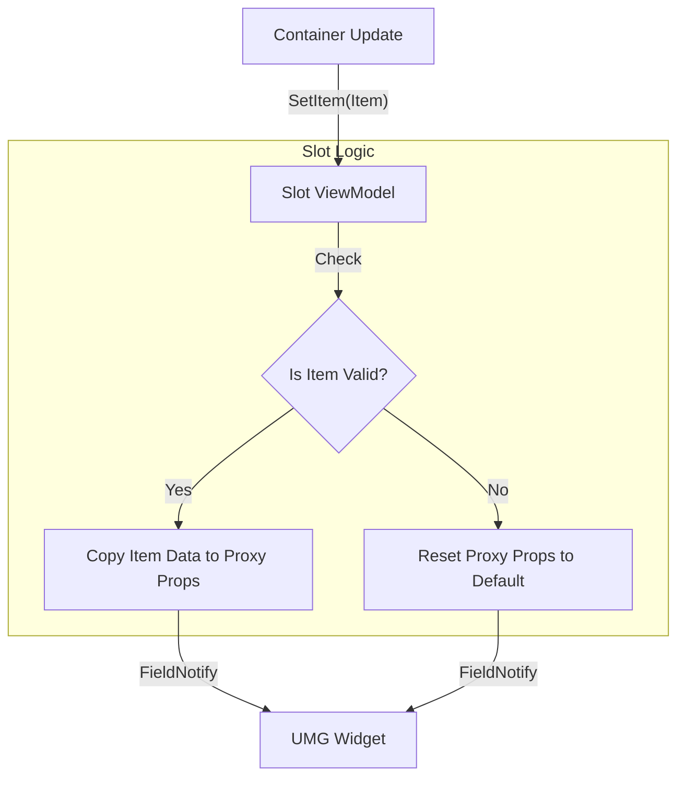

# Persistent Slot Pattern

### The Key Insight: Slots Always Exist

In raw backend data, an empty slot is simply... nothing. No entry exists. But in UI, you often need to display empty slots:

* An equipment slot showing "Empty - Equip Helmet"
* A grid with 20 slots, only 5 filled
* Attachment slots on a weapon waiting to be filled

> **The "Null Binding" Problem**
>
> In a standard ListView, if a slot is empty, the data object is often `null`. UMG widgets cannot bind to null. This forces you to write complex visibility logic in Blueprints:
>
> * _"If Item is valid -> Show Icon"_
> * _"If Item is null -> Hide Icon"_

We solve this with the **Persistent Slot Pattern**. Slot ViewModels always exist for defined slots, regardless of whether they contain an item.

### The Architecture

Instead of binding your widget directly to an `Item`, you bind it to a `SlotViewModel`.

* **The Slot:** Always exists. Represents the physical "box" on the screen.
* **The Item:** Transient. Represents the data inside the box.

The `SlotViewModel` acts as a **Proxy**. It has properties like `ItemIcon` and `StackCount` that mirror the item inside it.

| Feature             | Direct Item Binding (Bad)                     | Persistent Slot Binding (Good)  |
| ------------------- | --------------------------------------------- | ------------------------------- |
| **Object Lifetime** | Destroyed when item is removed.               | Created once, lasts forever.    |
| **Empty State**     | `null` pointer.                               | `bIsOccupied = false`.          |
| **Binding Logic**   | Requires "Is Valid" checks.                   | Bind directly to properties.    |
| **Drag & Drop**     | Hard to drop into an empty space (no object). | Slot exists to accept the drop. |

### How It Works

When the container rebuilds, it updates the slot's state via `SetItem`.

```cpp
void ULyraSlotViewModelBase::SetItem(ULyraItemViewModel* InItemViewModel)
{
    // 1. Store the reference
    UE_MVVM_SET_PROPERTY_VALUE(ItemViewModel, InItemViewModel);

    // 2. Update occupancy state
    const bool bNewOccupied = (InItemViewModel != nullptr);
    UE_MVVM_SET_PROPERTY_VALUE(bIsOccupied, bNewOccupied);

    // 3. Update Proxy Properties
    if (bNewOccupied)
    {
        UpdateProxiedProperties(); // Copies Name, Icon, Count from Item
    }
    else
    {
        ClearProxiedProperties(); // Sets Icon to null, Count to 0
    }
}
```

#### The Proxy Properties

The Slot ViewModel exposes these properties to Blueprint via FieldNotify.

* `ItemDisplayName` (Text)
* `ItemIcon` (Texture2D)
* `StackCount` (Int)
* `bIsGhost` (Bool)

This allows your Widget Designer to bind `Image_Icon.Brush` directly to `Slot.ItemIcon`. If the slot is empty, the texture is null, and UMG handles that gracefully (drawing nothing), without crashing.

### Blueprint Implementation Guide

When creating your Slot Widget in UMG, follow this pattern:

1. **Inherit** from `UserWidget`.
2. **Add** a Viewmodel Binding for `ULyraSlotViewModelBase`.
3. **Bind** your visual elements:

| UMG Element                                                                                                                                                                                                                    | Property to Bind                                        |
| ------------------------------------------------------------------------------------------------------------------------------------------------------------------------------------------------------------------------------ | ------------------------------------------------------- |
| **Border (Occupied)**                                                                                                                                                                                                          | `Slot.bIsOccupied` (Use a Bool-to-Visibility converter) |
| **Border (Empty)**                                                                                                                                                                                                             | `Slot.bIsOccupied` (Inverted)                           |
| **Image (Icon)**                                                                                                                                                                                                               | `Slot.ItemIcon`                                         |
| **Text (Count)**                                                                                                                                                                                                               | `Slot.StackCount`                                       |
| Since the Slot ViewModel always exists, you can add "Hover" animations and "Focus" logic to empty slots. This is critical for Gamepad navigation, where the cursor needs to land on empty slots just as easily as filled ones. |                                                         |

### Visualizing the Flow



By adding this layer of indirection, we decouple the _existence_ of the UI from the _existence_ of the data. Your grid stays stable, your bindings stay simple, and your log stays free of "Accessed None" warnings.
