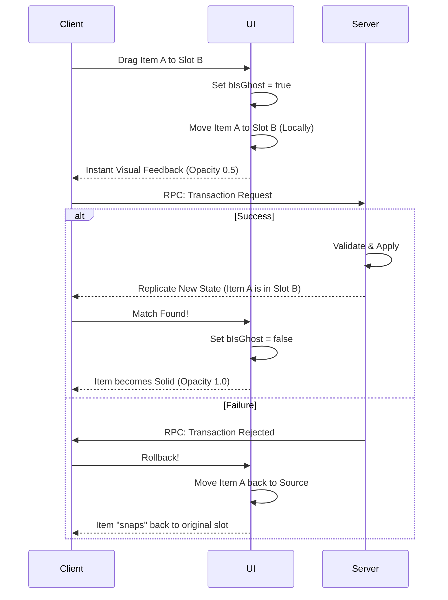

# Prediction & Visuals

In a high-latency environment, waiting for the server to confirm a drag-and-drop operation makes the UI feel sluggish and unresponsive.

To solve this, the system implements a **Predictive "Ghost" Layer**. This allows the UI to lie to the player, showing them the result of an action before it actually happens.

### The Concept

When a player moves an item, two things happen simultaneously:

1. **Network:** A transaction request (`ExecuteTransaction`) is sent to the server.
2. **Local:** The UI applies the change immediately but marks the affected items as **"Ghosts."**

#### What is a Ghost?

A "Ghost" item is a **Prediction Overlay**. It exists in the client's local View Model but has not been confirmed by the server's replication stream.

* **Ghost Add:** An item appears in the destination slot immediately.
* **Ghost Remove:** An item vanishes from the source slot immediately.


Never block user input on a Ghost item. Even though it is "pending," the player expects to be able to interact with it (e.g., drag it again) immediately. The transaction system queues these operations correctly.


### Visualizing Prediction

The `ULyraItemViewModel` exposes a boolean property: `bIsGhost`. This is your hook for visual feedback. You should use this to signal to the player that "This action is pending."

#### Common Styling Patterns

| Style          | Effect                         | Meaning                            |
| -------------- | ------------------------------ | ---------------------------------- |
| **Opacity**    | Set `RenderOpacity` to 0.5     | "This item is still transferring." |
| **Color Tint** | Tint the icon blue/holographic | "This is a predicted projection."  |
| **Spinner**    | Show a small loading throbber  | "Waiting for server confirmation." |

<figure><figcaption><p>Example of binding bIsGhost to RenderOpacity</p></figcaption></figure>

### The Prediction Lifecycle

It is important to understand the lifecycle of a Ghost item so you can debug visual glitches.




<details>

<summary>Advanced Internal logic (Read <a href="../../../item-container/prediction/">Item Container Prediction</a> for more details)</summary>

The system manages the transition from ghost to authoritative data through a strict three-phase lifecycle:

| Phase                    | Description                                                                                        | Result                                     |
| ------------------------ | -------------------------------------------------------------------------------------------------- | ------------------------------------------ |
| **Predicted Applied**    | The UI immediately updates the ViewModel. `bIsGhost` is set to `true`.                             | Instant visual feedback.                   |
| **Prediction Confirmed** | The server echoes the change back to the client. The "Ghost" is replaced by the real server entry. | `bIsGhost` becomes `false`.                |
| **Prediction Rejected**  | The server disagrees with the move (e.g., inventory full).                                         | The UI rolls back, and the ghost vanishes. |

#### How It Works Internally

The system utilizes the [**Prediction Engine**](/broken/pages/TFvvZl5DLdV6FNHgYCEl) that sits between the replicated data and the ViewModels. When a ViewModel rebuilds its list, it doesn't just look at the server's array; it looks at the **Composed View**.

**Implementation Example: `RebuildItemsList`**

In `LyraInventoryViewModel.cpp`, the system iterates through entries provided by the `LyraInventoryManagerComponent`. The component provides a view that merges real server data with pending client overlays.

```cpp
// Check if this is a predicted item during list rebuild
bool bIsPending = Entry.Prediction.HasPendingPrediction();
ItemVM->SetGhost(bIsPending);
```

The `FContainerPredictionStamp` is the technical anchor. It carries a `LastLocalPredictedKeyId`. If this ID is valid and hasn't been cleared by a server update, the UI knows the item is still in the "Ghost" state.

#### Handling Rejection

If the server rejects the move (e.g., item was stolen by another player, inventory full), the ghost state must be cleaned up.

The system handles this automatically via the **Prediction Key** mechanism (As seen in the diagram above).

1. The [Item Transaction Ability](/broken/pages/ZUPt9j5HfmobQDveNTPm) receives a `ClientNotifyTxFailed` RPC.
2. It triggers a **Rollback**.
3. The Container ViewModel detects the state reversion.
4. `bIsGhost` is cleared, and the item "snaps" back to its original position.


</details>

By exposing prediction state directly to UMG, it empowers designers to create responsive, high-fidelity interfaces that hide network latency from the player.
