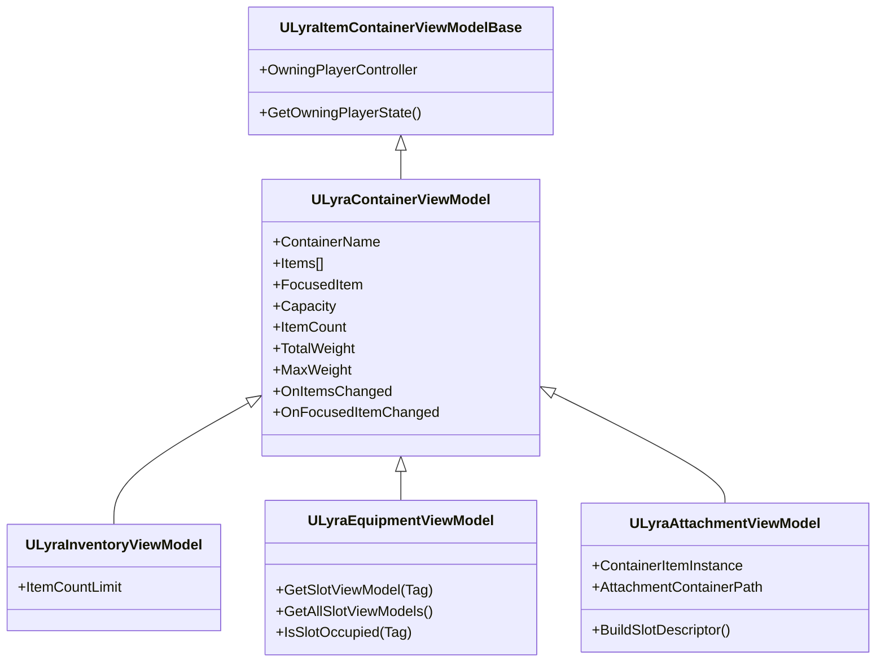

# Specialized Implementations

The core ViewModel architecture is powerful, but different game systems behave differently. A backpack doesn't work the same way as a weapon attachment point.

This page explains how the  `ULyraContainerViewModel`  is extended to handle specific gameplay mechanics.



### Polymorphic Container Sources

The system uses `FInstancedStruct` to work with any container type polymorphically:

```cpp
// All containers use the same API
ULyraContainerViewModel* AcquireViewModel(const FInstancedStruct& Source);
```

#### Built-in Sources

| Source Struct                | Creates                    | For                  |
| ---------------------------- | -------------------------- | -------------------- |
| `FInventoryContainerSource`  | `ULyraInventoryViewModel`  | Inventory components |
| `FEquipmentContainerSource`  | `ULyraEquipmentViewModel`  | Equipment components |
| `FAttachmentContainerSource` | `ULyraAttachmentViewModel` | Item attachments     |

#### Adding Custom Sources

See [Custom Container Types](../extension-and-integration-guide/custom-container-types.md) for creating new container types (vendors, crafting, etc.).

### Initialization

A simple way to initialize a container view model is by passing the ContainerSoure struct as an InstancedStruct to `AcquireViewModel`  or to `AcquireViewModelLeased` if you are inside a [window shell](../the-windowing-system/).

<details>

<summary>C++</summary>

```cpp
// Create via UI Manager
FInventoryContainerSource Source;
Source.InventoryComponent = PlayerInventoryComponent;

ULyraInventoryViewModel* VM = Cast<ULyraInventoryViewModel>(
    UIManager->AcquireViewModel(FInstancedStruct::Make(Source))
);
```

</details>

<details>

<summary>Blueprints</summary>

<figure><figcaption></figcaption></figure>

</details>

***

### The Inventory (`ULyraInventoryViewModel`)

This is the standard, index-based container. It represents a 1D list of items (Backpack, Chest, Stash).

#### Key Features

* **Index Mapping:** Items are identified by their `SlotIndex` (0, 1, 2...).
* **Capacity Handling:** It binds to `LyraInventoryManagerComponent` to track `MaxSlots` and `MaxWeight`.
* **Rebuild Logic:** It iterates over the items notifying changes.

#### Usage

This is the default for most storage. It works out-of-the-box with `LyraInventoryListPanel` and `LyraInventoryTilePanel`.


The `LyraInventoryTilePanel` handles empty slot visualization by:

1. Getting `MaxSlots` from ViewModel
2. Creating `SlotViewModel` for each position
3. Mapping items to slots via `FindItemForSlot()`
4. Empty slots get `bIsOccupied = false`

The `InventoryListPanel` does not do this as it just lists the items. There is no concept of an empty item.


***

### Equipment (`ULyraEquipmentViewModel`)

Equipment is unique because slots are not numbered; they are **Tagged**. You don't have "Slot 0"; you have "Head," "Chest," and "Weapon."

#### Key Features

* **Tag Mapping:** Instead of an array, it maintains a `TMap<FGameplayTag, ULyraEquipmentSlotViewModel>`.
* **Permanent Slots:** The slots are defined by the Character's configuration, not by the items present. The "Head" slot exists even if the player is naked.
* **Held State:** It tracks `ActiveHeldSlot` to visualize which item is currently in the character's hands (e.g., highlighting the active weapon).

#### On-Demand Creation

Unlike Inventory which rebuilds everything, Equipment slots are often created **On-Demand**. When your UI asks for `GetOrCreateSlotViewModel(Tag_Head)`, the system checks if it exists. If not, it creates it. This allows different UI layouts (e.g., a simple HUD vs. a detailed Character Sheet) to request only the slots they care about.

### Initialization

<details>

<summary>C++</summary>

```cpp
// Create via UI Manager
FInventoryContainerSource Source;
Source.InventoryComponent = PlayerInventoryComponent;

ULyraInventoryViewModel* VM = Cast<ULyraInventoryViewModel>(
    UIManager->AcquireViewModel(FInstancedStruct::Make(Source))
);
```

</details>

<details>

<summary>Blueprints</summary>

<figure><figcaption></figcaption></figure>

</details>

***

### Attachments (`ULyraAttachmentViewModel`)

This is the most complex container. It represents the "Item-on-Item" hierarchy (e.g., a Scope attached to a Rifle).

#### The "Nested Container" Problem

In a standard inventory, the container is an Actor Component. It doesn't move. In an attachment system, the container (Rifle) is an **Item**. It moves constantly.

If you move the Rifle from your Hands to your Backpack, the "Path" to the Scope changes.

* _Before:_ `Hands -> Rifle -> Scope`
* _After:_ `Backpack -> Slot 3 -> Rifle -> Scope`

#### Dynamic Context Updates

The `LyraAttachmentViewModel` solves this by listening to the `ItemMoved` message.

1. **Detection:** When the parent item (Rifle) moves, the ViewModel detects the event.
2. **Recalculation:** It calls `UAttachmentFunctionLibrary::GetAttachmentContainerInfo` to rebuild the `RootSlot` and `ContainerPath`.
3. **Propagation:** It updates the `SlotDescriptor` of every attachment slot.

This ensures that drag-and-drop operations continue to work seamlessly even if the parent item is moved while the attachment window is open.

#### The Attachment Fragment

Instead of a manager component, this ViewModel reads from the `UInventoryFragment_Attachment`.

* It reads the `CompatibleAttachments` map to know which slots exist (Muzzle, Optic, Mag).
* It creates a permanent `SlotViewModel` for each compatible point, even if empty.

### Initialization

<details>

<summary>C++</summary>

```cpp
// Create via UI Manager
FInventoryContainerSource Source;
Source.InventoryComponent = PlayerInventoryComponent;

ULyraInventoryViewModel* VM = Cast<ULyraInventoryViewModel>(
    UIManager->AcquireViewModel(FInstancedStruct::Make(Source))
);
```

</details>

<details>

<summary>Blueprints</summary>

<figure><figcaption></figcaption></figure>

</details>
