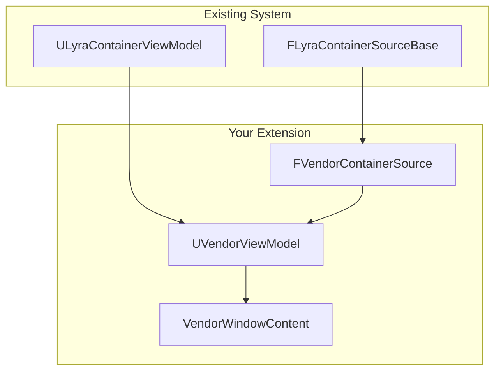

# Custom Container Types

The Item Container UI system is designed to be extended. This guide shows how to create entirely new container types, vendors, crafting stations, loot crates, or any custom container your game needs.

***

### When You Need a Custom Container Type

Create a new container type when:

* The container has **different data** than inventory/equipment (vendor prices, crafting recipes)
* The container has **different behavior** (vendor transactions, crafting costs)
* The container has **different display needs** (vendor categories, recipe ingredients)

If you just need a different visual layout, you probably don't need a custom type, just create a custom window content widget using the existing `ViewModels`.

***

#### The Extension Pattern



You create three things:

1. **Container Source** — Identifies the container instance
2. **`ViewModel`** — Transforms container data for UI
3. **Window Content** — Displays the `ViewModel`

***

### Step 1: Create the Container Source

The source struct identifies your container and tells the system how to create its `ViewModel`.

### Define the Source Struct

<details>

<summary>Define Vendor Container Struct</summary>

```cpp
USTRUCT()
struct FVendorContainerSource : public FLyraContainerSourceBase
{
    GENERATED_BODY()

    // Reference to your vendor component
    UPROPERTY()
    TWeakObjectPtr<UVendorComponent> VendorComponent;

    // Optional: Category filter
    UPROPERTY()
    FGameplayTag CategoryFilter;

    // --- Required overrides ---

    // What ViewModel class to create
    virtual TSubclassOf<ULyraContainerViewModel> GetViewModelClass() const override
    {
        return UVendorViewModel::StaticClass();
    }

    // Unique hash for caching
    virtual uint32 GetContentHash() const override
    {
        return HashCombine(
            GetTypeHash(VendorComponent.Get()),
            GetTypeHash(CategoryFilter)
        );
    }

    // Object to watch for destruction
    virtual UObject* GetOwner() const override
    {
        return VendorComponent.Get();
    }

    // Create the ViewModel
    virtual ULyraContainerViewModel* CreateViewModel(
        ULyraItemContainerUIManager* UIManager) const override
    {
        UVendorViewModel* VM = NewObject<UVendorViewModel>(UIManager);
        VM->Initialize(VendorComponent.Get(), CategoryFilter);
        return VM;
    }
};
```


</details>

***

### Step 2: Create the `ViewModel`

Your View Model transforms vendor data into bindable properties.

### Define the View Model Class

<details>

<summary>Class Definition</summary>

```cpp
UCLASS()
class UVendorViewModel : public ULyraContainerViewModel
{
    GENERATED_BODY()

public:
    // --- Vendor-specific properties ---

    UPROPERTY(BlueprintReadOnly, FieldNotify, Category = "Vendor")
    FText VendorName;

    UPROPERTY(BlueprintReadOnly, FieldNotify, Category = "Vendor")
    int32 PlayerCurrency;

    UPROPERTY(BlueprintReadOnly, FieldNotify, Category = "Vendor")
    TArray<UVendorItemViewModel*> VendorItems;

    // --- Events ---

    UPROPERTY(BlueprintAssignable)
    FOnCurrencyChanged OnCurrencyChanged;

    // --- Methods ---

    void Initialize(UVendorComponent* Vendor, FGameplayTag Category);

    UFUNCTION(BlueprintCallable)
    bool CanAffordItem(UVendorItemViewModel* Item) const;

    UFUNCTION(BlueprintCallable)
    void PurchaseItem(UVendorItemViewModel* Item, int32 Quantity = 1);

protected:
    virtual void RebuildItemsList() override;
    virtual void BindToMessages() override;

private:
    UPROPERTY()
    TWeakObjectPtr<UVendorComponent> VendorComponent;

    FGameplayTag ActiveCategory;

    void HandleVendorInventoryChanged();
    void HandlePlayerCurrencyChanged(int32 NewAmount);
};
```


</details>

### Implement the View Model

<details>

<summary>cpp Implementation</summary>

```cpp
void UVendorViewModel::Initialize(UVendorComponent* Vendor, FGameplayTag Category)
{
    VendorComponent = Vendor;
    ActiveCategory = Category;

    // Set base properties
    UE_MVVM_SET_PROPERTY_VALUE(ContainerName, Vendor->GetVendorName());
    UE_MVVM_SET_PROPERTY_VALUE(VendorName, Vendor->GetVendorName());

    // Get player currency
    UpdatePlayerCurrency();

    // Build items list
    RebuildItemsList();

    // Subscribe to changes
    BindToMessages();
}

void UVendorViewModel::RebuildItemsList()
{
    TArray<UVendorItemViewModel*> NewItems;

    for (const FVendorEntry& Entry : VendorComponent->GetVendorEntries())
    {
        // Filter by category if set
        if (ActiveCategory.IsValid() &&
            !Entry.ItemDef->HasMatchingGameplayTag(ActiveCategory))
        {
            continue;
        }

        // Create or reuse ViewModel
        UVendorItemViewModel* ItemVM = GetOrCreateVendorItemViewModel(Entry);
        ItemVM->UpdateFromEntry(Entry, PlayerCurrency);
        NewItems.Add(ItemVM);
    }

    UE_MVVM_SET_PROPERTY_VALUE(VendorItems, NewItems);

    // Also populate base Items array for compatibility
    TArray<ULyraItemViewModel*> BaseItems;
    for (auto* VM : NewItems)
    {
        BaseItems.Add(VM);
    }
    UE_MVVM_SET_PROPERTY_VALUE(Items, BaseItems);
}

void UVendorViewModel::BindToMessages()
{
    // Subscribe to vendor inventory changes
    VendorComponent->OnInventoryChanged.AddUObject(
        this, &UVendorViewModel::HandleVendorInventoryChanged);

    // Subscribe to player currency changes
    if (APlayerController* PC = GetOwningPlayerController())
    {
        if (UPlayerCurrencyComponent* Currency = PC->FindComponentByClass<...>())
        {
            Currency->OnCurrencyChanged.AddUObject(
                this, &UVendorViewModel::HandlePlayerCurrencyChanged);
        }
    }
}

bool UVendorViewModel::CanAffordItem(UVendorItemViewModel* Item) const
{
    return PlayerCurrency >= Item->GetPrice();
}

void UVendorViewModel::PurchaseItem(UVendorItemViewModel* Item, int32 Quantity)
{
    // Execute purchase ability
    FVendorPurchasePayload Payload;
    Payload.VendorComponent = VendorComponent.Get();
    Payload.ItemDefinition = Item->GetItemDefinition();
    Payload.Quantity = Quantity;

    // This handles prediction, server validation, etc.
    GetAbilitySystemComponent()->TryActivateAbilityByClass(
        UVendorPurchaseAbility::StaticClass(),
        &Payload
    );
}
```

</details>

### Vendor Item View Model

Create a specialized item View Model for vendor entries. This is necessary so each vendor slot/item widget can bind to the item view model instead of the component view model

<details>

<summary>Item Vendor Model</summary>

```cpp
UCLASS()
class UVendorItemViewModel : public ULyraItemViewModel
{
    GENERATED_BODY()

public:
    // Vendor-specific properties
    UPROPERTY(BlueprintReadOnly, FieldNotify)
    int32 Price;

    UPROPERTY(BlueprintReadOnly, FieldNotify)
    int32 Stock;  // -1 = unlimited

    UPROPERTY(BlueprintReadOnly, FieldNotify)
    bool bCanAfford;

    UPROPERTY(BlueprintReadOnly, FieldNotify)
    bool bInStock;

    void UpdateFromEntry(const FVendorEntry& Entry, int32 PlayerCurrency)
    {
        // Base item properties
        SetDisplayName(Entry.ItemDef->GetDisplayName());
        SetIcon(Entry.ItemDef->GetIcon());

        // Vendor-specific
        UE_MVVM_SET_PROPERTY_VALUE(Price, Entry.Price);
        UE_MVVM_SET_PROPERTY_VALUE(Stock, Entry.Stock);
        UE_MVVM_SET_PROPERTY_VALUE(bCanAfford, PlayerCurrency >= Entry.Price);
        UE_MVVM_SET_PROPERTY_VALUE(bInStock, Entry.Stock != 0);
    }
};
```


</details>

***

### Step 3: Create Window Content

Build a widget that displays your vendor UI.

#### Vendor Window Layout

```
┌─────────────────────────────────────┐
│  Trader Bob's Emporium              │
├─────────────────────────────────────┤
│ Categories: [All] [Weapons] [Armor] │
├─────────────────────────────────────┤
│  ┌─────┐ Sword           100g       │
│  │ 🗡️  │ A fine blade    [Buy]      │
│  └─────┘                            │
│  ┌─────┐ Health Potion    25g       │
│  │ 🧪  │ Restores HP     [Buy]      │
│  └─────┘ (Out of stock)             │
├─────────────────────────────────────┤
│  Your Gold: 500                     │
└─────────────────────────────────────┘
```

#### Implement the Interface

<details>

<summary>Window Interface</summary>

```cpp
void UVendorWindowContent::SetContainerSource(const FInstancedStruct& Source)
{
    const FVendorContainerSource* VendorSource =
        Source.GetPtr<FVendorContainerSource>();

    if (VendorSource)
    {
        VendorVM = Cast<UVendorViewModel>(
            UIManager->AcquireViewModel(Source)
        );

        // Bind vendor-specific properties
        VendorNameText->SetText(VendorVM->GetVendorName());
        UpdateCurrencyDisplay();

        // Set up item list
        ItemList->SetListItems(VendorVM->GetVendorItems());
    }
}
```


</details>

#### Vendor Item Entry Widget

```cpp
void UVendorItemEntry::NativeOnListItemObjectSet(UObject* ListItemObject)
{
    VendorItemVM = Cast<UVendorItemViewModel>(ListItemObject);

    // Bind standard item properties
    ItemIcon->SetBrushFromTexture(VendorItemVM->GetIcon());
    ItemName->SetText(VendorItemVM->GetDisplayName());

    // Bind vendor-specific properties
    PriceText->SetText(FText::Format(LOCTEXT("Price", "{0}g"), VendorItemVM->GetPrice()));

    // Affordability styling
    bool bCanAfford = VendorItemVM->CanAfford();
    PriceText->SetColorAndOpacity(bCanAfford ? AffordableColor : UnaffordableColor);
    BuyButton->SetIsEnabled(bCanAfford && VendorItemVM->IsInStock());

    // Stock display
    if (!VendorItemVM->IsInStock())
    {
        StockText->SetText(LOCTEXT("OutOfStock", "Out of Stock"));
        StockText->SetVisibility(ESlateVisibility::Visible);
    }
    else
    {
        StockText->SetVisibility(ESlateVisibility::Collapsed);
    }
}

void HandleBuyClicked()
{
    VendorVM->PurchaseItem(VendorItemVM, 1);
}
```

***

### Step 4: Register the Window Type

```cpp
// Define window type tag
UE_DEFINE_GAMEPLAY_TAG(TAG_UI_Window_Vendor, "UI.Window.Vendor");

// Register in UI configuration
WindowTypeMap.Add(TAG_UI_Window_Vendor, UVendorWindowContent::StaticClass());
```

***

### Step 5: Open the Vendor Window

```cpp
void UVendorInteractionComponent::OpenVendorUI()
{
    ULyraItemContainerUIManager* UIManager = GetUIManager();

    // Create source
    FVendorContainerSource Source;
    Source.VendorComponent = VendorComponent;
    Source.CategoryFilter = FGameplayTag::EmptyTag;  // All categories

    // Create session for this vendor
    FLyraUISessionHandle VendorSession = UIManager->CreateChildSession(
        UIManager->GetOrCreateBaseSession(),
        GetOwner()  // Vendor actor
    );

    // Build request
    FLyraWindowOpenRequest Request;
    Request.WindowType = TAG_UI_Window_Vendor;
    Request.SourceDesc = FInstancedStruct::Make(Source);
    Request.SessionHandle = VendorSession;

    UIManager->RequestOpenWindow(Request);

    // Also open player inventory for comparison
    OpenPlayerInventory(VendorSession);
}
```


***

### Checklist

* [ ] `FYourContainerSource` = Container identification
* [ ] `UYourViewModel` = Data transformation
* [ ] `UYourWindowContent` = UI widget
* [ ] Window type tag and registration
* [ ] Code or ability to open the window

The system handles:

* ViewModel caching
* Session management
* Window lifecycle
* Cross-window navigation

You focus on:

* Your specific data transformations
* Your specific UI layout
* Your specific interactions

***

### Next Steps

For non-standard window layouts (split views, comparison modes), see [Custom Windows](custom-windows.md).
