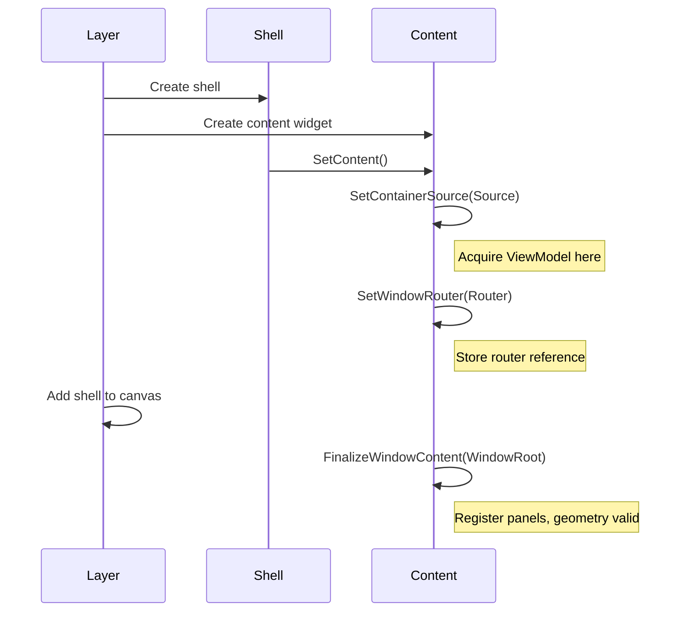

# Custom Windows

Beyond custom container types, you may need custom window layouts, comparison views, split panels, or windows without standard chrome. This guide covers window customization at every level.

***

### Custom Window Scenarios

| Scenario                          | Solution                     |
| --------------------------------- | ---------------------------- |
| Different visual layout           | Custom window content widget |
| Multiple containers in one window | Multi-source content widget  |
| No title bar / minimal chrome     | Custom window shell          |
| Floating tooltip-style            | Lightweight overlay widget   |
| Split view comparison             | Multi-panel content widget   |

***

### The Window Content Interface

All window content widgets must implement `ILyraItemContainerWindowContentInterface`. This interface has exactly **three methods**:

```cpp
class ILyraItemContainerWindowContentInterface
{
public:
    // Called first: receive the container source to acquire your ViewModel
    virtual void SetContainerSource(const FInstancedStruct& Source) = 0;

    // Called second: receive the navigation router for panel registration
    virtual void SetWindowRouter(ULyraNavigationRouter* Router) = 0;

    // Called last: widget is in visual tree, geometry is valid
    virtual void FinalizeWindowContent(UWidget* WindowRootWidget) = 0;
};
```

#### Method Call Order



***

### Registering Window Types

The Layer maps `WindowType` tags to content widget classes via `GetContentWidgetClassForWindowType()`. This enables reusable windows that work with any compatible container source.

#### Override in Your Layer Blueprint

```cpp
// In your Layer subclass
TSubclassOf<UUserWidget> UMyItemContainerLayer::GetContentWidgetClassForWindowType_Implementation(
    FGameplayTag WindowType)
{
    // Map tags to content widget classes
    if (WindowType == TAG_UI_Window_Inventory)
    {
        return UInventoryGridContent::StaticClass();
    }
    if (WindowType == TAG_UI_Window_Equipment)
    {
        return UEquipmentSlotsContent::StaticClass();
    }
    if (WindowType == TAG_UI_Window_Attachment)
    {
        return UAttachmentGridContent::StaticClass();
    }
    if (WindowType == TAG_UI_Window_Vendor)
    {
        return UVendorListContent::StaticClass();
    }

    // Fallback to default
    return Super::GetContentWidgetClassForWindowType_Implementation(WindowType);
}
```

#### Reusable Window Content

The power of this system is that **the same content widget class works with different container sources**. For example:

| Window Type            | Content Widget           | Works With                                   |
| ---------------------- | ------------------------ | -------------------------------------------- |
| `UI.Window.Inventory`  | `UInventoryGridContent`  | Player inventory, chest, loot crate, stash   |
| `UI.Window.Attachment` | `UAttachmentGridContent` | Gun attachments, armor mods, vehicle parts   |
| `UI.Window.Equipment`  | `UEquipmentSlotsContent` | Player equipment, mannequin, loadout preview |

The content widget doesn't care _which_ inventory it's showing,  it just receives a source via `SetContainerSource()` and displays it.

#### Example: One Grid Widget, Many Uses

```cpp
// Same widget class used for multiple window types
UCLASS()
class UInventoryGridContent : public UUserWidget,
                              public ILyraItemContainerWindowContentInterface
{
    // Works with FInventoryContainerSource, FChestContainerSource,
    // FLootCrateContainerSource - any source that creates a ULyraContainerViewModel
};

// In Layer:
if (WindowType == TAG_UI_Window_Inventory ||
    WindowType == TAG_UI_Window_Chest ||
    WindowType == TAG_UI_Window_LootCrate ||
    WindowType == TAG_UI_Window_Stash)
{
    return UInventoryGridContent::StaticClass();
}
```

#### Defining Window Type Tags

```cpp
// In your GameplayTags file or using the blueprint gameplay tag manager
UE_DEFINE_GAMEPLAY_TAG(TAG_UI_Window_Inventory, "UI.Window.Inventory");
UE_DEFINE_GAMEPLAY_TAG(TAG_UI_Window_Equipment, "UI.Window.Equipment");
UE_DEFINE_GAMEPLAY_TAG(TAG_UI_Window_Attachment, "UI.Window.Attachment");
UE_DEFINE_GAMEPLAY_TAG(TAG_UI_Window_Vendor, "UI.Window.Vendor");
UE_DEFINE_GAMEPLAY_TAG(TAG_UI_Window_Trade, "UI.Window.Trade");
UE_DEFINE_GAMEPLAY_TAG(TAG_UI_Window_Crafting, "UI.Window.Crafting");
```

***

### Custom Window Content Widget

The most common customization: a different layout for an existing container type.

#### Recommended: ViewModel Leasing

The simplest approach uses the window shell's lease system for automatic cleanup:

```cpp
UCLASS()
class UCompactGridContent : public UUserWidget,
                            public ILyraItemContainerWindowContentInterface
{
    GENERATED_BODY()

public:
    //~ ILyraItemContainerWindowContentInterface
    virtual void SetContainerSource_Implementation(const FInstancedStruct& Source) override
    {
        // Get owning shell and use its lease system
        ULyraItemContainerWindowShell* Shell =
            ULyraItemContainerWindowShell::GetOwningWindowShell(this);

        // AcquireViewModelLease auto-releases when window closes
        ContainerVM = Shell->AcquireViewModelLease(Source);

        // Set up your custom layout
        TilePanel->SetNumColumns(8);  // Dense 8-column grid
        TilePanel->SetContainerViewModel(ContainerVM);
    }

    virtual void SetWindowRouter_Implementation(ULyraNavigationRouter* InRouter) override
    {
        Router = InRouter;
    }

    virtual void FinalizeWindowContent_Implementation(UWidget* WindowRootWidget) override
    {
        // Register panel for navigation (geometry is now valid)
        FBox2f PanelBounds = ULyraNavigationRouter::GetWidgetBoundsInRootSpace(
            TilePanel, WindowRootWidget);

        PanelHandle = Router->RegisterPanel(
            TilePanel,
            TAG_Panel_Inventory,
            PanelBounds,
            true  // bIsDefaultFocus
        );
    }
    //~ End interface

private:
    UPROPERTY()
    TObjectPtr<ULyraContainerViewModel> ContainerVM;

    UPROPERTY()
    TObjectPtr<ULyraNavigationRouter> Router;

    UPROPERTY(meta = (BindWidget))
    TObjectPtr<ULyraTileInventoryPanel> TilePanel;

    FNavigationPanelHandle PanelHandle;
};
```

#### Alternative: Manual ViewModel Management

For finer control over ViewModel lifetime:

```cpp
void UMyContent::SetContainerSource_Implementation(const FInstancedStruct& Source)
{
    // Store source for later release
    CachedSource = Source;

    // Get UIManager and acquire manually
    ULyraItemContainerUIManager* UIManager =
        GetOwningLocalPlayer()->GetSubsystem<ULyraItemContainerUIManager>();

    ContainerVM = UIManager->AcquireViewModel(Source);
    SetupBindings();
}

void UMyContent::NativeDestruct()
{
    // Must release manually
    if (ContainerVM)
    {
        ULyraItemContainerUIManager* UIManager =
            GetOwningLocalPlayer()->GetSubsystem<ULyraItemContainerUIManager>();
        UIManager->ReleaseViewModel(CachedSource);
        ContainerVM = nullptr;
    }

    Super::NativeDestruct();
}
```

#### Setting Window Title

The content interface doesn't have a title method. Set the title via the shell:

```cpp
void UMyContent::SetContainerSource_Implementation(const FInstancedStruct& Source)
{
    // ... acquire ViewModel ...

    // Set window title through shell
    if (ULyraItemContainerWindowShell* Shell =
            ULyraItemContainerWindowShell::GetOwningWindowShell(this))
    {
        Shell->SetTitle(ContainerVM->GetContainerName());
    }
}
```

***

### Multi-Container Windows

Show multiple containers in one window (e.g., player inventory + target inventory for trading).

#### Layout

```
+-----------------------------------------------------+
|                   Trade Window                       |
+------------------------+----------------------------+
|   Your Inventory       |    Their Inventory          |
|  +-----------------+   |  +----------------------+   |
|  |                 |   |  |                      |   |
|  |  [Items...]     |   |  |  [Items...]          |   |
|  |                 |   |  |                      |   |
|  +-----------------+   |  +----------------------+   |
+------------------------+----------------------------+
| [Cancel]                              [Confirm Trade]|
+-----------------------------------------------------+
```

#### Approach 1: Custom Trade Source + ViewModel

If you need trade-specific logic (offer tracking, confirmation state, etc.), create a dedicated source and ViewModel:

```cpp
// Trade-specific container source
USTRUCT()
struct FTradeContainerSource : public FLyraContainerSourceBase
{
    GENERATED_BODY()

    UPROPERTY()
    TWeakObjectPtr<ULyraInventoryManagerComponent> PlayerInventory;

    UPROPERTY()
    TWeakObjectPtr<ULyraInventoryManagerComponent> TargetInventory;

    virtual TSubclassOf<ULyraContainerViewModel> GetViewModelClass() const override
    {
        return UTradeViewModel::StaticClass();
    }

    virtual ULyraContainerViewModel* CreateViewModel(
        ULyraItemContainerUIManager* UIManager) const override
    {
        UTradeViewModel* VM = NewObject<UTradeViewModel>(UIManager);
        VM->Initialize(PlayerInventory.Get(), TargetInventory.Get());
        return VM;
    }

    // ... hash and owner methods
};
```

The content widget receives this source and the `UTradeViewModel` handles both inventories:

```cpp
virtual void SetContainerSource_Implementation(const FInstancedStruct& Source) override
{
    ULyraItemContainerWindowShell* Shell =
        ULyraItemContainerWindowShell::GetOwningWindowShell(this);

    // Single lease for the trade ViewModel (which manages both inventories internally)
    TradeVM = Cast<UTradeViewModel>(Shell->AcquireViewModelLease(Source));

    // TradeVM exposes both inventories' items
    PlayerPanel->SetItemsSource(TradeVM->GetPlayerItems());
    TargetPanel->SetItemsSource(TradeVM->GetTargetItems());
}
```

#### Approach 2: Composite Source with Standard ViewModels

If you just need to display two inventories side-by-side without trade-specific logic, the source can carry both inventory references and the content widget builds standard `FInventoryContainerSource` structs:

```cpp
// Simple composite source (NOT a container source - just data)
USTRUCT()
struct FTradeWindowSource
{
    GENERATED_BODY()

    UPROPERTY()
    TWeakObjectPtr<ULyraInventoryManagerComponent> PlayerInventory;

    UPROPERTY()
    TWeakObjectPtr<ULyraInventoryManagerComponent> TargetInventory;
};
```

The content widget extracts both and creates standard container sources:

```cpp
UCLASS()
class UTradeWindowContent : public UUserWidget,
                            public ILyraItemContainerWindowContentInterface
{
public:
    virtual void SetContainerSource_Implementation(const FInstancedStruct& Source) override
    {
        const FTradeWindowSource* TradeSource = Source.GetPtr<FTradeWindowSource>();
        if (!TradeSource) return;

        ULyraItemContainerWindowShell* Shell =
            ULyraItemContainerWindowShell::GetOwningWindowShell(this);

        // Build standard inventory sources from the composite
        FInventoryContainerSource PlayerSource;
        PlayerSource.InventoryComponent = TradeSource->PlayerInventory.Get();

        FInventoryContainerSource TargetSource;
        TargetSource.InventoryComponent = TradeSource->TargetInventory.Get();

        // Acquire ViewModels via lease (auto-cleanup on window close)
        PlayerVM = Shell->AcquireViewModelLease(FInstancedStruct::Make(PlayerSource));
        TargetVM = Shell->AcquireViewModelLease(FInstancedStruct::Make(TargetSource));

        PlayerPanel->SetContainerViewModel(PlayerVM);
        TargetPanel->SetContainerViewModel(TargetVM);
    }

    virtual void SetWindowRouter_Implementation(ULyraNavigationRouter* InRouter) override
    {
        Router = InRouter;
    }

    virtual void FinalizeWindowContent_Implementation(UWidget* WindowRootWidget) override
    {
        // Register both panels
        FBox2f PlayerBounds = ULyraNavigationRouter::GetWidgetBoundsInRootSpace(
            PlayerPanel, WindowRootWidget);
        FBox2f TargetBounds = ULyraNavigationRouter::GetWidgetBoundsInRootSpace(
            TargetPanel, WindowRootWidget);

        PlayerPanelHandle = Router->RegisterPanel(
            PlayerPanel, TAG_Panel_PlayerInventory, PlayerBounds, true);
        TargetPanelHandle = Router->RegisterPanel(
            TargetPanel, TAG_Panel_TargetInventory, TargetBounds, false);

        SetupCrossPanelNavigation();
    }

private:
    void SetupCrossPanelNavigation()
    {
        Router->AddRouteOverride(PlayerPanelHandle, EUINavigation::Right, TargetPanelHandle);
        Router->AddRouteOverride(TargetPanelHandle, EUINavigation::Left, PlayerPanelHandle);
    }

    UPROPERTY()
    TObjectPtr<ULyraContainerViewModel> PlayerVM;

    UPROPERTY()
    TObjectPtr<ULyraContainerViewModel> TargetVM;

    UPROPERTY()
    TObjectPtr<ULyraNavigationRouter> Router;

    UPROPERTY(meta = (BindWidget))
    TObjectPtr<ULyraInventoryListPanel> PlayerPanel;

    UPROPERTY(meta = (BindWidget))
    TObjectPtr<ULyraInventoryListPanel> TargetPanel;

    FNavigationPanelHandle PlayerPanelHandle;
    FNavigationPanelHandle TargetPanelHandle;
};
```

#### Which Approach to Use?

| Approach                        | Use When                                                                   |
| ------------------------------- | -------------------------------------------------------------------------- |
| **Custom Trade ViewModel**      | You need trade-specific state (offers, confirmations, transaction history) |
| **Composite with Standard VMs** | You just need to display two inventories side-by-side                      |

#### Opening the Trade Window

```cpp
void OpenTradeWindow(ULyraInventoryManagerComponent* TargetInventory)
{
    ULyraItemContainerUIManager* UIManager = GetUIManager();

    // Build composite source with both inventories
    FTradeWindowSource Source;
    Source.PlayerInventory = PlayerInventory;
    Source.TargetInventory = TargetInventory;

    FItemWindowSpec Spec;
    Spec.WindowType = TAG_UI_Window_Trade;
    Spec.SourceDesc = FInstancedStruct::Make(Source);
    Spec.SessionHandle = UIManager->CreateChildSession(
        UIManager->GetBaseSession(),
        TargetInventory->GetOwner()  // Close when target actor is destroyed
    );
    Spec.Title = LOCTEXT("Trade", "Trade");

    UIManager->RequestOpenWindow(Spec);
}
```

***

### Custom Window Shell

For windows that need different chrome (no title bar, custom close behavior, etc.), create a shell subclass.

#### Widget Bindings

The base `ULyraItemContainerWindowShell` has these optional widget bindings:

| Widget        | Type       | Purpose                                       |
| ------------- | ---------- | --------------------------------------------- |
| `TitleText`   | UTextBlock | Displays window title                         |
| `CloseButton` | UButton    | Close button                                  |
| `ContentSlot` | UNamedSlot | Hosts the content widget                      |
| `DragHandle`  | UWidget    | Draggable area (usually title bar background) |
| `RootBorder`  | UBorder    | Root visual element for styling               |

All are marked `BindWidgetOptional`, so you can omit any in your Blueprint.

#### Minimal Shell Example

```cpp
UCLASS()
class UMinimalWindowShell : public ULyraItemContainerWindowShell
{
    GENERATED_BODY()

protected:
    virtual void NativeConstruct() override
    {
        Super::NativeConstruct();

        // Hide standard chrome
        if (TitleText)
        {
            TitleText->SetVisibility(ESlateVisibility::Collapsed);
        }
        if (CloseButton)
        {
            CloseButton->SetVisibility(ESlateVisibility::Collapsed);
        }

        // Style the root border
        if (RootBorder)
        {
            RootBorder->SetBrushColor(FLinearColor(0.3f, 0.3f, 0.3f, 1.0f));
        }
    }
};
```

#### Blueprint Events

The shell provides these Blueprint-implementable events:

| Event               | When Fired                      |
| ------------------- | ------------------------------- |
| `OnDragStarted`     | User begins dragging            |
| `OnDragEnded`       | Drag operation completes        |
| `OnCloseRequested`  | Close attempted (may be denied) |
| `OnClosing(Reason)` | Window is closing               |
| `OnWindowFocused`   | Window gains focus              |
| `OnWindowUnfocused` | Window loses focus              |

#### Registering Custom Shells

Override `GetWindowShellClass()` in your Layer Blueprint to provide custom shells:

```cpp
// In your Layer Blueprint
TSubclassOf<ULyraItemContainerWindowShell> UMyLayer::GetWindowShellClass_Implementation()
{
    // Return your custom shell class
    return UMinimalWindowShell::StaticClass();
}
```

For per-window-type shells, check the spec's `WindowType`:

```cpp
TSubclassOf<ULyraItemContainerWindowShell> UMyLayer::GetWindowShellClass_Implementation()
{
    // Different shells for different window types
    // (Note: you'd need to store/pass the current spec)
    if (CurrentWindowType == TAG_UI_Shell_Tooltip)
    {
        return UTooltipWindowShell::StaticClass();
    }
    return Super::GetWindowShellClass_Implementation();
}
```

***

## Item Tracking & Window Reparenting

Windows can track items and automatically respond when items move between containers.

#### Setting Up Tracking

Include `TrackedItemId` in the window spec:

```cpp
void OpenAttachmentWindow(ULyraInventoryItemInstance* Item)
{
    FItemWindowSpec Spec;
    Spec.WindowType = TAG_UI_Window_Attachment;
    Spec.SourceDesc = FInstancedStruct::Make(FAttachmentContainerSource{Item});
    Spec.TrackedItemId = Item->GetItemGuid();  // Track this item
    Spec.SessionHandle = CreateChildSessionForItem(Item);

    UIManager->RequestOpenWindow(Spec);
}
```

#### What Happens When Tracked Item Moves

| Event                                   | System Response                               |
| --------------------------------------- | --------------------------------------------- |
| Item destroyed                          | Window closes with `SourceLost` reason        |
| Item moved to inaccessible location     | Window closes with `SourceBecameInaccessible` |
| Item moved within accessible containers | `OnSourceReparented()` called on shell        |

#### Handling Reparenting

The shell's `OnSourceReparented()` method notifies content when the tracked item's location changes:

```cpp
// In your shell subclass or by binding to the shell
void UMyContent::HandleSourceReparented(const FInstancedStruct& NewSlotDesc)
{
    // Item moved - update the source and refresh
    // The NewSlotDesc contains the item's new location

    // Update any displayed slot information
    RefreshSlotDisplay(NewSlotDesc);
}
```

***

### Navigation in Custom Windows

Custom content must register navigable panels for keyboard/gamepad support.

#### Registering Panels

In `FinalizeWindowContent()`, register each navigable panel:

```cpp
void FinalizeWindowContent_Implementation(UWidget* WindowRootWidget)
{
    // Calculate panel bounds in window-local coordinates
    FBox2f PanelBounds = ULyraNavigationRouter::GetWidgetBoundsInRootSpace(
        MyPanel,
        WindowRootWidget
    );

    // Register with options
    PanelHandle = Router->RegisterPanel(
        MyPanel,                    // The navigable widget
        TAG_Panel_MyPanel,          // Panel type tag
        PanelBounds,                // Geometry for neighbor resolution
        true                        // bIsDefaultFocus - receives initial focus
    );
}
```

#### Updating Geometry

If your layout changes after initialization:

```cpp
void OnLayoutChanged()
{
    FBox2f NewBounds = ULyraNavigationRouter::GetWidgetBoundsInRootSpace(
        MyPanel, GetWindowRootWidget());

    Router->UpdatePanelGeometry(PanelHandle, NewBounds);
}
```

#### Custom Navigation Rules

For explicit panel-to-panel navigation (instead of geometry-based):

```cpp
void SetupNavigation()
{
    // Explicit: Right from LeftPanel always goes to RightPanel
    Router->AddRouteOverride(LeftPanelHandle, EUINavigation::Right, RightPanelHandle);
    Router->AddRouteOverride(RightPanelHandle, EUINavigation::Left, LeftPanelHandle);

    // Down from either goes to ActionBar
    Router->AddRouteOverride(LeftPanelHandle, EUINavigation::Down, ActionBarHandle);
    Router->AddRouteOverride(RightPanelHandle, EUINavigation::Down, ActionBarHandle);
}
```

#### Focus Management

```cpp
// Programmatically set which panel has focus
Router->SetActivePanel(TargetPanelHandle);

// Or request focus (may be denied)
Router->RequestPanelFocus(TargetPanelHandle);

// Get current active panel
FNavigationPanelHandle Active = Router->GetActivePanel();
```

***

### Opening Custom Windows

#### The FItemWindowSpec Struct

All window creation goes through `FItemWindowSpec`:

```cpp
USTRUCT(BlueprintType)
struct FItemWindowSpec
{
    // Window type tag - determines content widget class
    FGameplayTag WindowType;

    // Display title
    FText Title;

    // Polymorphic container source
    FInstancedStruct SourceDesc;

    // Session this window belongs to
    FItemWindowSessionHandle SessionHandle;

    // Optional: item to track for reparenting
    FGuid TrackedItemId;

    // Placement strategy
    EItemWindowPlacement Placement = EItemWindowPlacement::Automatic;

    // Position (for Explicit placement)
    FVector2D InitialPosition;

    // Source window (for RelativeToSource placement)
    FItemWindowHandle SourceWindow;

    // Initial focus
    bool bFocusOnOpen = true;

    // User can close via button/escape
    bool bCanUserClose = true;

    // User can drag to reposition
    bool bCanDrag = true;
};
```

#### Placement Options

| Placement          | Behavior                     |
| ------------------ | ---------------------------- |
| `Automatic`        | Cascade from previous window |
| `Explicit`         | Use `InitialPosition`        |
| `CenterScreen`     | Center in viewport           |
| `RelativeToSource` | Position near `SourceWindow` |

#### Complete Example

```cpp
void OpenCustomWindow()
{
    ULyraItemContainerUIManager* UIManager =
        GetOwningLocalPlayer()->GetSubsystem<ULyraItemContainerUIManager>();

    // Build the source
    FMyContainerSource Source;
    Source.MyComponent = MyComponent;

    // Build the spec
    FItemWindowSpec Spec;
    Spec.WindowType = TAG_UI_Window_MyCustom;
    Spec.Title = LOCTEXT("MyWindow", "My Custom Window");
    Spec.SourceDesc = FInstancedStruct::Make(Source);
    Spec.SessionHandle = UIManager->GetBaseSession();
    Spec.Placement = EItemWindowPlacement::CenterScreen;
    Spec.bCanUserClose = true;
    Spec.bCanDrag = true;

    // Request open
    UIManager->RequestOpenWindow(Spec);
}
```

***

### Comparison View Example

A split window showing two items side-by-side:

#### Layout

```
+-----------------------------------------------------+
|              Compare Items                          |
+------------------------+----------------------------+
|       Rusty Sword      |       Steel Sword          |
|       +-------+        |         +-------+          |
|       |  [X]  |        |         |  [X]  |          |
|       +-------+        |         +-------+          |
|                        |                            |
|  Damage: 15    ------> |  Damage: 25 (+10)         |
|  Weight: 3.5           |  Weight: 4.0 (+0.5)       |
|  Durability: 50%       |  Durability: 100% (+50%)  |
|                        |                            |
|  [Keep Current]        |       [Equip New]         |
+------------------------+----------------------------+
```

#### Implementation

```cpp
UCLASS()
class UComparisonWindowContent : public UUserWidget,
                                 public ILyraItemContainerWindowContentInterface
{
public:
    // Called externally before window opens
    void SetItemsToCompare(ULyraItemViewModel* Current, ULyraItemViewModel* New)
    {
        CurrentItemVM = Current;
        NewItemVM = New;
    }

    virtual void SetContainerSource_Implementation(const FInstancedStruct& Source) override
    {
        // Source might contain comparison info, or items set via SetItemsToCompare
        PopulateItemPanel(CurrentItemPanel, CurrentItemVM);
        PopulateItemPanel(NewItemPanel, NewItemVM);
        CalculateAndShowDifferences();
    }

    virtual void SetWindowRouter_Implementation(ULyraNavigationRouter* InRouter) override
    {
        Router = InRouter;
    }

    virtual void FinalizeWindowContent_Implementation(UWidget* WindowRootWidget) override
    {
        // Register action buttons for navigation
        FBox2f KeepBounds = ULyraNavigationRouter::GetWidgetBoundsInRootSpace(
            KeepButton, WindowRootWidget);
        FBox2f EquipBounds = ULyraNavigationRouter::GetWidgetBoundsInRootSpace(
            EquipButton, WindowRootWidget);

        KeepHandle = Router->RegisterPanel(KeepButton, TAG_Panel_Action, KeepBounds, true);
        EquipHandle = Router->RegisterPanel(EquipButton, TAG_Panel_Action, EquipBounds, false);

        Router->AddRouteOverride(KeepHandle, EUINavigation::Right, EquipHandle);
        Router->AddRouteOverride(EquipHandle, EUINavigation::Left, KeepHandle);
    }

private:
    void CalculateAndShowDifferences()
    {
        int32 CurrentDamage = CurrentItemVM->GetStatValue(TAG_Stat_Damage);
        int32 NewDamage = NewItemVM->GetStatValue(TAG_Stat_Damage);
        int32 DamageDiff = NewDamage - CurrentDamage;

        FLinearColor DiffColor = DamageDiff > 0 ? GreenColor :
                                 DamageDiff < 0 ? RedColor : NeutralColor;

        NewDamageText->SetText(FText::Format(
            LOCTEXT("DamageCompare", "{0} ({1}{2})"),
            NewDamage,
            DamageDiff > 0 ? TEXT("+") : TEXT(""),
            DamageDiff
        ));
        NewDamageText->SetColorAndOpacity(DiffColor);
    }

    UPROPERTY()
    TObjectPtr<ULyraItemViewModel> CurrentItemVM;

    UPROPERTY()
    TObjectPtr<ULyraItemViewModel> NewItemVM;

    UPROPERTY()
    TObjectPtr<ULyraNavigationRouter> Router;

    UPROPERTY(meta = (BindWidget))
    TObjectPtr<UButton> KeepButton;

    UPROPERTY(meta = (BindWidget))
    TObjectPtr<UButton> EquipButton;

    FNavigationPanelHandle KeepHandle;
    FNavigationPanelHandle EquipHandle;
};
```

***

### Best Practices


**Use ViewModel leasing.** Call `Shell->AcquireViewModelLease(Source)` instead of manual acquire/release. The shell handles cleanup automatically.



**Register all navigable panels.** If your window has interactive elements, register them with the router in `FinalizeWindowContent()`.



**Update geometry when layout changes.** If panels resize or reposition, call `Router->UpdatePanelGeometry()`.



**Don't bypass sessions.** Even custom windows should belong to sessions for proper lifecycle management. Use `UIManager->CreateChildSession()` for external containers or item inspection.



**Don't hardcode window positions.** Use placement options and let the system handle positioning for a consistent user experience.


***

### Summary

| Customization       | Approach                                              |
| ------------------- | ----------------------------------------------------- |
| Different layout    | Custom content widget implementing interface          |
| Multiple containers | Multi-source content with multiple `ViewModel` leases |
| Different chrome    | Custom shell subclass                                 |
| No chrome           | Overlay widget on `PopupOverlay`                      |
| Item comparison     | Specialized content with multi-item display           |

#### Key Interface Methods

| Method                    | Purpose                         |
| ------------------------- | ------------------------------- |
| `SetContainerSource()`    | Acquire ViewModel(s)            |
| `SetWindowRouter()`       | Store router reference          |
| `FinalizeWindowContent()` | Register panels, geometry valid |

#### Key Shell Methods

| Method                    | Purpose                        |
| ------------------------- | ------------------------------ |
| `AcquireViewModelLease()` | Auto-managed `ViewModel`       |
| `SetTitle()`              | Set window title               |
| `GetOwningWindowShell()`  | Static - find shell from child |
| `CanUserClose()`          | Check if closeable             |
| `CanDrag()`               | Check if draggable             |

#### Key Router Methods

| Method                  | Purpose                   |
| ----------------------- | ------------------------- |
| `RegisterPanel()`       | Register navigable panel  |
| `UpdatePanelGeometry()` | Update panel bounds       |
| `AddRouteOverride()`    | Explicit navigation route |
| `SetActivePanel()`      | Set focused panel         |

***
