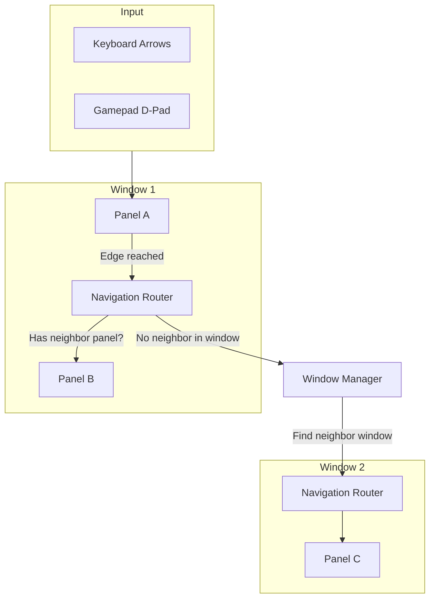

# Geometric Navigation

One of the greatest challenges in game UI development is **Controller Support**.

In a standard UMG layout, you can use Unreal’s built-in navigation (Up, Down, Left, Right). However, that system falls apart as soon as you introduce **Floating Windows**.

* What if Windows overlap?
* What if a Window is slightly higher than its neighbor?
* What if you want to navigate from a grid in Window A to a button in Window B?

Unreal’s default focus system doesn't know about these spatial relationships. To solve this, we built a **Geometric Navigation Engine**.

### The Philosophy: "Eyes, not Indices"

Instead of relying on hardcoded tab-indices or explicit "Up/Down" links, this system "looks" at the screen. It treats your UI as a 2D map and calculates the best neighbor based on **Geometry**.

#### Why Built-in Navigation Fails

Imagine two windows side-by-side. The Inventory window is 10 pixels higher than the Chest window. If you press "Right," UMG’s default logic might fail to find the neighbor because their centers don't align perfectly.

#### Why Geometric Navigation Wins

Our system uses a **Perpendicular Overlap** algorithm. It asks: _"If I am moving Right, which panel has the most vertical overlap with my current position and is the shortest distance away?"_ This makes navigation feel intuitive, "sticky," and professional—similar to the cursor logic found in high-budget RPGs like _Destiny_ or _The Division_.

### The Architecture

The system is split into two layers to handle both "Internal" and "External" movement.

#### 1. The Local Brain: The Router (`LyraNavigationRouter`)

Every window has its own **Router**. Its job is to manage movement between the different **Panels** _inside_ that window. It doesn't know about the rest of the game; it only cares about its local "neighborhood."

#### 2. The Global Bridge: The Window Manager

When a Router reaches its own edge (e.g., you are at the far right of the Inventory) and can't find a local neighbor, it calls the **Window Manager**. The Manager then searches for a different **Window** in that direction and hands off the focus.

### Core Concepts

Before diving in, you must understand the three primary components of this chapter:

* **The Panel:** A specific interactive zone (e.g., a Grid, a Header, a Footer). This is the unit of navigation.
* **The Edge Hit:** An event that occurs when a player tries to navigate "past" the boundary of their current panel.
* **The Entry Provider:** An interface (`INavigationEntryProvider`) that allows panels to "Snap" the cursor to the best logical spot (e.g., snapping to the nearest row when entering a grid).

### In This Section

We will explore the math and the implementation of this system:

* **Routers & Panels**
  * The hierarchy of focus.
  * How to register your UI zones with the Router.
* **The Geometric Algorithm**
  * Deep dive into `FindGeometricNeighbor`.
  * How we score distance vs. alignment.
* **Edge Hits & Wrapping**
  * Handling the "Boundaries" of your UI.
  * Configuring "Wrap-Around" logic (Left to Right).
* **Precision Snapping**
  * Using `INavigationEntryProvider` to make grids feel perfect.
  * The difference between "Promiscuous" and "Aligned" entry.
* **Cross-Window Traversal**
  * How the Window Manager bridges the gap between disconnected UI.
