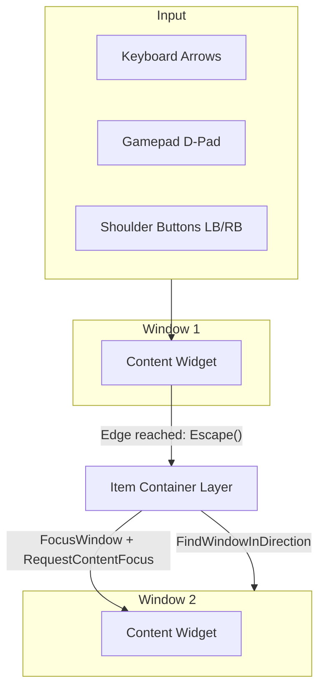

# Geometric Navigation

One of the greatest challenges in game UI development is **Controller Support**.

In a standard UMG layout, you can use Unreal's built-in navigation (Up, Down, Left, Right). However, that system falls apart as soon as you introduce **Floating Windows**.

* What if Windows overlap?
* What if a Window is slightly higher than its neighbor?
* What if you want to navigate from a grid in Window A to a slot in Window B?

Unreal's default focus system doesn't know about these spatial relationships. To solve this, we built navigation directly into the **Item Container Layer**.

### The Philosophy

Instead of relying on hardcoded tab-indices or explicit "Up/Down" links, this system "looks" at the screen. It treats your UI as a 2D map and calculates the best neighbor based on **Geometry**.

#### Why Built-in Navigation Fails

Imagine two windows side-by-side. The Inventory window is 10 pixels higher than the Chest window. If you press "Right," UMG's default logic might fail to find the neighbor because their centers don't align perfectly.

#### Why Geometric Navigation Wins

Our system uses a **spatial navigation algorithm.** It asks: _"If I am moving Right, which window's entry point is closest to my cursor's exit point, with a bonus for perpendicular alignment?"_ This makes navigation feel intuitive, "sticky," and professional, similar to the cursor logic found in high-budget RPGs like _Destiny_ or _The Division_.

### The Architecture

The system is built into the **Layer** which handles both internal content navigation and cross-window movement.

#### The Layer as Navigation Controller

The `LyraItemContainerLayer` intercepts navigation events from its child windows. When a content widget reaches its edge and returns `FNavigationReply::Escape()`, the Layer catches this in `NativeOnNavigation` and decides where focus should go next.

***

### How Navigation Works



#### Content Widget Navigation

Each content widget (list, tile view, tetris grid) handles its own internal navigation using UE's built-in focus system.



#### Edge Detection

When navigation reaches the edge of a content widget, it returns `FNavigationReply::Escape()`.



#### Layer Interception

The Layer's `NativeOnNavigation` catches escaped navigation events.



#### Geometric Search

The Layer uses `FindWindowInDirection()` to find the best target window based on screen position.



#### Focus Transfer

The Layer defers focus to the next frame via a next-tick timer, then calls `FocusWindow()` which triggers `Shell->RequestContentFocus()` on the target.



#### Cursor Alignment

Navigation context (direction and cursor position) is passed to the target window so it can align its cursor appropriately.



### Navigation Features

#### Cross-Window Edge Navigation

Press D-pad at the edge of a window to jump to the nearest window in that direction. The cursor position is preserved for natural alignment.

#### Window Cycling (Shoulder Buttons)

Press LB/RB to cycle through open windows by focus order. This provides quick access without needing to navigate through intermediate windows.

#### Auto-Focus on Window Open

When a window opens, it automatically receives focus on its content widget—no manual focus management required.

### Core Concepts

* **The Window**: A draggable shell containing a content widget. Windows track their screen geometry for navigation calculations.
* **The Content Widget**: The actual interactive content (ListView, TileView, Tetris Grid, etc.) that implements `ILyraItemContainerWindowContentInterface`.
* **The Edge Hit**: When navigation tries to move beyond a content widget's boundaries and triggers `Escape()`.
* **Cursor Alignment**: The system that preserves cursor position when moving between windows.

### Implementation Topics Covered

* [The Geometric Algorithm](geometric-algorithm.md)
  * Deep dive into `FindWindowInDirection`.
  * How we the algorithm handles distance, alignment, and overlap.
* [Cross-Window Navigation](cross-window-navigation.md)
  * How the Layer intercepts escaped navigation.
  * The deferred focus pattern and pending navigation context system.
* [Cursor Alignment](cursor-alignment.md)
  * Using `GetCursorScreenPosition` and `ReceiveNavigationEntry` to align cursors.
  * Screen coordinate translation between windows.
* [Window Cycling](window-cycling.md)
  * LB/RB shoulder button navigation.
  * Focus order tracking.
