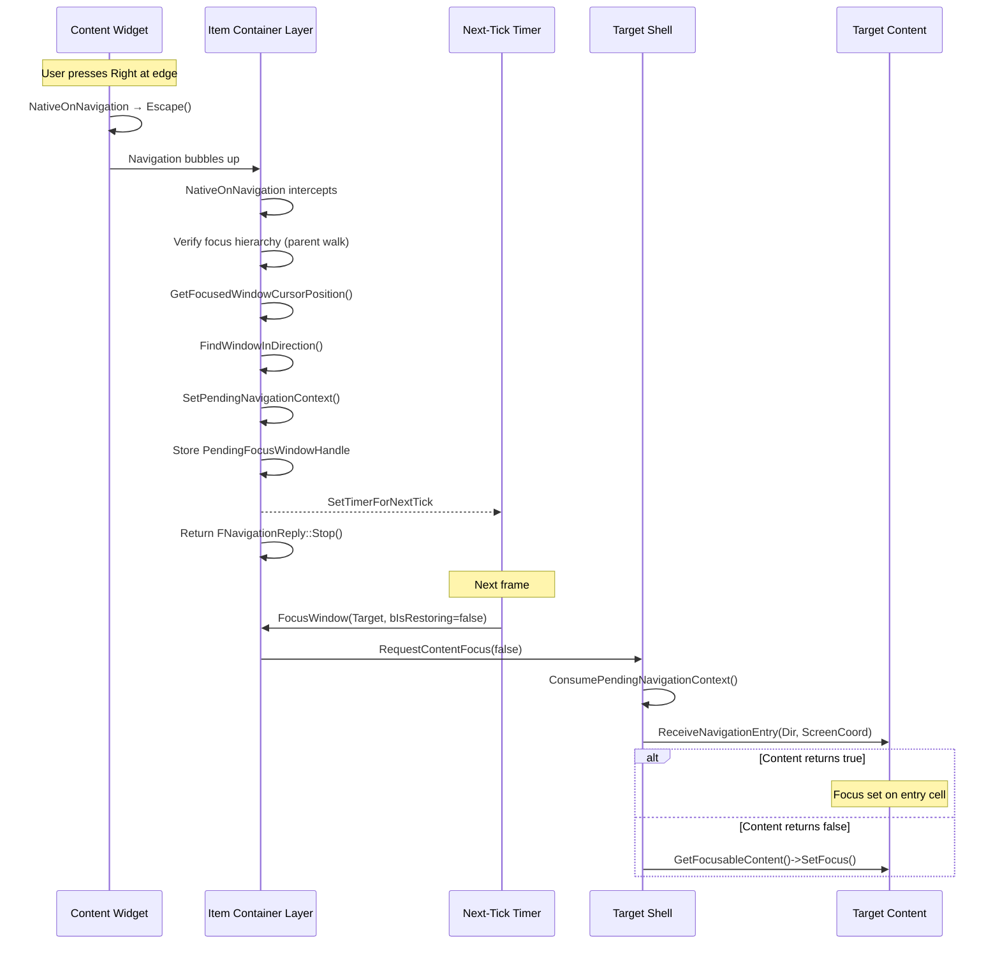

# Cross Window Navigation

When a user navigates to the edge of a window's content and tries to continue, the system must find the appropriate target window and transfer focus. This page explains how the **Layer** intercepts navigation events, finds the best neighbor using the [geometric scoring algorithm](geometric-algorithm.md), and bridges focus between windows using a **deferred focus pattern** that prevents double-processing.

### The Navigation Flow

The flow spans two frames. On the first frame, the Layer intercepts the escaped navigation event, finds the target, and schedules a deferred focus transfer. On the next frame, the timer fires, focus moves to the target, and the content positions its cursor.



### Layer Interception

The `LyraItemContainerLayer` overrides `NativeOnNavigation` to catch escaped navigation. Three mechanisms work together: a **focus hierarchy walk** to verify the event came from the right window, the **geometric scoring algorithm** to find the best target, and a **deferred focus transfer** to avoid double-processing.



```
NativeOnNavigation(Direction):

    // Only handle navigation that escaped from a focused window's content
    if no focused window OR navigation did not escape:
        return pass to Super

    // 1. Focus Hierarchy Walk
    //    Walk up the Slate parent chain from the currently focused widget.
    //    If it is not inside the focused window's shell, focus has drifted
    //    (e.g., to a popup).
    if FocusedWidget is not inside FocusedShell's hierarchy:
        return pass to Super

    // 2. Geometric Search
    CursorScreenPos = GetFocusedWindowCursorPosition()
    Target = FindWindowInDirection(FocusedWindow, Direction, CursorScreenPos)

    if Target found:
        // Store navigation context for cursor alignment on the other side
        SetPendingNavigationContext(Direction, CursorScreenPos)

        // 3. Deferred Focus Transfer
        //    Schedule focus for next tick — calling SetFocus() mid-event
        //    would cause Slate to route the same event to the new target.
        PendingFocusWindow = Target
        ScheduleForNextTick → FocusWindow(PendingFocusWindow)

        return Stop   // handled

    // No target in this direction — keep focus where it is
    return Stop
```



```cpp
FNavigationReply ULyraItemContainerLayer::NativeOnNavigation(
    const FGeometry& MyGeometry,
    const FNavigationEvent& InNavigationEvent,
    const FNavigationReply& InDefaultReply)
{
    if (FocusedWindowId.IsValid() &&
        InDefaultReply.GetBoundaryRule() == EUINavigationRule::Escape)
    {
        // 1. Focus Hierarchy Walk
        //    Verify that Slate's focused widget is actually inside the
        //    focused window's shell hierarchy. If focus has drifted
        //    (e.g., to a popup or action menu), fall through to Super.
        ULyraItemContainerWindowShell* FocusedShell = ActiveWindows.FindRef(FocusedWindowId);
        if (FocusedShell)
        {
            TSharedPtr<SWidget> FocusedSlateWidget =
                FSlateApplication::Get().GetUserFocusedWidget(0);

            bool bFocusInWindow = false;
            if (FocusedSlateWidget.IsValid())
            {
                TSharedPtr<SWidget> ShellSlateWidget = FocusedShell->GetCachedWidget();
                if (ShellSlateWidget.IsValid())
                {
                    TSharedPtr<SWidget> Parent = FocusedSlateWidget;
                    while (Parent.IsValid())
                    {
                        if (Parent == ShellSlateWidget)
                        {
                            bFocusInWindow = true;
                            break;
                        }
                        Parent = Parent->GetParentWidget();
                    }
                }
            }

            if (!bFocusInWindow)
            {
                return Super::NativeOnNavigation(
                    MyGeometry, InNavigationEvent, InDefaultReply);
            }
        }

        // 2. Geometric Search
        FVector2D CursorScreenPos = GetFocusedWindowCursorPosition();

        FItemWindowHandle Target = FindWindowInDirection(
            FItemWindowHandle(FocusedWindowId),
            InNavigationEvent.GetNavigationType(),
            CursorScreenPos);

        if (Target.IsValid())
        {
            SetPendingNavigationContext(
                InNavigationEvent.GetNavigationType(), CursorScreenPos);

            // 3. Deferred Focus Transfer
            //    Schedule focus for next tick to prevent Slate from
            //    routing the same navigation event to the new target.
            PendingFocusWindowHandle = Target;
            bPendingFocusIsRestoring = false;

            if (UWorld* World = GetWorld())
            {
                DeferredFocusTimerHandle =
                    World->GetTimerManager().SetTimerForNextTick(
                        FTimerDelegate::CreateWeakLambda(this, [this]()
                        {
                            if (PendingFocusWindowHandle.IsValid())
                            {
                                FocusWindow(PendingFocusWindowHandle,
                                    bPendingFocusIsRestoring);
                                PendingFocusWindowHandle = FItemWindowHandle();
                            }
                        })
                    );
            }

            return FNavigationReply::Stop();
        }

        // No target found - keep focus on current window
        return FNavigationReply::Stop();
    }

    return Super::NativeOnNavigation(
        MyGeometry, InNavigationEvent, InDefaultReply);
}
```



The three key elements:



**Focus Hierarchy Walk**

Before acting on the event, the Layer walks up the Slate parent chain from the currently focused widget to verify it lives inside the focused window's shell hierarchy. If focus has drifted elsewhere, for example, to an action menu or quantity prompt, the Layer does not attempt cross-window navigation.



**Geometric Search**

`FindWindowInDirection` evaluates all candidate windows using the [geometric scoring algorithm](geometric-algorithm.md). It filters by direction (edge-to-edge), scores by exit/entry point distance and perpendicular overlap, and returns the best-scoring target.



**Deferred Focus (Next-Tick Timer)**

Instead of calling `FocusWindow()` immediately, the Layer stores `PendingFocusWindowHandle` and schedules a timer for the next tick. This is critical, if `SetFocus()` were called during the same navigation event, Slate would route the **same event** to the newly-focused widget, causing a "double-hop" where focus skips through two windows in a single press. By deferring to the next frame, the navigation event is fully consumed before focus changes.

The Layer always returns `FNavigationReply::Stop()`, whether or not a target was found. This prevents focus from escaping the Layer entirely, if there is no valid target in the navigation direction, focus simply stays on the current window.




**Why not just call FocusWindow() directly?** When `SetFocus()` is called mid-navigation-event, Slate sees the new widget as "focused" and routes the same in-flight navigation event to it. The target widget's `NativeOnNavigation` fires with the same direction, and if it also escapes, navigation continues chain-hopping across windows in a single frame. The next-tick timer breaks this chain by letting the current event complete before focus transfers.


### The Pending Navigation Context

When transferring focus between windows, we need to preserve information about where navigation came from so the target can align its cursor appropriately. The Layer stores three values as **pending navigation context**: the navigation direction, the cursor's screen position, and a flag indicating that context is available.

Before scheduling the deferred focus, the Layer writes all three values. Then, when the target window's shell receives focus on the next frame, it consumes the pending context, reading the stored direction and cursor position, then clearing all three fields so the context is only used once. If no context was pending, consumption returns false and the shell falls back to default focus behavior.

### Focus Transfer

When the deferred timer fires and `FocusWindow()` is called on the target, the shell's `RequestContentFocus` handles three distinct paths:



```
RequestContentFocus(bIsRestoringFocus):

    // Path 1: Restoring focus (e.g., after action menu closes)
    // Cursor is already positioned — just restore keyboard focus.
    if bIsRestoringFocus:
        GetFocusableContent().SetFocus()
        return

    // Path 2: Navigation with content handling
    if Layer has pending navigation context:
        consume Direction and CursorPos from Layer
        ScreenCoord = CursorPos.Y (for Left/Right) or CursorPos.X (for Up/Down)

        if ContentWidget implements the interface:
            handled = ContentWidget.ReceiveNavigationEntry(Direction, ScreenCoord)
            if handled: return   // content positioned cursor and called SetFocus

    // Path 3: Fallback chain
    FocusTarget = GetFocusableContent()

    if FocusTarget is different from ContentWidget AND has pending context:
        if FocusTarget implements the interface:
            handled = FocusTarget.ReceiveNavigationEntry(Direction, ScreenCoord)
            if handled: return

    // Final fallback — nothing handled navigation
    FocusTarget.SetFocus()
```



```cpp
void ULyraItemContainerWindowShell::RequestContentFocus(bool bIsRestoringFocus)
{
    // Path 1: Restoring focus (e.g., after pop menu closes)
    // Skip navigation handling — cursor is already positioned correctly.
    if (bIsRestoringFocus)
    {
        if (UWidget* FocusTarget = GetFocusableContent())
        {
            FocusTarget->SetFocus();
        }
        return;
    }

    bool bNavigationHandledFocus = false;
    bool bHasPendingNavContext = false;
    EUINavigation PendingDirection = EUINavigation::Invalid;
    float PendingScreenCoord = 0.0f;

    // Path 2: Navigation with content handling
    if (ULyraItemContainerLayer* Layer = OwningLayer.Get())
    {
        FVector2D CursorPos;
        if (Layer->ConsumePendingNavigationContext(PendingDirection, CursorPos))
        {
            bHasPendingNavContext = true;
            PendingScreenCoord =
                (PendingDirection == EUINavigation::Left ||
                 PendingDirection == EUINavigation::Right)
                    ? CursorPos.Y   // Horizontal nav: use Y coordinate
                    : CursorPos.X;  // Vertical nav: use X coordinate

            if (UWidget* Content = ContentWidget.Get())
            {
                if (Content->Implements<ULyraItemContainerWindowContentInterface>())
                {
                    bNavigationHandledFocus =
                        ILyraItemContainerWindowContentInterface::
                            Execute_ReceiveNavigationEntry(
                                Content, PendingDirection, PendingScreenCoord);
                }
            }
        }
    }

    // Path 3: Fallback chain
    if (!bNavigationHandledFocus)
    {
        UWidget* FocusTarget = GetFocusableContent();

        // If FocusableContent differs from ContentWidget, try navigation on it too
        if (bHasPendingNavContext && FocusTarget && FocusTarget != ContentWidget.Get())
        {
            if (FocusTarget->Implements<ULyraItemContainerWindowContentInterface>())
            {
                bNavigationHandledFocus =
                    ILyraItemContainerWindowContentInterface::
                        Execute_ReceiveNavigationEntry(
                            FocusTarget, PendingDirection, PendingScreenCoord);
            }
        }

        // Final fallback: plain SetFocus
        if (!bNavigationHandledFocus && FocusTarget)
        {
            FocusTarget->SetFocus();
        }
    }
}
```



The three paths in order:



**Path 1: Restoring Focus**

When `bIsRestoringFocus` is true, typically after an action menu or quantity prompt closes, the shell simply calls `SetFocus()` on `GetFocusableContent()` without consuming any navigation context. The cursor is already positioned correctly from the previous interaction; this just restores keyboard focus.



**Path 2: Navigation with Content Handling**

During cross-window navigation, the shell consumes the pending context and calls `ReceiveNavigationEntry` on the `ContentWidget`. The perpendicular screen coordinate is extracted from the cursor position (Y for horizontal navigation, X for vertical). If the content returns `true`, it has already positioned its cursor and called `SetFocus()` internally, the shell is done.



**Path 3: Fallback Chain**

If `ContentWidget` did not handle navigation (returned `false` or does not implement the interface), the shell tries `GetFocusableContent()`. If that returns a **different** widget that also implements the interface, `ReceiveNavigationEntry` is tried on it as well. If nothing handles navigation, the shell falls back to a plain `SetFocus()` on `GetFocusableContent()`.

This fallback chain ensures that simple content widgets that do not implement cursor alignment still receive focus correctly.




**The `bool` return value matters.** `ReceiveNavigationEntry` returning `true` means the content widget has already called `SetFocus()` on the appropriate internal widget (e.g., a grid cell). Returning `false` triggers the fallback chain. If your content always handles navigation entry, always return `true`.


### Why This Design?

#### Decoupling

Content widgets don't need to know about other windows or the Layer. They simply:

* Return `FNavigationReply::Escape()` when navigation hits their edge.
* Implement `ReceiveNavigationEntry()` to handle incoming focus and return whether they handled it.

#### Flexibility

Because the Layer intercepts all escaped navigation, you can:

* Add new window types without changing navigation code.
* Drag windows anywhere and navigation automatically adapts.
* Have different content widget types (lists, grids, custom) all participating in the same navigation system.

#### Robustness

The focus hierarchy walk prevents stale `FocusedWindowId` from causing misbehavior. If focus has drifted to a popup or external widget, the Layer gracefully falls through to `Super`. The deferred focus timer prevents double-processing during the same frame. And the fallback chain in `RequestContentFocus` ensures focus always lands somewhere sensible, even when content does not implement the navigation interface.

#### Predictability

The pending context system ensures that cursor alignment is preserved across the focus transfer, even though an entire frame passes between setting and consuming the context.

### Integration Checklist



**Implement `GetFocusableContent()`**

Return the default widget that should receive focus. Useful for controllers when the window is first created. When navigated from another window, this function will only be called if `ReceiveNaivgationEntry` is not implemented.



**Implement `GetCursorScreenPosition()` (optional)**

Return the current cursor's screen position for alignment when leaving this window.



**Implement `ReceiveNavigationEntry()` (optional)**

Position your cursor appropriately when receiving focus from another window. Return `true` if you handled focus and called `SetFocus()` internally. Return `false` to let the shell handle focus via the fallback chain.


