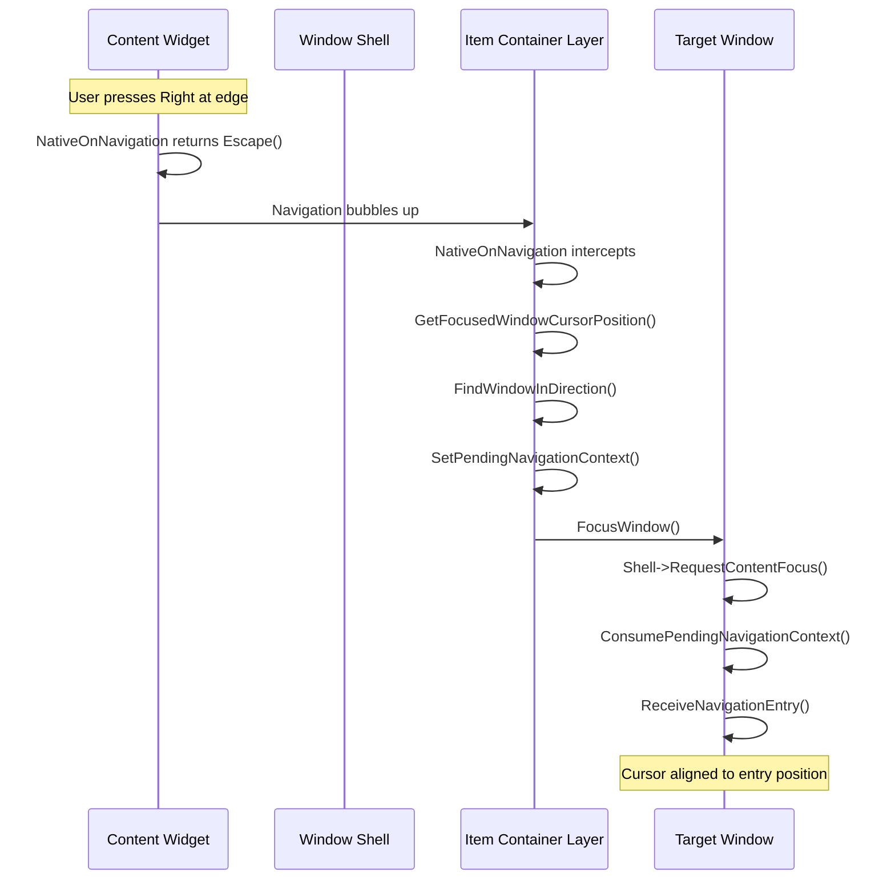

# Cross Window Navigation

When a user navigates to the edge of a window's content and tries to continue, the system must find the appropriate target window and transfer focus. This page explains how the **Layer** intercepts navigation events and bridges focus between windows.

### The Navigation Flow



### Layer Interception

The `LyraItemContainerLayer` overrides `NativeOnNavigation` to catch escaped navigation:

```cpp
FNavigationReply ULyraItemContainerLayer::NativeOnNavigation(
    const FGeometry& MyGeometry,
    const FNavigationEvent& InNavigationEvent,
    const FNavigationReply& InDefaultReply)
{
    // Only intercept if navigation is escaping from a focused window
    if (FocusedWindowId.IsValid() &&
        InDefaultReply.GetBoundaryRule() == EUINavigationRule::Escape)
    {
        // Get current cursor position for alignment
        FVector2D CursorScreenPos = GetFocusedWindowCursorPosition();

        // Find target window in direction
        FItemWindowHandle Target = FindWindowInDirection(
            FItemWindowHandle(FocusedWindowId),
            InNavigationEvent.GetNavigationType(),
            CursorScreenPos);

        if (Target.IsValid())
        {
            // Store context for cursor alignment
            SetPendingNavigationContext(
                InNavigationEvent.GetNavigationType(),
                CursorScreenPos);

            // Transfer focus
            FocusWindow(Target);
            return FNavigationReply::Stop();
        }
    }

    return Super::NativeOnNavigation(MyGeometry, InNavigationEvent, InDefaultReply);
}
```

### The Pending Navigation Context

When transferring focus between windows, we need to preserve information about where navigation came from so the target can align its cursor appropriately.

The Layer stores this as **pending navigation context**:

```cpp
// In LyraItemContainerLayer.h
EUINavigation PendingNavDirection = EUINavigation::Invalid;
FVector2D PendingNavCursorPosition = FVector2D::ZeroVector;
bool bHasPendingNavContext = false;
```

#### Setting the Context

Before calling `FocusWindow()`, the Layer stores the navigation direction and cursor screen position:

```cpp
void ULyraItemContainerLayer::SetPendingNavigationContext(
    EUINavigation Direction,
    FVector2D CursorPos)
{
    PendingNavDirection = Direction;
    PendingNavCursorPosition = CursorPos;
    bHasPendingNavContext = true;
}
```

#### Consuming the Context

When the target window's shell receives focus, it consumes the pending context:

```cpp
bool ULyraItemContainerLayer::ConsumePendingNavigationContext(
    EUINavigation& OutDirection,
    FVector2D& OutCursorPos)
{
    if (!bHasPendingNavContext)
    {
        return false;
    }

    OutDirection = PendingNavDirection;
    OutCursorPos = PendingNavCursorPosition;

    // Clear pending state
    bHasPendingNavContext = false;
    PendingNavDirection = EUINavigation::Invalid;
    PendingNavCursorPosition = FVector2D::ZeroVector;

    return true;
}
```

### Focus Transfer

When `FocusWindow()` is called on the target window:

1. **Z-Order Update**: The window is brought to front by updating its focus timestamp.
2. **Content Focus**: `Shell->RequestContentFocus()` is called.
3. **Context Consumption**: The shell checks for pending navigation context.
4. **Entry Notification**: If context exists, `ReceiveNavigationEntry()` is called on the content widget.
5. **Widget Focus**: `SetFocus()` is called on the focusable content widget.

```cpp
void ULyraItemContainerWindowShell::RequestContentFocus()
{
    // Check for pending navigation context
    if (ULyraItemContainerLayer* Layer = OwningLayer.Get())
    {
        EUINavigation Direction;
        FVector2D CursorPos;
        if (Layer->ConsumePendingNavigationContext(Direction, CursorPos))
        {
            // Notify content of navigation entry
            if (UWidget* Content = ContentWidget.Get())
            {
                if (Content->Implements<ULyraItemContainerWindowContentInterface>())
                {
                    FIntPoint DirVector = DirectionToVector(Direction);
                    float ScreenCoord = GetPerpendicularCoordinate(Direction, CursorPos);

                    ILyraItemContainerWindowContentInterface::Execute_ReceiveNavigationEntry(
                        Content, DirVector, ScreenCoord);
                }
            }
        }
    }

    // Set focus on content
    if (UWidget* FocusTarget = GetFocusableContent())
    {
        FocusTarget->SetFocus();
    }
}
```

### Why This Design?

#### Decoupling

Content widgets don't need to know about other windows or the Layer. They simply:

* Return `FNavigationReply::Escape()` when navigation hits their edge.
* Implement `ReceiveNavigationEntry()` to handle incoming focus.

#### Flexibility

Because the Layer intercepts all escaped navigation, you can:

* Add new window types without changing navigation code.
* Drag windows anywhere and navigation automatically adapts.
* Have different content widget types (lists, grids, custom) all participating in the same navigation system.

#### Predictability

The pending context system ensures that cursor alignment is preserved across the focus transfer, even though multiple frames may pass between setting and consuming the context.

### Integration Checklist



#### Return Escape at edges

Implement `NativeOnNavigation` and return `FNavigationReply::Escape()` when navigation would leave your content area.



#### Implement `GetFocusableContent()`

Return the widget that should receive focus.



#### Implement `GetCursorScreenPosition()` (optional)

Return the current cursor's screen position for alignment when leaving this window.



#### Implement `ReceiveNavigationEntry()` (optional)

Position your cursor appropriately when receiving focus from another window.


