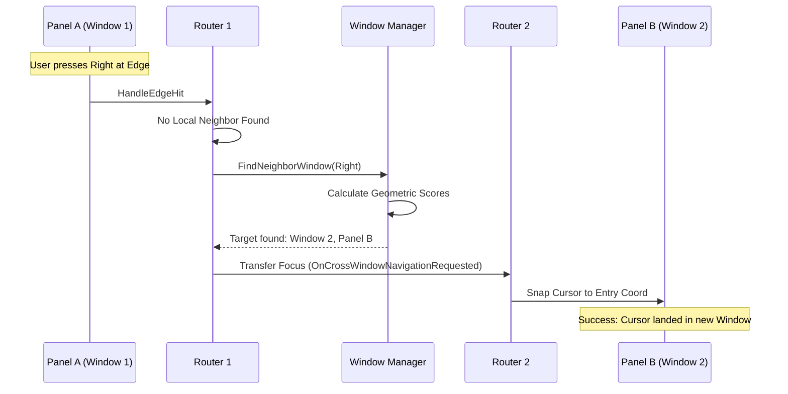

# Cross Window Traversal

In a modular UI, individual windows are isolated islands. An Inventory window has no idea that a Chest window exists 50 pixels to its right. If the Inventory tried to manage these links manually, your code would become a tangled web of hardcoded pointers.

**Cross-Window Traversal** is the process of building a "bridge" between these islands dynamically, using the **Window Manager** as the portal.

### The Escalation Flow

When a player presses a navigation key (e.g., **Right**), the system follow a specific hierarchy of checks. We call this the **Escalation Path**.

1. **Local Check:** The `NavigationRouter` looks for another **Panel** _inside_ the current window.
2. **Global Escalation:** If no panel is found, the Router says: _"I've hit my edge. Window Manager, is there anywhere else to go?"_
3. **Global Search:** The Window Manager looks at the screen geometry of every other open window.
4. **Handoff:** If a neighbor window is found, the focus is "teleported" from the source Router to the target Router.

### The Handoff Mechanics

This handoff is not just a simple focus swap. To make the movement feel smooth, the system must translate coordinates between different coordinate systems.

#### 1. Translation (Local -> Absolute)

The source window takes the cursor's **Window-Local** position and converts it to **Absolute Screen Space**. This is the only way the Window Manager can compare it against other windows.

#### 2. The Search

The Window Manager uses the Geometric Algorithm (Distance + Overlap) to find the best candidate window in the requested direction.

#### 3. The Suggested Landing (`OutTargetPanelType`)

Once a target window is found, we don't want to just "guess" where to land. The Window Manager uses a **Heuristic** to suggest the best entry point:

* **If moving Right:** It looks for the panel on the **Left** edge of the target window.
* **If moving Down:** It looks for the panel on the **Top** edge.

```cpp
// Window Manager Logic
ULyraNavigationRouter* NeighborRouter = WindowManager->FindNeighborWindow(
    SourceWindowId, 
    Direction, 
    OutTargetPanelType // The suggested panel to land on
);
```

#### 4. Acceptance (Absolute -> Local)

The target window receives the focus request along with the **Absolute Entry Coordinate**. It converts that coordinate back into its own **Local Space** and uses Precision Snapping to place the cursor on the correct slot.

### Why This Matters: Total Decoupling

The beauty of this system is that **Windows are completely unaware of each other.**

* You can drag Window A to the other side of Window B, and the navigation will **automatically invert**.
* You can close Window B, and the system will simply look past it to find Window C.
* You can add a third-party plugin that adds a "Mini-Map" window, and as long as it registers with the Window Manager, you can navigate into it instantly without writing a single line of integration code.

### Visualizing the Bridge



### Developer Summary

By delegating cross-window logic to the Window Manager, we solve the "n+1" problem of UI complexity. No matter how many windows you open, the navigation cost stays constant, and the user experience remains fluid.
