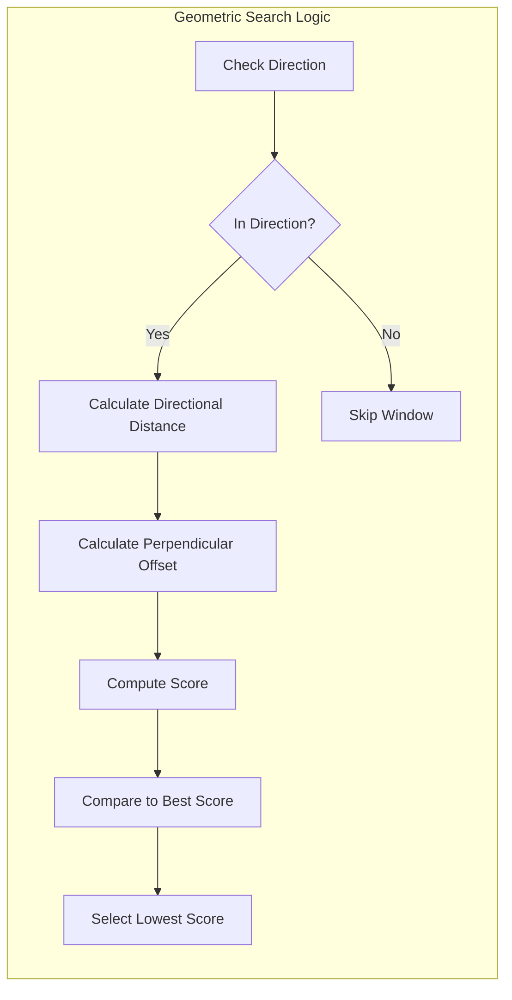

# Geometric Algorithm

At the heart of cross-window navigation is the **Geometric Neighbor Search** implemented in `LyraItemContainerLayer::FindWindowInDirection`. While standard UMG navigation relies on simple center-to-center proximity, our algorithm uses a "Directional Lane" approach. This ensures that focus moves in a way that feels predictable and "aligned" to the human eye.

### The Concept: Navigation Lanes

Imagine your UI as a series of lanes on a highway. When you press **Right**, you aren't just looking for the closest window; you are looking for the best window that sits in your current "Lane."



#### Direction Filtering

The algorithm first filters candidate windows to only include those actually in the requested direction.

* Moving Right: Only consider windows whose left edge is to the right of the source window's right edge.
* Moving Left: Only consider windows whose right edge is to the left of the source window's left edge.
* Moving Up/Down: Similar logic for vertical movement.

A small threshold (50 pixels) is used to handle edge cases where windows are nearly aligned.



#### Perpendicular Overlap

The algorithm then checks if a candidate window overlaps with the cursor position along the axis perpendicular to movement.

* Moving Horizontal (Left/Right): Does the candidate window share any vertical space with the cursor's Y position?
* Moving Vertical (Up/Down): Does the candidate window share any horizontal space with the cursor's X position?

If they overlap, they are considered **Direct Neighbors**. If they don't overlap (e.g., a window shifted slightly higher or lower), they are **Diagonal Neighbors**.



### The Scoring Formula

To decide between multiple candidates, the Layer calculates a **Cost Score**. The window with the **lowest** score wins.

```cpp
Score = DirectionalDistance + (PerpendicularOffset * 0.5f)
```

#### Directional Distance

We measure the gap between the boundaries in the direction of movement.

* If moving Right, we measure from the source window's right edge to the candidate's left edge.
* This is crucial for windows of varying sizes; it ensures that a massive window doesn't "hog" focus just because its center is technically closer.

#### Perpendicular Offset (Alignment Penalty)

We penalize windows that are offset from the cursor's current position.

* A window that perfectly aligns with your cursor's row or column gets no penalty.
* Windows that are offset get a penalty proportional to the distance from the cursor.
* The 0.5 multiplier makes perpendicular offset less important than direct distance.

The Result: A directly aligned window further away will beat a closer window that's significantly offset. This creates the "sticky lane" feeling.

***

### The Implementation

```cpp
FItemWindowHandle ULyraItemContainerLayer::FindWindowInDirection(
    FItemWindowHandle FromWindow,
    EUINavigation Direction,
    FVector2D CursorScreenPos) const
{
    float BestScore = FLT_MAX;
    FItemWindowHandle BestTarget;

    for (const auto& Pair : ActiveWindows)
    {
        if (Pair.Key == FromWindow.WindowId) continue;

        ULyraItemContainerWindowShell* CandidateShell = Pair.Value;
        FGeometry CandidateGeom = CandidateShell->GetCachedGeometry();
        FVector2D CandidatePos = CandidateGeom.GetAbsolutePosition();
        FVector2D CandidateSize = CandidateGeom.GetAbsoluteSize();

        // Check if candidate is in the correct direction
        // Calculate distance and perpendicular offset
        // Score = DirectionalDistance + (PerpendicularOffset * 0.5f)

        if (Score < BestScore)
        {
            BestScore = Score;
            BestTarget = FItemWindowHandle(Pair.Key);
        }
    }

    return BestTarget;
}
```

***

### Visualizing the Search



### Developer Tips for Debugging



#### Check Window Geometry

Windows must have valid cached geometry. If a window was just created, its geometry might not be available until the next frame.



#### Inspect Cursor Position

The `CursorScreenPos` used for scoring comes from `GetFocusedWindowCursorPosition()`, which queries the content widget's `GetCursorScreenPosition()` interface method.



#### Check Direction Threshold

Windows that are almost aligned might be filtered out. The 50-pixel threshold handles most cases, but extremely narrow windows might need adjustment.



By using physical geometry rather than hardcoded links, the navigation system remains robust even if you dynamically move or resize windows at runtime. Drag a window to a new position, and navigation automatically adapts.
