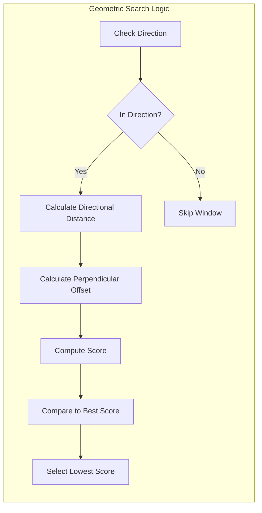

# Geometric Algorithm

At the heart of cross-window navigation is the **Geometric Neighbor Search** implemented in `LyraItemContainerLayer::FindWindowInDirection`. While standard UMG navigation relies on simple center-to-center proximity, the algorithm uses a "Directional Lane" approach. This ensures that focus moves in a way that feels predictable and "aligned" to the human eye.

### The Concept: Navigation Lanes

Imagine your UI as a series of lanes on a highway. When you press **Right**, you aren't just looking for the closest window; you are looking for the best window that sits in your current "Lane."



**Direction Filtering**

The algorithm first filters candidate windows to only include those actually in the requested direction.

* Moving Right: Only consider windows whose left edge is to the right of the **cursor position** by more than the threshold.
* Moving Left: Only consider windows whose right edge is to the left of the cursor position by more than the threshold.
* Moving Up: Only consider windows whose bottom edge is above the cursor position by more than the threshold.
* Moving Down: Only consider windows whose top edge is below the cursor position by more than the threshold.

A threshold of 50 pixels prevents accidental selection of nearly-aligned windows. This cursor-based approach means navigation "starts" from where your selection is, not from the window boundary.



**Scoring Alignment**

After filtering to valid candidates, the algorithm scores each window based on two factors:

* **Directional Distance**: Distance from the cursor to the target window's center along the navigation axis.
* **Perpendicular Offset**: Distance from the cursor to the target window's center perpendicular to navigation.

Both measurements use the target's **center point**, not its edges. This ensures consistent scoring regardless of window size.



### The Scoring Formula

To decide between multiple candidates, the Layer calculates a **Cost Score**. The window with the **lowest** score wins.

```cpp
Score = DirectionalDistance + (PerpendicularOffset * 0.5f)
```

#### Directional Distance

We measure the distance from the cursor position to the target window's **center** along the movement axis.

* If moving Right, we measure `TargetCenterX - CursorX`.
* If moving Left, we measure `CursorX - TargetCenterX`.

**Important**: The direction _validation_ uses edge-to-cursor distance, but the _scoring_ uses center-to-cursor distance. This distinction prevents large windows from getting unfair advantage just because their edge is closer.

#### Perpendicular Offset (Alignment Penalty)

We penalize windows that are offset from the cursor's current position.

* A window that perfectly aligns with your cursor's row or column gets no penalty.
* Windows that are offset get a penalty proportional to the distance from the cursor.
* The 0.5 multiplier makes perpendicular offset less important than direct distance.

The Result: A directly aligned window further away will beat a closer window that's significantly offset. This creates the "sticky lane" feeling.

***

### The Implementation


```cpp
FItemWindowHandle ULyraItemContainerLayer::FindWindowInDirection(
    FItemWindowHandle FromWindow,
    EUINavigation Direction,
    FVector2D CursorScreenPos) const
{
    FItemWindowHandle BestTarget;
    float BestScore = TNumericLimits<float>::Max();

    for (const auto& Pair : ActiveWindows)
    {
        if (Pair.Key == FromWindow.WindowId) continue;

        ULyraItemContainerWindowShell* TargetShell = Pair.Value;
        if (!TargetShell || !TargetShell->GetFocusableContent()) continue;

        const FGeometry& TargetGeom = TargetShell->GetCachedGeometry();
        const FVector2D TargetPos = TargetGeom.GetAbsolutePosition();
        const FVector2D TargetSize = TargetGeom.GetAbsoluteSize();
        const FVector2D TargetCenter = TargetPos + TargetSize * 0.5f;

        // Delta from cursor to target center (for scoring)
        const FVector2D DeltaToCenter = TargetCenter - CursorScreenPos;

        float DeltaToEdge = 0.0f;
        bool bValidDirection = false;
        float DirectionalDistance = 0.0f;
        float PerpendicularDistance = 0.0f;

        constexpr float DirectionThreshold = 50.0f;

        switch (Direction)
        {
        case EUINavigation::Right:
            // Validate: target's LEFT edge must be right of cursor
            DeltaToEdge = TargetPos.X - CursorScreenPos.X;
            bValidDirection = DeltaToEdge > DirectionThreshold;
            // Score: distance to center
            DirectionalDistance = DeltaToCenter.X;
            PerpendicularDistance = FMath::Abs(DeltaToCenter.Y);
            break;
        case EUINavigation::Left:
            DeltaToEdge = (TargetPos.X + TargetSize.X) - CursorScreenPos.X;
            bValidDirection = DeltaToEdge < -DirectionThreshold;
            DirectionalDistance = -DeltaToCenter.X;
            PerpendicularDistance = FMath::Abs(DeltaToCenter.Y);
            break;
        // Up/Down follow the same pattern for Y axis
        }

        if (bValidDirection)
        {
            const float Score = DirectionalDistance + PerpendicularDistance * 0.5f;
            if (Score < BestScore)
            {
                BestScore = Score;
                BestTarget = FItemWindowHandle(Pair.Key);
            }
        }
    }

    return BestTarget;
}
```


### Two-Step Approach: Validation vs Scoring

The algorithm separates **direction validation** from **scoring**:



#### Validation

Uses the target's closest edge to check if it's actually in the navigation direction. This prevents windows that extend back past the cursor from being considered.



#### Scoring

Uses the target's center to rank candidates. Using the center ensures large windows don't get unfair advantage just because their edge is closer.



***

### Visualizing the Search



### Developer Tips for Debugging



**Check Window Geometry**

Windows must have valid cached geometry. If a window was just created, its geometry might not be available until the next frame.



**Inspect Cursor Position**

The `CursorScreenPos` used for scoring comes from `GetFocusedWindowCursorPosition()`, which queries the content widget's `GetCursorScreenPosition()` interface method.



**Check Direction Threshold**

Windows that are almost aligned might be filtered out. The 50-pixel threshold handles most cases, but extremely narrow windows might need adjustment.



By using physical geometry rather than hardcoded links, the navigation system remains robust even if you dynamically move or resize windows at runtime. Drag a window to a new position, and navigation automatically adapts.
