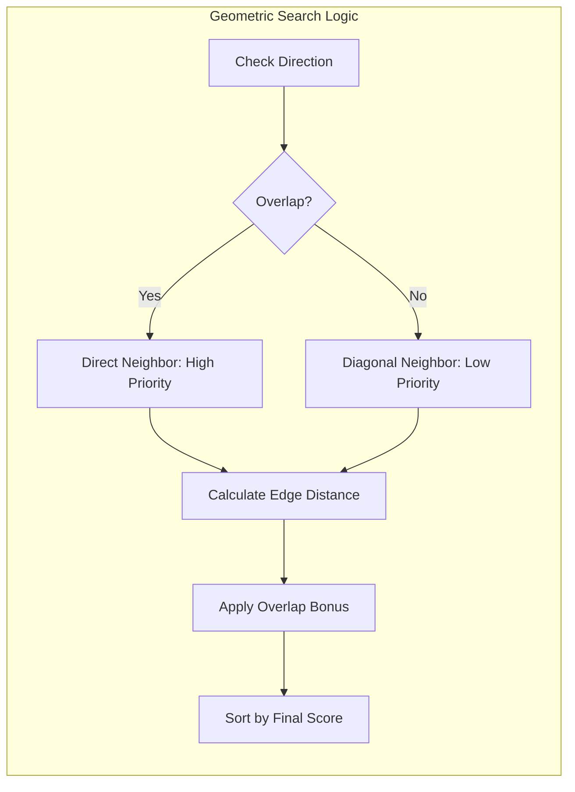

# Geometric Algorithm

At the heart of the Navigation Router is the **Geometric Neighbor Search**. While standard UMG navigation relies on simple center-to-center proximity, our algorithm uses a "Directional Lane" approach. This ensures that the cursor moves in a way that feels predictable and "aligned" to the human eye.

### The Concept: Navigation Lanes

Imagine your UI as a series of lanes on a highway. When you press **Right**, you aren't just looking for the closest object; you are looking for the best object that sits in your current "Lane."

#### 1. Perpendicular Overlap

The algorithm first checks if a candidate panel overlaps with the source panel along the axis perpendicular to your movement.

* **Moving Horizontal (Left/Right):** Does the candidate share any vertical space (Y-axis) with the source?
* **Moving Vertical (Up/Down):** Does the candidate share any horizontal space (X-axis) with the source?

If they overlap, they are considered **Direct Neighbors**. If they don't overlap (e.g., a panel shifted slightly higher or lower), they are **Diagonal Neighbors**.

### The Scoring Formula

To decide between multiple candidates, the Router calculates a **Cost Score**. The panel with the **lowest** score wins.

$$Score = Distance - (Overlap \times 0.5)$$

#### Distance (Edge-to-Edge)

We measure the gap between the boundaries of the panels, not their centers.

* If moving Right, we measure from the `Source.Right` to the `Candidate.Left`.
* This is crucial for windows of varying sizes; it ensures that a massive panel doesn't "hog" focus just because its center is technically closer.

#### Overlap (The "Alignment Bonus")

We reward panels that line up with the player's current position.

* A panel that perfectly aligns with your current row or column gets a massive reduction in cost.
* This creates a "sticky" feeling—the cursor naturally wants to stay within its current lane unless the player makes a deliberate effort to move to a different row.

***

### The Tie-Breaker: Precision Quality

In complex UIs like a **Tetris Grid**, multiple panels might be at the exact same distance. To solve this, we introduce **Alignment Quality**.

1. **Perfect Match (1.0):** The target has a slot that lines up exactly with your current row/column.
2. **Snapped Match (0.1 - 0.9):** The target is slightly offset, but we can "snap" the cursor to the nearest logical spot.
3. **Default (0.5):** A generic panel (like a button) that accepts focus from anywhere.

**The Golden Rule:** A perfectly aligned panel 50 pixels away will beat a non-aligned panel 10 pixels away. This prevents the "zig-zag" cursor behavior common in many game UIs.

***

### Visualizing the Search

### Developer Tips for Debugging

If you find that the cursor is "skipping" a panel or jumping to the wrong place:

1. **Check Geometry:** Ensure `UpdatePanelGeometry` is being called. If the Router thinks a panel is at `(0,0)`, it will never find it.
2. **Inspect Overlap:** Is the panel slightly too high or too low? A 1-pixel gap can turn a "Direct Neighbor" into a "Diagonal Neighbor," drastically changing its score.
3. **Check Lanes:** If you have a very narrow panel, it might be hard to hit from a wider panel. You can use **Route Overrides** (explained in the next section) to manually "force" a connection in tricky layouts.

By using physical geometry rather than a list of indices, the navigation system remains robust even if you dynamically move or resize panels at runtime.
