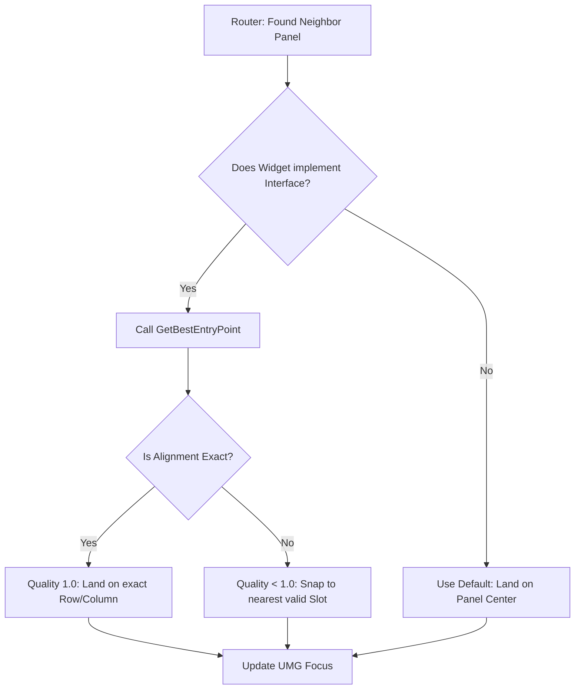

# Precision Snapping

When you navigate between a simple button and a massive 100-slot inventory grid, the system faces a logical dilemma: **Which specific slot should the cursor land on?**

If you are at the top-right of your inventory and you press "Up" to hit the "Sort" button, the transition is easy. But when you move from that tiny "Sort" button back "Down" into the massive grid, you shouldn't just land on Slot 0 every time. You should land on the slot that **aligns** with your previous position.

We solve this using **Precision Snapping** and the `INavigationEntryProvider` interface.

### The "Promiscuous" vs. "Aligned" Logic

In this system, panels fall into two categories based on how they "accept" the navigation cursor.

| Type            | Logic                                                                                                            | Use Case                                                |
| --------------- | ---------------------------------------------------------------------------------------------------------------- | ------------------------------------------------------- |
| **Promiscuous** | Accepts the cursor from any angle and just lands on the center or a default widget.                              | Simple buttons, single sliders, or "Close" icons.       |
| **Aligned**     | Calculates the exact perpendicular coordinate of the entry and "snaps" the cursor to the matching row or column. | Inventory Grids, Tetris layouts, or multi-column lists. |

### The `INavigationEntryProvider` Interface

To make a panel "Aligned," its focus widget must implement this interface. It acts as a specialized filter that tells the Router: _"I will only let you in if you land on one of my specific slots."_

#### The Core Function: `GetBestEntryPoint`

This function is the "gatekeeper." When the Router wants to enter a panel, it sends the entry coordinate and asks the panel to calculate the best result.

```cpp
bool GetBestEntryPoint(
    float IncomingCoord,    // The absolute screen position of the cursor
    float SourceExtent,     // How wide/tall the previous object was
    ENavigationDirection Side, // Which edge we are entering (Top, Bottom, etc.)
    float& OutEntryCoord,   // [OUT] The snapped coordinate
    float& OutQuality       // [OUT] How "perfect" is the match (0.0 to 1.0)
);
```

#### The 3 Steps of Snapping

1. **Validation:** Can I even be reached from this coordinate? (e.g., if you're way off-screen, return false).
2. **Matching:** The panel looks at its internal rows/columns. It finds the one that has the most overlap with `IncomingCoord`.
3. **Snapping:** It replaces the `IncomingCoord` with the **Center coordinate** of that row/column.

***

### Alignment Quality: The Tie-Breaker

This is where the system becomes "intelligent." The `OutQuality` value allows the Router to choose the most logical path when multiple panels are nearby.

* **Quality 1.0 (Perfect):** You were on Row 2 in Window A, and you landed exactly on Row 2 in Window B.
* **Quality 0.5 (Default):** The panel doesn't care about alignment (Promiscuous). It will always accept the cursor.
* **Quality 0.1 - 0.9 (Snapped):** The panel found a neighbor, but it had to "stretch" or "snap" to reach it.

**The Logic:** If there are two panels to your right, the Router will pick the one with **Quality 1.0** (perfect alignment) even if it is physically further away than a panel with **Quality 0.5**. This prevents the cursor from "stair-stepping" diagonally across the screen.


**The Coordinate Contract** All coordinates passed through the Navigation Interface are in **Absolute Screen Space**.

Why? Because the source panel and the target panel might be in different windows with different local scales. Absolute coordinates are the only "Universal Language" both panels can speak to compare their positions accurately.


### Visual Decision Flow



By implementing this interface on your complex widgets, you ensure that navigating your UI feels "magnetic", the cursor always seems to know exactly where the player expects it to go.
