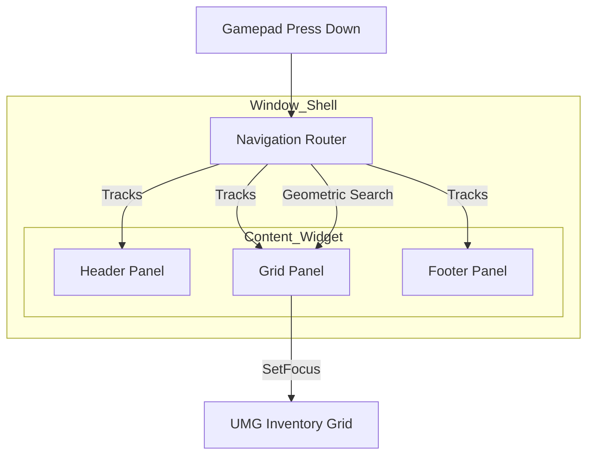

# Routers & Panels

To support complex gamepad navigation, the UI needs a map. It needs to know that the "Filter Bar" is above the "Item Grid," and that the "Sort Button" is below it.

In this system, we don't hard-code these links. Instead, we use a **Router** to manage a collection of **Panels**.

### The Navigation Hierarchy

Understanding the hierarchy is key to debugging focus issues.

1. **The Router (`LyraNavigationRouter`):** Every Window Shell owns one Router. It is the "Local Brain" that knows the layout of its specific window.
2. **The Panel:** A Panel is a logical "Zone" inside your window. It could be a single button, a list of tabs, or a massive 100-slot inventory grid.
3. **The Focus Widget:** Every Panel points to a specific UMG Widget that should receive the actual Unreal focus when that Panel is entered.

### What is a Panel?

Think of a **Panel** as an address on a map. When the player presses "Down" while in the Header, the Router looks at its map, finds the Panel physically below the Header, and tells Unreal to focus that Panel's widget.

#### The Panel Handle (`FNavigationPanelHandle`)

We don't track Panels using pointers (which can become null). We use a **Handle**, which is a unique key consisting of:

* **Window ID:** Which window do I belong to?
* **Panel Type:** A Gameplay Tag identifying the zone (e.g., `UI.Panel.Inventory`).
* **Panel Name:** An optional name for distinguishing multiple panels of the same type.

### Registering Panels

For the Router to "see" your UI, you must register your Panels. This usually happens during the **`FinalizeWindowContent`** event of the Content Interface.

#### The Registration Flow (Blueprint)

1. **Get Router:** Use the reference you stored from `SetWindowRouter`.
2. **Register:** Call `RegisterPanel`.
3. **Update Geometry:** Call `UpdatePanelGeometry`.

| Parameter           | Purpose                                                                                          |
| ------------------- | ------------------------------------------------------------------------------------------------ |
| **Panel Type**      | The tag identifying this zone (e.g., `Header`).                                                  |
| **Focus Widget**    | Which widget should actually "light up" when navigated to? (e.g., the first button in the list). |
| **bIsDefaultFocus** | If true, the cursor starts here when the window opens.                                           |


After registering, you **must** call `UpdatePanelGeometry`. Without this, the Router knows the Panel exists but thinks its size is 0x0 at coordinates (0,0), making it impossible to find via geometric search.


### Coordinate System: Window-Local

A major design decision in this system is the use of **Window-Local Coordinates**.

The Router calculates Panel positions relative to the **Window Root**, not the screen.

* **The Benefit:** When you drag a window across the screen, the Panels move _with_ it in screen space, but their _local_ positions stay the same.
* **The Result:** You don't have to update the Router every frame while dragging. Navigation works perfectly whether the window is in the top-left or bottom-right corner.

### Focus vs. Geometry

It is important to distinguish between **UMG Focus** and **Router Focus**.

* **UMG Focus:** Where Unreal's hardware input is currently going.
* **Router Focus (`ActivePanel`):** Which logical zone the system considers "active."

When you move the cursor, the Router updates its `ActivePanel` and then calls `FocusWidget->SetFocus()` on the underlying UMG widget. This ensures that our high-level geometric logic and Unreal's low-level input system stay perfectly in sync.

### Visual Summary

