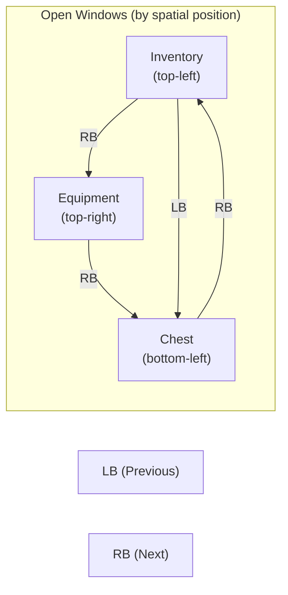

# Window Cycling

In addition to directional navigation (D-pad), users can cycle through open windows using **shoulder buttons** (LB/RB). This provides quick access to any window without needing to navigate through intermediate windows.

## How It Works


```mermaid
flowchart LR
    subgraph Windows ["Open Windows (by spatial position)"]
        W1["Inventory\n(top-left)"]
        W2["Equipment\n(top-right)"]
        W3["Chest\n(bottom-left)"]
    end

    LB["LB (Previous)"]
    RB["RB (Next)"]

    W1 -->|RB| W2
    W2 -->|RB| W3
    W3 -->|RB| W1
    W1 -->|LB| W3
```

Pressing **RB** moves to the next window in spatial order (top-to-bottom, then left-to-right). Pressing **LB** moves to the previous window. The cycle wraps around, pressing RB on the last window focuses the first.

***

## Spatial Order

Windows are ordered by **spatial position** on the canvas: top-to-bottom, then left-to-right. Windows within 50 pixels of each other vertically are treated as being in the same row.

```cpp
// Sort by position: top-to-bottom then left-to-right
Windows.Sort([this](const FItemWindowHandle& A, const FItemWindowHandle& B)
{
    UCanvasPanelSlot* SlotA = WindowSlots.FindRef(A.WindowId);
    UCanvasPanelSlot* SlotB = WindowSlots.FindRef(B.WindowId);
    if (!SlotA || !SlotB) return false;

    FVector2D PosA = SlotA->GetPosition();
    FVector2D PosB = SlotB->GetPosition();

    // Sort by Y first, then X, with a threshold for same-row tolerance
    constexpr float RowThreshold = 50.0f;
    if (FMath::Abs(PosA.Y - PosB.Y) > RowThreshold)
    {
        return PosA.Y < PosB.Y;
    }
    return PosA.X < PosB.X;
});
```


The 50-pixel row threshold means windows don't need to be pixel-perfectly aligned vertically to be considered "in the same row." Two windows at Y=200 and Y=230 are treated as the same row and sorted left-to-right by X position.


***

## Implementation

The Layer handles shoulder button input in `NativeOnKeyDown`:

```cpp
FReply ULyraItemContainerLayer::NativeOnKeyDown(
    const FGeometry& InGeometry,
    const FKeyEvent& InKeyEvent)
{
    // Handle shoulder button cycling
    if (InKeyEvent.GetKey() == EKeys::Gamepad_LeftShoulder)
    {
        CycleFocusedWindow(false);  // Previous
        return FReply::Handled();
    }
    if (InKeyEvent.GetKey() == EKeys::Gamepad_RightShoulder)
    {
        CycleFocusedWindow(true);   // Next
        return FReply::Handled();
    }

    return Super::NativeOnKeyDown(InGeometry, InKeyEvent);
}
```

### `CycleFocusedWindow`

```cpp
void ULyraItemContainerLayer::CycleFocusedWindow(bool bForward)
{
    // Build list of windows sorted by spatial position
    TArray<FItemWindowHandle> Windows;
    for (const auto& Pair : ActiveWindows)
    {
        Windows.Add(FItemWindowHandle(Pair.Key));
    }

    if (Windows.Num() < 2)
    {
        return;
    }

    // Sort by position: top-to-bottom then left-to-right
    Windows.Sort([this](const FItemWindowHandle& A, const FItemWindowHandle& B)
    {
        UCanvasPanelSlot* SlotA = WindowSlots.FindRef(A.WindowId);
        UCanvasPanelSlot* SlotB = WindowSlots.FindRef(B.WindowId);
        if (!SlotA || !SlotB) return false;

        FVector2D PosA = SlotA->GetPosition();
        FVector2D PosB = SlotB->GetPosition();

        constexpr float RowThreshold = 50.0f;
        if (FMath::Abs(PosA.Y - PosB.Y) > RowThreshold)
        {
            return PosA.Y < PosB.Y;
        }
        return PosA.X < PosB.X;
    });

    int32 CurrentIndex = Windows.IndexOfByPredicate([this](const FItemWindowHandle& H) {
        return H.WindowId == FocusedWindowId;
    });

    if (CurrentIndex == INDEX_NONE)
    {
        CurrentIndex = 0;
    }

    int32 NewIndex = bForward
        ? (CurrentIndex + 1) % Windows.Num()
        : (CurrentIndex - 1 + Windows.Num()) % Windows.Num();

    FocusWindow(Windows[NewIndex]);
}
```

***

## Z-Order Behavior

When cycling windows, the focused window is brought to the front (highest Z-order). This ensures:



**Focus visibility**

The focused window is always fully visible.



**Visual/input match**

Visual focus matches input focus.



**Clear identification**

Users can see which window they've cycled to.



***

## Keyboard Support

While the primary use case is gamepad shoulder buttons, you can also bind keyboard keys:

```cpp
// Example: Tab and Shift+Tab for cycling
if (InKeyEvent.GetKey() == EKeys::Tab)
{
    bool bForward = !InKeyEvent.IsShiftDown();
    CycleFocusedWindow(bForward);
    return FReply::Handled();
}
```

***

## Customization

### Filtering Windows

To exclude certain windows from cycling (e.g., tooltips, temporary popups), override `CycleFocusedWindow` and filter the window list before sorting:

```cpp
void UMyLayer::CycleFocusedWindow(bool bForward)
{
    // Build filtered list — exclude non-cycling windows
    TArray<FItemWindowHandle> Windows;
    for (const auto& Pair : ActiveWindows)
    {
        ULyraItemContainerWindowShell* Shell = Pair.Value;
        if (Shell && Shell->ShouldParticipateInCycling())
        {
            Windows.Add(FItemWindowHandle(Pair.Key));
        }
    }

    // Continue with spatial sorting and cycling as normal...
}
```

### Custom Order

To use a different ordering (e.g., always Inventory, Equipment, Chest regardless of position), override `CycleFocusedWindow` and replace the spatial sort with your own comparator.


`GetWindowsByFocusOrder()` is **not** used for cycling. It is used for focus restoration when closing a window, the system falls back to the most recently focused remaining window. To customize the cycle order, override `CycleFocusedWindow` directly.


### Visual Feedback

Consider adding visual feedback when cycling:

1. **Window highlight animation**: Flash or highlight the newly focused window.
2. **Sound effect**: Play a subtle UI sound on cycle.
3. **Indicator**: Show a small indicator (like a border) on the focused window.

These are implemented in your Window Shell blueprint, typically in the `OnWindowAdded` or focus-related events.

***
