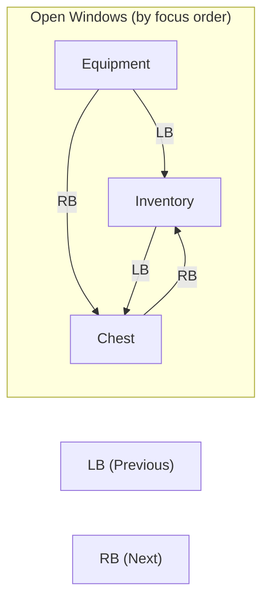

# Window Cycling

In addition to directional navigation (D-pad), users can cycle through open windows using **shoulder buttons** (LB/RB). This provides quick access to any window without needing to navigate through intermediate windows.

### How It Works



Pressing **RB** moves to the next window in focus order. Pressing **LB** moves to the previous window. The cycle wraps around, pressing RB on the last window focuses the first window.

### Focus Order

Windows are ordered by **when they were last focused**. The most recently focused window is at the end of the list.

```cpp
TArray<FItemWindowHandle> ULyraItemContainerLayer::GetWindowsByFocusOrder() const
{
    // Sort windows by their last focus timestamp (oldest first)
    TArray<FItemWindowHandle> SortedWindows;

    for (const auto& Pair : WindowFocusTimes)
    {
        SortedWindows.Add(FItemWindowHandle(Pair.Key));
    }

    SortedWindows.Sort([this](const FItemWindowHandle& A, const FItemWindowHandle& B)
    {
        return WindowFocusTimes[A.WindowId] < WindowFocusTimes[B.WindowId];
    });

    return SortedWindows;
}
```

### Implementation

The Layer handles shoulder button input in `NativeOnKeyDown`:

```cpp
FReply ULyraItemContainerLayer::NativeOnKeyDown(
    const FGeometry& InGeometry,
    const FKeyEvent& InKeyEvent)
{
    // Handle shoulder button cycling
    if (InKeyEvent.GetKey() == EKeys::Gamepad_LeftShoulder)
    {
        CycleFocusedWindow(false);  // Previous
        return FReply::Handled();
    }
    if (InKeyEvent.GetKey() == EKeys::Gamepad_RightShoulder)
    {
        CycleFocusedWindow(true);   // Next
        return FReply::Handled();
    }

    return Super::NativeOnKeyDown(InGeometry, InKeyEvent);
}
```

#### `CycleFocusedWindow`

```cpp
void ULyraItemContainerLayer::CycleFocusedWindow(bool bForward)
{
    TArray<FItemWindowHandle> Windows = GetWindowsByFocusOrder();

    if (Windows.Num() <= 1)
    {
        return;  // Nothing to cycle
    }

    // Find current window in the list
    int32 CurrentIndex = INDEX_NONE;
    for (int32 i = 0; i < Windows.Num(); ++i)
    {
        if (Windows[i].WindowId == FocusedWindowId)
        {
            CurrentIndex = i;
            break;
        }
    }

    if (CurrentIndex == INDEX_NONE)
    {
        // No focused window, focus the first one
        FocusWindow(Windows[0]);
        return;
    }

    // Calculate next index with wrapping
    int32 NextIndex;
    if (bForward)
    {
        NextIndex = (CurrentIndex + 1) % Windows.Num();
    }
    else
    {
        NextIndex = (CurrentIndex - 1 + Windows.Num()) % Windows.Num();
    }

    FocusWindow(Windows[NextIndex]);
}
```

### Z-Order Behavior

When cycling windows, the focused window is brought to the front (highest Z-order). This ensures:



#### Focus visibility

The focused window is always fully visible.



#### Visual/input match

Visual focus matches input focus.



#### Clear identification

Users can see which window they've cycled to.



### Keyboard Support

While the primary use case is gamepad shoulder buttons, you can also bind keyboard keys:

```cpp
// Example: Tab and Shift+Tab for cycling
if (InKeyEvent.GetKey() == EKeys::Tab)
{
    bool bForward = !InKeyEvent.IsShiftDown();
    CycleFocusedWindow(bForward);
    return FReply::Handled();
}
```

### Customization

#### Filtering Windows

If you want certain windows excluded from cycling (e.g., tooltips, temporary popups), override `GetWindowsByFocusOrder`:

```cpp
TArray<FItemWindowHandle> UMyLayer::GetWindowsByFocusOrder() const
{
    TArray<FItemWindowHandle> AllWindows = Super::GetWindowsByFocusOrder();

    // Filter out windows that shouldn't be in the cycle
    return AllWindows.FilterByPredicate([this](const FItemWindowHandle& Handle)
    {
        ULyraItemContainerWindowShell* Shell = GetWindowShell(Handle);
        return Shell && Shell->ShouldParticipateInCycling();
    });
}
```

#### Custom Order

If you want a specific order rather than focus-time order (e.g., always Inventory → Equipment → Chest):

```cpp
TArray<FItemWindowHandle> UMyLayer::GetWindowsByFocusOrder() const
{
    // Return windows in your preferred order
    TArray<FItemWindowHandle> OrderedWindows;

    // Add windows in specific order based on type
    for (const auto& Pair : ActiveWindows)
    {
        // Sort by window type tag, position, or custom criteria
    }

    return OrderedWindows;
}
```

### Visual Feedback

Consider adding visual feedback when cycling:

1. **Window highlight animation**: Flash or highlight the newly focused window.
2. **Sound effect**: Play a subtle UI sound on cycle.
3. **Indicator**: Show a small indicator (like a border) on the focused window.

These are implemented in your Window Shell blueprint, typically in the `OnWindowAdded` or focus-related events.

### Use Cases

| Scenario            | Benefit                                       |
| ------------------- | --------------------------------------------- |
| Many open windows   | Quick access without navigating through each  |
| Overlapping windows | Cycle to bring hidden windows to front        |
| Controller users    | Efficient one-button window switching         |
| Accessibility       | Alternative to precise directional navigation |

### Best Practices



#### Keep window count reasonable

With 10+ windows, cycling becomes tedious. Consider grouping or closing unused windows.



#### Combine with directional navigation

Use cycling for "big jumps" between windows, directional for precise movement within and between adjacent windows.



#### Consistent button mapping

LB/RB are standard for "previous/next" on most controllers. Avoid remapping unless necessary.



#### Provide visual context

Users should always know which window is focused and roughly where they are in the cycle order.


