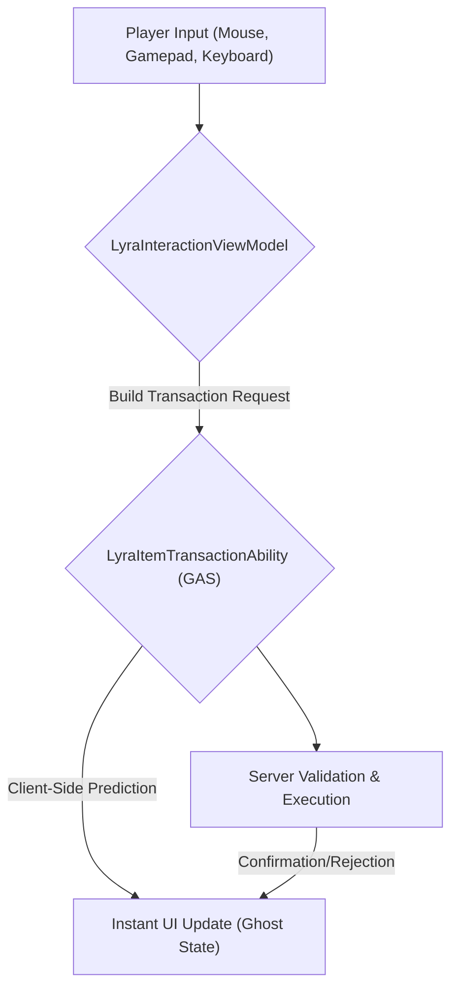

# Interaction & Transactions

This is where the rubber meets the road. All the architectural setup, manager logic, and data translation culminates here: **when the player wants to&#x20;**_**do something**_**&#x20;with an item.**

Interacting with items in a networked, flexible UI is arguably the most complex part of the system. It requires:

1. **Unified Input:** Supporting mouse, gamepad, and keyboard with the same underlying logic.
2. **Network Prediction:** Making the UI feel instant even with latency.
3. **Server Authority:** Ensuring all actions are validated and executed securely on the server.
4. **Polymorphic Handling:** Moving items between _any_ type of container.

This section delves into the intricate dance between your UI inputs, client-side prediction, and server-authoritative gameplay abilities.

### The Interaction Pipeline: UI to Gameplay

At its core, any item interaction, whether it's dragging a sword to an equipment slot or right-clicking to split a stack of ammo, follows a predictable path:

1. **Input Unification:** All player actions are normalized by the `LyraInteractionViewModel`. It doesn't care if you clicked, dragged, or pressed a hotkey, it processes a generic "I want to move this item to that slot" request.
2. **Transaction Request:** The `LyraInteractionViewModel` constructs a flexible `FItemTransactionRequest` containing one or more atomic operations (e.g., "Remove from here," "Add to there").
3. **GAS Execution:** This request is sent via a Gameplay Event to the `LyraItemTransactionAbility`. This ability is `LocalPredicted`, meaning the client runs it immediately _and_ sends it to the server.
4. **Client-Side Prediction:** The UI immediately updates to reflect the predicted outcome, often showing items in a "Ghost" state.
5. **Server Authority:** The server receives the request, re-validates _everything_, and then executes the transaction authoritatively.
6. **Reconciliation:** The server's replicated state either confirms the client's prediction (the "Ghost" becomes real) or rejects it (the UI rolls back).


You can read the [Item Container Prediction](../../../item-container/prediction/) in more detail.


### Core Components

#### 1. The Interaction Engine (`LyraInteractionViewModel`)

This is the central hub for all UI-driven item interactions. It manages the current drag state, validates potential drops, and orchestrates the creation of transaction requests.

#### 2. The Transaction Ability (`LyraItemTransactionAbility`)

The backbone of server-authoritative, predicted item manipulation. This GAS ability receives generic transaction requests and executes them atomically across any `ILyraItemContainerInterface` implementation. It also handles the complex logic of client-side rollback and server reconciliation.

#### 3. Contextual UI Elements

* **Action Menu (`LyraItemActionMenuViewModel`):** The "right-click" menu. It dynamically populates available actions for an item based on its type and context (e.g., "Use," "Drop," "Equip").
* **Quantity Prompt (`LyraQuantityPromptViewModel`):** For operations that require user input (like splitting a stack). It provides a generic modal for quantity selection.

### In This Section

We will break down the intricate details of each part of this pipeline:

* [**The Interaction Engine**](the-interaction-engine/)
  * How `LyraInteractionViewModel` unifies mouse, gamepad, and keyboard input.
  * Managing drag visuals and drop validation.
* [**UI Transaction Pipeline**](ui-transaction-pipeline.md)
  * Deep dive into `ULyraItemTransactionAbility`.
  * The structure of `FItemTransactionRequest` and atomic operations.
  * The prediction recording and rollback mechanism.
* [**Contextual UI (Actions & Prompts)**](/broken/pages/QaasAtGwBchjljlDZgpr)
  * How `LyraItemActionMenuViewModel` discovers and filters actions.
  * The `LyraQuantityPromptViewModel` for user input.
