# Drag-and-Drop

This page explains how to implement Drag-and-Drop item movement in your widgets.

Unlike standard UMG Drag-and-Drop (which creates a payload object), this system uses a centralized **Transaction State** on the `LyraInteractionViewModel`. This allows us to support Mouse, Gamepad ("Click to Pickup"), and Keyboard with a single code path.

### The Drag Cycle

```mermaid
sequenceDiagram
    participant Player
    participant SourceSlot
    participant InteractionVM
    participant TargetSlot

    Player->>SourceSlot: On Drag Detected
    SourceSlot->>InteractionVM: BeginInteraction(Item, SourceDesc)
    
    rect rgb(20, 20, 20)
        note right of InteractionVM: State: bIsActiveTransaction = true
        InteractionVM-->>Player: Show Drag Visual (Bound to VM)
    end
    
    Player->>TargetSlot: Drag Over
    TargetSlot->>InteractionVM: CanPlaceAt(TargetDesc)?
    InteractionVM-->>TargetSlot: True/False (Show Green/Red Highlight)
    
    Player->>TargetSlot: Mouse Release
    TargetSlot->>InteractionVM: CommitInteraction(TargetDesc)
    InteractionVM->>InteractionVM: Execute Move Request
    
    rect rgb(20, 20, 20)
        note right of InteractionVM: State: bIsActiveTransaction = false
    end
```



***

### Step 1: Starting the Drag (Source Widget)

In your `W_InventorySlot` widget, you need to detect the input and notify the engine.

#### Blueprint Logic

Override `OnMouseButtonDown` / `OnDragDetected`

1. **Check Key:** Is it `LeftMouseButton`?
2. **Check Content:** Does `SlotViewModel.bIsOccupied` == true?
3. **Get Offset:** Calculate `AbsoluteToLocal` to know where the user clicked inside the icon (so the drag visual doesn't "jump").
4. **Call Begin:** `InteractionVM->BeginInteraction`.

<figure><figcaption><p>Starting the drag process for an equipment system</p></figcaption></figure>

#### Key Function: `BeginInteraction`

```cpp
bool BeginInteraction(
    ULyraItemViewModel* Item, 
    FInstancedStruct SourceDescriptor, 
    FVector2D DragOffset
);
```

* `Item`: The data to move.
* `SourceDescriptor`: Where it came from (from `SlotViewModel->SlotDescriptor`).
* `DragOffset`: Normalizes the visual (0.5, 0.5 is center).

***

### Step 2: The Drag Visual (Layer Widget)

You do **NOT** need to create a `UDragDropOperation`. The `LyraItemContainerLayer` handles the visual representation globally.

Bind your **Drag Cursor Widget** to these ViewModel properties:

* **Visibility:** Bind to `InteractionVM.bIsActiveTransaction` (Visible when true).
* **Icon:** Bind to `InteractionVM.ActiveTransactionItem.Icon`.
* **Position:** In `NativeTick`, follow the mouse cursor, offset by `DragClickOffset`.

**Why Global?** By having one global drag visual in the Layer, we avoid Z-order issues where a dragged item gets clipped by its parent window.

***

### Step 3: Handling the Drop (Target Widget)

In your `W_InventorySlot` widget, you need to detect when the mouse enters and releases.

#### Hover Feedback (`OnMouseEnter`)

The player needs to know if they can drop here.

1. Check `InteractionVM->IsActiveTransaction`.
2. Call `InteractionVM->CanPlaceAt(MySlotDescriptor)`.
3. If true, show a **Green Border**. If false, show a **Red Border**.

<figure><figcaption><p>Checking if the dragged item can enter this equipment slot and updating the brush color</p></figcaption></figure>

#### Completing the Move (`OnMouseButtonUp`)

This is the commit phase.

1. Check `InteractionVM->IsActiveTransaction`.
2. Call `InteractionVM->CanPlaceAt(MySlotDescriptor)` again (for safety).
3. If valid, call `InteractionVM->CommitInteraction(MySlotDescriptor)`.

#### Key Function: `CommitInteraction`

This function triggers the Transaction Pipeline. It builds the request and sends it to the server.

<figure><figcaption><p>Placing the item in the equipment slot and clearing the brush highlight</p></figcaption></figure>

***

### Step 4: Canceling

If the player releases the mouse **outside** any valid slot, we must cancel.

In your root `LyraItemContainerLayer`, override `OnMouseButtonUp`. If `InteractionVM->IsActiveTransaction` is true, call `InteractionVM->CancelInteraction()`.

This resets the state and hides the drag visual.

***

### Complete Drag Example

```cpp
// 1. User starts dragging item from inventory slot 5
InteractionVM->BeginInteraction(
    ItemAtSlot5,
    FInstancedStruct::Make(FInventorySlotDescriptor{InventoryComp, 5}),
    ClickOffset
);

// 2. User drags over equipment primary slot
bool CanDrop = InteractionVM->CanPlaceAt(
    FInstancedStruct::Make(FEquipmentSlotDescriptor{EquipmentComp, TAG_Equipment_Primary})
);
// Returns true if item can equip there

// 3. User releases over equipment slot
InteractionVM->CommitInteraction(
    FInstancedStruct::Make(FEquipmentSlotDescriptor{EquipmentComp, TAG_Equipment_Primary})
);
// Item moves from Inventory[5] to Equipment.Primary
```

***

### Cheat Sheet: Input Mapping

| Action                    | Function Call       | State Change                           |
| ------------------------- | ------------------- | -------------------------------------- |
| **OnDragDetected**        | `BeginInteraction`  | `bIsActive = true`                     |
| **Mouse Up** (Valid Slot) | `CommitInteraction` | `bIsActive = false` (Transaction Sent) |
| **Mouse Up** (Invalid)    | `CancelInteraction` | `bIsActive = false` (Reset)            |
| **Gamepad "A"** (Pickup)  | `BeginInteraction`  | `bIsActive = true`                     |
| **Gamepad "A"** (Place)   | `CommitInteraction` | `bIsActive = false`                    |

This unification means you don't write separate logic for Gamepads. The "Cursor" is just a visual abstraction; the underlying `InteractionVM` state is identical.
