# UI Transaction Pipeline

Once the `InteractionEngine` has decided _what_ needs to happen (e.g., "Move Item A to Slot B"), it hands off control to the **Transaction Pipeline**.

This page explains how the UI sends this request to the gameplay layer and how it handles the asynchronous response (Prediction, Success, or Failure).


This section focuses on the **UI Integration**. For a deep dive into how the server validates moves, handles rollbacks, and manages replication, please refer to the[ **Item Container Prediction**](../../../item-container/prediction/) documentation.


### The Bridge: `ExecuteMove`

When `CommitInteraction` calls `ExecuteMove`, it performs a critical translation:

1. **Generate ID:** It creates a `FUITransactionId`. This is a unique key used to correlate this specific UI request with the server's response later.
2. **Build Request:** It packages the source slot, destination slot, and optional quantity into an `FItemTransactionRequest`.
3. **Activate GAS:** It triggers the `LyraItemTransactionAbility` via a Gameplay Event, passing the request struct as payload.

From this point on, the UI has no direct control. It is now waiting on the Gameplay Ability System.

### Handling Prediction (The "Promise")

Because the ability is `LocalPredicted`, the client executes the logic immediately.

1. **Immediate Feedback:** The Interaction ViewModel broadcasts `OnInteractionCompleted` with a result of `Pending_WaitingForServer`.
2. **UI Reaction:** The UI typically plays a sound or closes the window immediately, assuming success.
3. **Ghost State:** The data layer (Container ViewModels) will see the item move instantly and mark it as a `bIsGhost`.

### Handling Results (The "Truth")

The UI needs to know if the server accepted or rejected the move to update status messages or error logs.

The Interaction Engine listens for `TAG_Lyra_Item_Message_TransactionResult` via the Gameplay Message Subsystem.

```cpp
void ULyraInteractionViewModel::HandleTransactionResult(..., const FItemTransactionResultMessage& Message)
{
    // Match the result back to our original request ID
    if (FUITransactionId* TxId = CorrelationIdToTransactionId.Find(Message.ClientRequestId))
    {
        switch (Message.Result)
        {
            case Success:
                OnPredictionConfirmed(*TxId);
                break;
                
            case Failed_Validation:
            case Failed_ServerRejected:
                OnPredictionRejected(*TxId);
                // Show error toast to user: "Inventory Full"
                break;
        }
    }
}
```

This loop ensures that even though the systems are decoupled (UI -> GAS -> UI), the user experience feels coherent. If a move fails, the UI knows exactly _which_ move failed and can inform the player.

```mermaid
sequenceDiagram
    participant UI as Interaction VM
    participant Ability as Transaction Ability
    participant Server as Server Logic

    UI->>UI: Generate Transaction ID (101)
    UI->>Ability: Send Gameplay Event (Request + ID:101)
    
    rect rgb(20, 20, 40)
        Note over UI, Ability: Client Prediction Phase
        Ability->>Ability: Apply Changes Locally
        Ability-->>UI: Item Moves Instantly (Ghost)
    end

    Ability->>Server: Server RPC (Request + ID:101)
    
    alt Success
        Server->>Server: Validate & Execute
        Server->>Ability: ClientNotifyTxSucceeded(ID:101)
        Ability->>UI: Message: Result=Success, ID=101
        UI->>UI: OnPredictionConfirmed (Ghost becomes Real)
    else Failure
        Server->>Server: Validation Failed
        Server->>Ability: ClientNotifyTxFailed(ID:101)
        Ability->>UI: Message: Result=Rejected, ID=101
        UI->>UI: OnPredictionRejected (Rollback UI)
    end
```



### Atomic Operations

The pipeline supports more than just simple moves. The `FItemTransactionRequest` can contain multiple **Atomic Operations**.

* **Move:** Simple transfer.
* **Split:** Modify source stack count, create new item at destination.
* **Drop:** Remove from container, spawn actor in world.

The UI constructs these operations based on user intent (e.g., holding 'Shift' to split), but once sent to the pipeline, they are executed as a single, indivisible transaction. If any part fails (e.g., can't split because destination is full), the entire operation rolls back.
