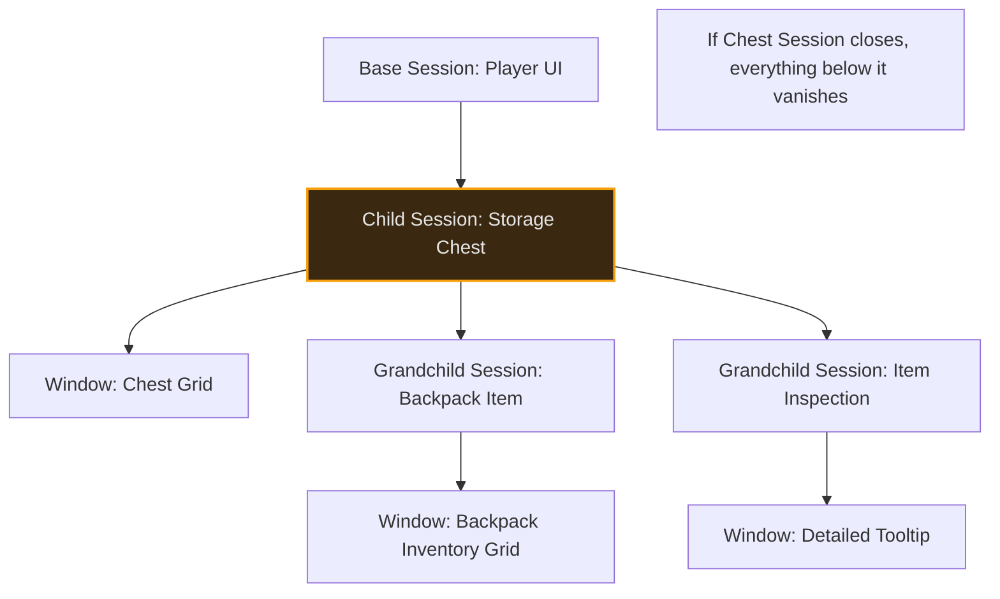

# Session Management

When a player is actively interacting with a chest, additional windows can open. The chest's contents open, the player might right-click an item to inspect it, that inspection might in turn open an attachment view of a gun inside the item. These windows are related: they were spawned by the same player action, and when that action ends, the player walks too far away, the chest is destroyed, the player closes the inventory, all of them should close together.

A **session** is the manager's way of grouping related windows so they share a single lifetime. Closing a session closes every window that belongs to it. Sessions can nest: a chest session can contain a child session for an inspected item, and closing the parent closes the child too.

The rest of this page covers what a session looks like in code, how the cascade close works, how to open and close sessions explicitly, and how the system reparents sessions when the underlying items move between containers.

## The Session Structure

A session is defined by its `Handle`, its `ParentSession`, and arrays of its `Windows` and `ChildSessions`. It also carries a `SourceContext` (`FInstancedStruct`), which preserves the data that originally triggered the session's creation.

```cpp
USTRUCT(BlueprintType)
struct FItemWindowSession
{
    FItemWindowSessionHandle Handle;       // Unique ID
    FItemWindowSessionHandle ParentSession; // Pointer to owner
    TArray<FItemWindowHandle> Windows;      // Windows in this group
    TArray<FItemWindowSessionHandle> ChildSessions; // Sub-groups
    FInstancedStruct SourceContext;         // The "Why" behind this session
};
```

### The Parent-Child Lifecycle

The primary benefit of the session system is **Cascading Logic**. When a session is closed, the system recursively traverses its children to ensure no "orphan" windows are left on the screen.

**Cascading Closure Logic:**

1. **Direct Request:** A session is told to close (e.g., the player walks too far from a chest).
2. **Recursive Search:** The manager identifies all `ChildSessions` belonging to that session.
3. **Recursive Closure:** Every child session is closed first.
4. **Window Disposal:** Every `FItemWindowHandle` registered to these sessions is sent a close request to the UI Layer.
5. **ViewModel Release:** Any ViewModels the closing session was holding are released. If no other open session is using a given ViewModel, it is torn down at the same time.

### The Hierarchy

Every window belongs to a **Session** (`FItemWindowSession`).

#### 1. The Base Session

This represents the player's persistent UI state.

* **Created:** When the UI manager initializes for the local player. Available immediately and independently of the windowing layer.
* **Content:** The persistent UI state for the player. Holds the mandatory windows the Layer spawns on activation, plus ViewModels for any item-container widgets the game shows outside a window shell, a static inventory screen, an equipment panel, or any other item-container UI for a game that doesn't use windowed UI.
* **Lifetime:** Survives across map transitions. Closed only when the local player is destroyed.

#### 2. Child Sessions

These represent temporary, context-dependent UI.

* **Example:** A Loot Chest.
* **Parent:** The Base Session (or another child).
* **Source Context:** The Chest Actor or Component.

If the Base Session closes (e.g., player closes inventory), the Chest window must also close.

#### 3. Nested Sessions (Grandchildren)

* **Example:** Right-clicking an item in the Chest to "Inspect" it.
* **Parent:** The Chest Session.
* **Source Context:** The Item Instance.

If the Chest window closes (e.g., player walks away), the Inspection window must also close.



***

## Session Lifecycle

The `UIManager` maintains a map of all active sessions: `TMap<FGuid, FItemWindowSession>`.

### Creating a Session

You typically create a session when opening a new root window (like a Chest).



<figure><figcaption></figcaption></figure>



```cpp
// 1. Define the source context (The Chest's Inventory using FInventoryContainrSouce)
FInstancedStruct ChestSource = ...;

// 2. Create the session attached to the Base Session
FItemWindowSessionHandle ChestSession = UIManager->CreateChildSession(
    SessionTags::Chest,
    ChestSource,
    UIManager->GetBaseSession()
);

// 3. Open the window inside this session
WindowSpec.SessionHandle = ChestSession;
UIManager->RequestOpenWindow(WindowSpec);
```



### Closing a Session (`CloseSession`)

When a session is closed, the Manager performs a **Cascade Closure**:

1. **Recursion:** It finds all `ChildSessions` of the target session and calls `CloseSession` on them first.
2. **Window Cleanup:** It iterates all `Windows` registered to the session and broadcasts `OnWindowCloseRequested`.
3. **ViewModel Release:** Every ViewModel the session was holding is released. Anything still wanted by another open session stays; anything orphaned is torn down.
4. **Registry Cleanup:** It removes the session from the registry.

This ensures that closing a parent "cleanly" removes the entire branch of the UI tree.

***

## Dynamic Reparenting

The most complex part of session management is handling items moving between containers.

**Scenario:**

1. Player opens a Backpack (Session A).
2. Player inspects an Item inside the Backpack (Window B, linked to Session A).
3. Player drags the Backpack into a Chest.

The Backpack is no longer in the player's inventory; it is now inside the Chest. The "path" to the data has changed.

The UI Manager handles this via `HandleItemReparenting`:

1. It listens for `Lyra.Item.Message.ItemMoved`.
2. It checks if any open windows are tracking that Item ID.
3. It finds the _new_ parent container (The Chest).
4. It **Reparents** the session: The Backpack Session is now a child of the Chest Session.

If the Chest is closed later, the Backpack (and its inspection window) will correctly close with it.

***

## Session Best Practices


**Always use sessions** for external containers. Never open a chest window in the base session, it should close when the player walks away.



**Track items** when inspecting them. If a player is looking at a gun's attachments and sells the gun, the window should close automatically.



**Don't close parent sessions prematurely.** If you close the base session while a chest session is active, the chest session closes too (which is usually correct, but be aware).

