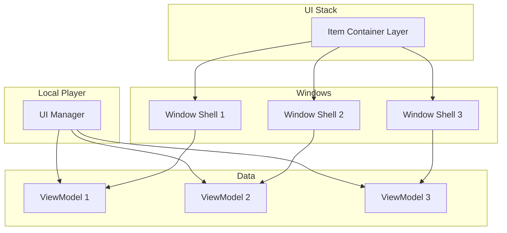

# The Central Managers

If ViewModels are the "muscles" of the system, the Managers are the "Central Nervous System."

The UI Manager sits on the `LocalPlayer` and is responsible for coordinating the chaos of a multiplayer environment:

* Creating and destroying ViewModels.
* Tracking sessions and window relationships.
* Ensuring the UI closes securely when server permissions change.

Without this manager, every widget would have to manage its own lifecycle, leading to memory leaks and invalid pointer crashes.

***

### The UI Manager (`LyraItemContainerUIManager`)

**Scope:** `LocalPlayerSubsystem`\
**Job:** Data Lifecycle & Logic.

Think of this as the **Factory and Garbage Collector**.

* **Leasing:** It holds the master cache of all active `ViewModels`.
* **Sessions:** It groups windows together logically (e.g., "This chest window owns this popup").
* **Events:** It listens to the game world for item destruction or movement and tells the relevant `ViewModels` to react.

***

### Window Management

Window management (z-order, focus, dragging, cross-window navigation) is handled by the **Item Container Layer** rather than a separate manager. This keeps the windowing logic close to the widgets it manages.

The Layer handles:

* **Geometry:** Tracking where every window is on screen via `ActiveWindows` map
* **Navigation:** Finding the nearest window when you navigate with D-pad via `FindWindowInDirection`
* **Focus:** Managing z-order and deciding which window is "Active" via `WindowFocusTimes`
* **Cycling:** Switching between windows with LB/RB shoulder buttons

See [The Item Container Layer](../the-windowing-system/the-item-container-layer.md) for details on window management.

***

### Architecture

**Key Relationships:**

* The **UI Manager** owns `ViewModels` and manages their lifecycle
* The **Layer** owns Window Shells and manages their spatial relationships
* **Window Shells** connect `ViewModels` to their visual representation
