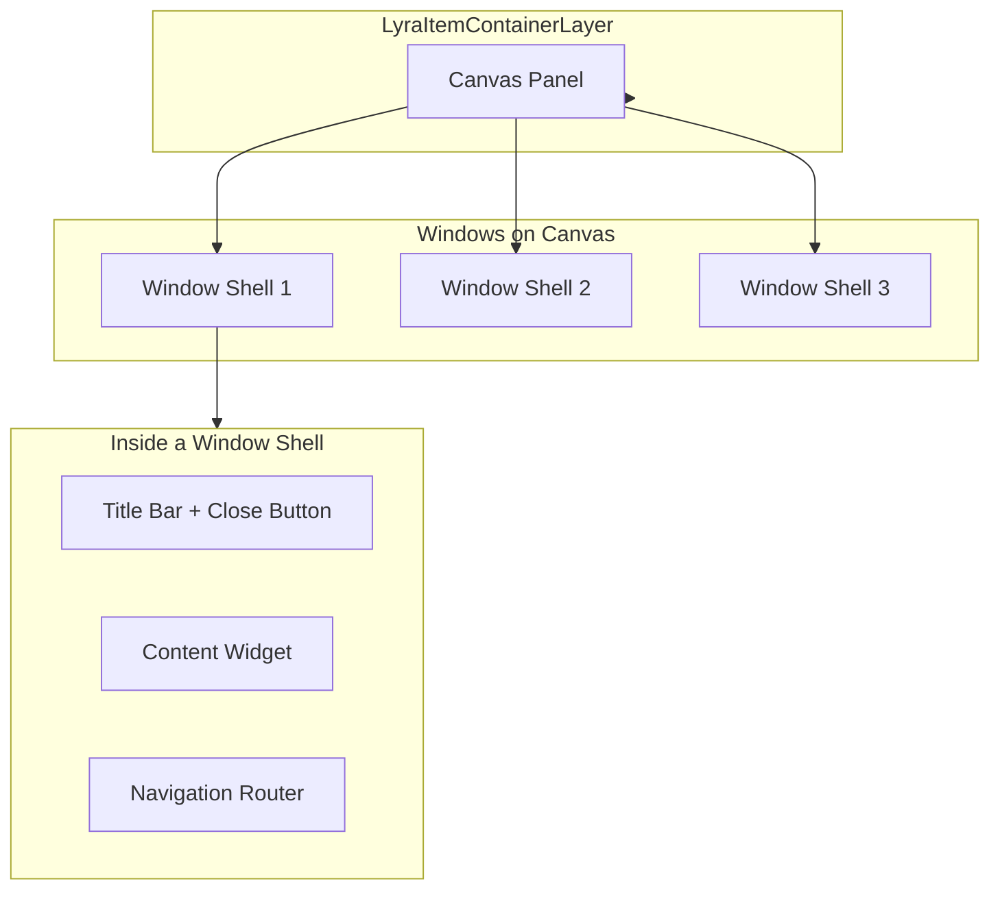

# The Windowing System

The Windowing System is the visual framework that manages your UI for comlex item container systems. It turns widgets into tangible, draggable, closable windows on the screen.

It is designed to be **Composable**. A "Window" is not a single widget; it is a sandwich:

1. **The Shell:** The reusable frame (Title bar, background, drag logic).
2. **The Content:** Your specific game logic (Inventory Grid, Vendor List).

This separation allows you to fix a bug in the "Drag" logic _once_ in the Shell, and it fixes it for every single window in your game.

### Architecture

### Core Components

#### 1. The Shell (`ULyraItemContainerWindowShell`)

This is the "Physical" window. It handles:

* **Input:** Dragging the window around the screen.
* **Lifecycle:** Automatically acquiring and releasing ViewModels (preventing memory leaks).
* **Focus:** Telling the system "I was clicked."

#### 2. The Layer (`LyraItemContainerLayer`)

This is the "Manager" widget. It sits on your HUD. It handles:

* **Configuration:** You tell it _"When the UI Manager asks for 'Tag.Inventory', spawn 'W\_GridInventory'."_
* **Placement:** It decides where new windows appear (Center? Cascaded?).
* **Z-Order:** It physically reorders the Shells on the canvas when the Window Manager requests it.

#### 3. The Content Interface

To put _your_ widget inside a Shell, it needs to implement `ILyraItemContainerWindowContentInterface`. This interface acts as the initialization handshake, passing the Data Source and Navigation Router to your widget _after_ the window is constructed.

### In This Section

* [The Window Lifecycle](window-lifecycle.md)
  * Explores how windows are created, managed, and destroyed
* [**The Window Shell**](the-window-shell.md)
  * How the shell manages ViewModel leasing.
  * Setting up the blueprint widgets (`DragHandle`, `CloseButton`).
* [**The Item Container Layer**](the-item-container-layer.md)
  * Implementing the `GetContentWidgetClass` mapping function.
  * Spawning mandatory windows (like the Player Inventory) on startup.
* [**The Content Interface**](the-window-content-interface.md)
  * Understanding the initialization flow.
  * How to receive the Data Source and Navigation Router.
* [**Dynamic Reparenting**](dynamic-window-reparenting.md)
  * How the system updates Session Logic when items move between containers.
