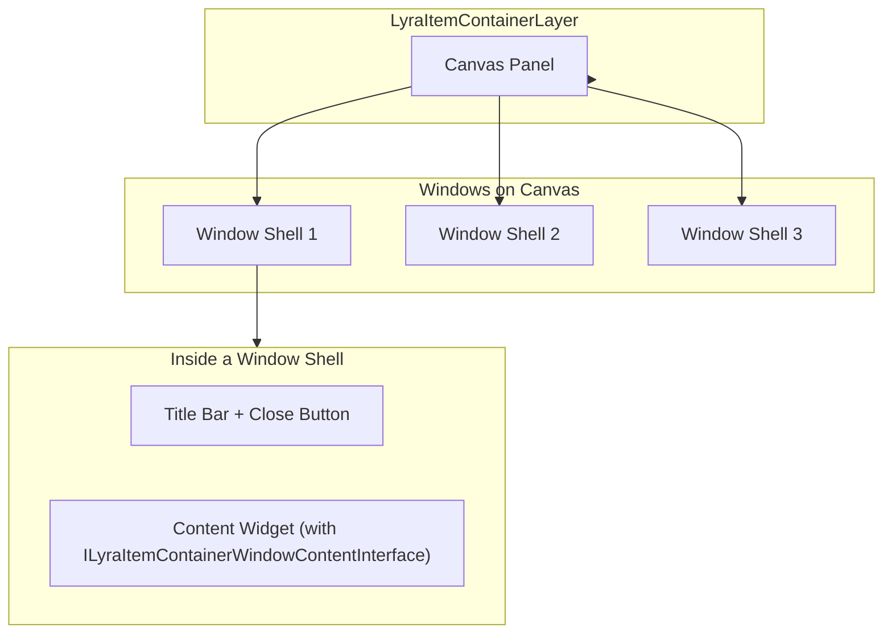

# The Windowing System


This section is optional for static inventory screens. Use it when your game needs floating, draggable, closable inventory windows.


The Windowing System is the visual framework for games whose inventory UI is **windowed**, Tarkov style designs with separate movable windows for the inventory, equipment, attachments, item inspection, loot containers, and so on. The player can drag those windows around, close them individually, and open more on demand.

If your game shows all of its inventory data on a single static screen the player opens with one button, common for most action games, including battle-royale-style HUDs, you do not need any of this. The static-screen pattern lives on [ViewModels Without a Window Shell](../extension-and-integration/viewmodels-without-a-window-shell.md), and the rest of the item container UI subsystem works without ever activating the windowing layer.

For the games that do want windowed UI, the system turns widgets into tangible, draggable, closable windows on the screen and is designed to be **Composable**. A "Window" is not a single widget; it is a sandwich:

1. **The Shell:** The reusable frame (Title bar, background, drag logic).
2. **The Content:** Your specific game logic (Inventory Grid, Vendor List).

This separation allows you to fix a bug in the "Drag" logic _once_ in the Shell, and it fixes it for every single window in your game.

***

## Architecture

```mermaid
flowchart TB
    subgraph Layer ["LyraItemContainerLayer"]
        direction TB
        Canvas[Canvas Panel]
    end

    subgraph Windows ["Windows on Canvas"]
        W1[Window Shell 1]
        W2[Window Shell 2]
        W3[Window Shell 3]
    end

    subgraph Shell ["Inside a Window Shell"]
        Chrome[Title Bar + Close Button]
        Content["Content Widget (with ILyraItemContainerWindowContentInterface)"]
    end

    Layer --> Canvas
    Canvas --> W1
    Canvas --> W2
    Canvas --> W3
    W1 --> Shell
```

### Core Components

#### 1. The Shell (`ULyraItemContainerWindowShell`)

This is the "Physical" window. It handles:

* **Input:** Dragging the window around the screen.
* **Lifecycle:** Owning the session that backs the window so ViewModels are released automatically when the window closes.
* **Focus:** Telling the system "I was clicked."

#### 2. The Layer (`LyraItemContainerLayer`)

This is the "Manager" widget. It sits on your HUD. It handles:

* **Configuration:** You tell it _"When the UI Manager asks for 'Tag.Inventory', spawn 'W\_GridInventory'."_
* **Placement:** It decides where new windows appear (Center? Cascaded?).
* **Z-Order:** It physically reorders the Shells on the canvas when the Window Manager requests it.

#### 3. The Content Interface

To put _your_ widget inside a Shell, it needs to implement `ILyraItemContainerWindowContentInterface`. This interface acts as the initialization handshake, passing the Data Source and Navigation Router to your widget _after_ the window is constructed.

***

## In This Section

* [**The Window Lifecycle**](window-lifecycle.md)
  * Explores how windows are created, managed, and destroyed
* [**The Window Shell**](the-window-shell.md)
  * How the shell owns the session that backs the window's ViewModels.
  * Setting up the blueprint widgets (`DragHandle`, `CloseButton`).
* [**The Item Container Window Host**](the-item-container-window-host.md)
  * &#x20;Mapping window types to content widgets with `ContentWidgetClasses`.
  * Spawning startup windows (like the Player Inventory) automatically when the host activates.
* [**The Content Interface**](the-window-content-interface.md)
  * Understanding the initialization flow.
  * How to receive the Data Source and Navigation Router.
* [**Dynamic Reparenting**](dynamic-window-reparenting.md)
  * How the system updates Session Logic when items move between containers.
