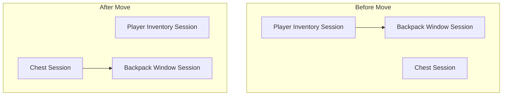

# Dynamic Window Reparenting

In a standard UI, windows are usually static. But in a game where items can be containers themselves (like a backpack or a weapon), the data hierarchy is constantly shifting.

Imagine this scenario:

1. You have a **Backpack** item in your main inventory.
2. You open the Backpack to view its contents (Window A).
3. While Window A is open, you drag the **Backpack** item from your Inventory into a **Loot Chest**.

The path to that data has changed.

* _Before:_ `Player -> Inventory -> Slot 5 -> Backpack`
* _After:_ `Chest -> Slot 2 -> Backpack`

The Backpack hasn't been destroyed, but its "Parent" has changed from the Player to the Chest. This page explains how the UI system maintains a logical hierarchy during these transitions.

### The Problem: Orphaned Windows

If we simply opened a window and left it there, the UI would lose its **Session Context**.

In the scenario above, if you walk away from the Loot Chest, the game should close the Chest window. If the system isn't aware that the Backpack is now _inside_ that chest, the Backpack window would stay open on your screen, an "orphaned" window that no longer makes sense in the game world.

### The Solution: Automatic Grafting

The `LyraItemContainerUIManager` solves this by tracking the relationship between **Item Instance IDs** and **UI Sessions**.

#### 1. The Detection Phase

The UI Manager listens to the `Lyra.Item.Message.ItemMoved` message. This message contains:

* The **Item Instance** being moved.
* The **Source Slot** (where it came from).
* The **Destination Slot** (where it went).

#### 2. The Search Phase

The Manager checks its registry to see if any active **Session** is tracking that specific Item ID.

#### 3. The Reparenting Phase (`HandleItemReparenting`)

If a match is found, the Manager calculates the session of the _new_ container.

* If the Backpack moved into a Chest, and the Chest has an open window, the Manager **"Grafts"** the Backpack session onto the Chest session.
* The Backpack window is now logically a child of the Chest window.

### Why this matters: Cascade Closures

The primary benefit of this system is maintaining a clean screen. By ensuring the hierarchy is always accurate, we get **Cascade Closures** for free.

| Action                | Result                                                                                                    |
| --------------------- | --------------------------------------------------------------------------------------------------------- |
| **Move Item**         | Window stays open; hierarchy updates behind the scenes.                                                   |
| **Close Parent**      | All child windows (including moved containers) close automatically.                                       |
| **Walk Out of Range** | The server revokes access to the Chest; the Chest session closes, and the Backpack window closes with it. |

### Data Resilience

You might wonder: _"Do I need to refresh my icons or text when an item moves?"_

**No.** Because the ViewModels are bound to the **Item Instance ID** (a unique GUID) rather than a slot index, the data connection remains solid. The polymorphic slot descriptors inside the window are updated via the `OnSourceReparented` event, but the user sees zero flicker or interruption.

### Hierarchy Visualization

By "teleporting" the session link in response to gameplay events, we ensure that the UI always mirrors the physical logic of your game world.
