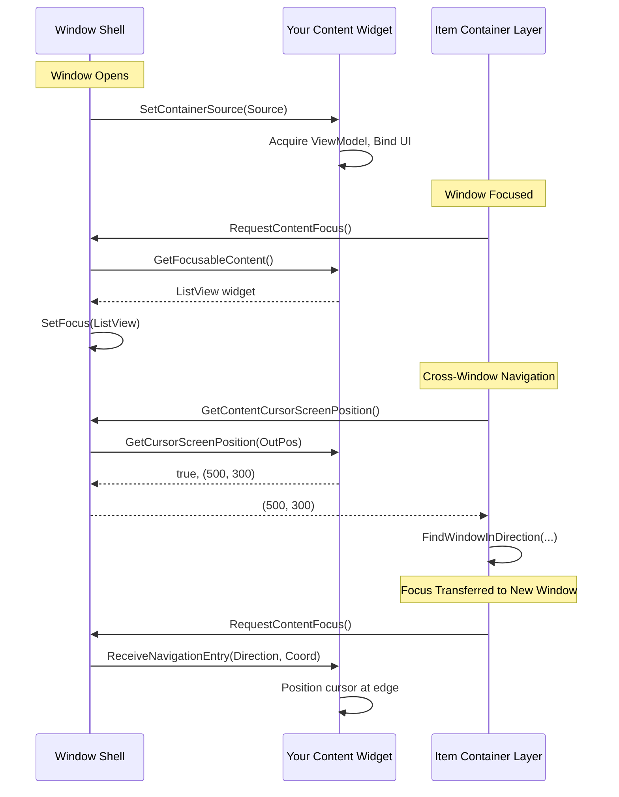

# The Window Content Interface

The **Window Shell** handles the frame (the chrome), but your widget (the Inventory Grid, the Skill Tree, or the Loot List) handles the actual game logic.

To bridge the gap between the generic Shell and your specific Widget, we use a "Handshake" mechanism called the **`ILyraItemContainerWindowContentInterface`**.

***

### Why an Interface?

If you simply spawned a widget and added it to the Shell, the widget wouldn't know which inventory to look at or how to handle gamepad navigation.

We use an interface because:

1. **Decoupling:** The Shell doesn't need to know if it's holding an Inventory or a Talent Tree. It just knows it's holding "Content."
2. **Order of Operations:** UMG's built-in Construct event happens too early. At construction time, widgets often don't have their data yet. The interface provides a specific **Initialization Callback**.
3. **Navigation Support:** The interface enables cross-window controller/keyboard navigation by letting content report its cursor position and receive navigation entries.

***

### The Interface

```cpp
class ILyraItemContainerWindowContentInterface
{
public:
    // Initialization
    void SetContainerSource(const FInstancedStruct& Source);

    // Focus Management
    UWidget* GetFocusableContent() const;

    // Cross-Window Navigation
    bool GetCursorScreenPosition(FVector2D& OutScreenPosition) const;
    void ReceiveNavigationEntry(FIntPoint Direction, float ScreenCoordinate);
};
```

***

### Method Details

#### 1. `SetContainerSource`

This is your "Construct" event. The source context passed into the `FItemWindowSpec`'s `SourceDesc` is delivered here.

```cpp
UFUNCTION(BlueprintNativeEvent, BlueprintCallable)
void SetContainerSource(const FInstancedStruct& Source);
```

**Purpose:** Receive your data source and acquire your ViewModel.

**Standard Implementation:**



Call `GetOwningWindowShell()` → `AcquireViewModelLease(Source)`



Take the returned ViewModel and bind your widget content to it




**Why use the Lease API?** By using `AcquireViewModelLease` through the Shell instead of calling the UI Manager directly, your ViewModel is automatically cleaned up when the window closes. No manual cleanup code required.


#### 2. `GetFocusableContent`

Returns the widget that should receive focus when this window becomes focused.

```cpp
UFUNCTION(BlueprintNativeEvent, BlueprintCallable)
UWidget* GetFocusableContent() const;
```

**Purpose:** Tell the Shell which widget should get keyboard/controller focus.

**Return Values:**

* Return your primary interactive widget (ListView, Grid, etc.)
* Return `nullptr` to use Unreal's default focus behavior (first focusable child)

**Examples:**

| Content Type    | Return Value                       |
| --------------- | ---------------------------------- |
| List Panel      | The `ListView` widget              |
| Tetris Grid     | The `GridClump` widget             |
| Equipment Panel | The first slot widget or container |

#### 3. `GetCursorScreenPosition`

Reports the current cursor/selection position in screen space.

```cpp
UFUNCTION(BlueprintNativeEvent, BlueprintCallable)
bool GetCursorScreenPosition(FVector2D& OutScreenPosition) const;
```

**Purpose:** Enable cursor alignment during cross-window navigation. When the user navigates from Window A to Window B, the Layer uses this position to find a geometrically appropriate target.

**Return Values:**

* Return `true` and set `OutScreenPosition` to the absolute screen position of your current selection
* Return `false` to use the window center as a fallback

**Example Implementation:**

```cpp
bool UMyContentWidget::GetCursorScreenPosition_Implementation(FVector2D& OutScreenPosition) const
{
    if (UWidget* SelectedSlot = GetCurrentlySelectedSlot())
    {
        FGeometry Geom = SelectedSlot->GetCachedGeometry();
        OutScreenPosition = Geom.GetAbsolutePositionAtCoordinates(FVector2D(0.5f, 0.5f));
        return true;
    }
    return false;
}
```

#### 4. `ReceiveNavigationEntry`

Called when this content receives focus from cross-window navigation.

```cpp
UFUNCTION(BlueprintNativeEvent, BlueprintCallable)
void ReceiveNavigationEntry(FIntPoint Direction, float ScreenCoordinate);
```

**Purpose:** Position your cursor/selection to align with where navigation came from.

**Parameters:**

* `Direction` - The direction navigation came from as a vector:
  * `(1, 0)` = navigated Right (came from the left)
  * `(-1, 0)` = navigated Left (came from the right)
  * `(0, 1)` = navigated Down (came from above)
  * `(0, -1)` = navigated Up (came from below)
* `ScreenCoordinate` - The coordinate to align with (perpendicular to direction):
  * For Left/Right navigation: Y screen coordinate
  * For Up/Down navigation: X screen coordinate

**Example Implementation:**

```cpp
void UMyContentWidget::ReceiveNavigationEntry_Implementation(FIntPoint Direction, float ScreenCoordinate)
{
    // Find the slot closest to the incoming coordinate
    if (Direction.X != 0)
    {
        // Horizontal navigation - align with Y coordinate
        SelectSlotNearestToY(ScreenCoordinate, Direction.X > 0 ? EEdge::Left : EEdge::Right);
    }
    else if (Direction.Y != 0)
    {
        // Vertical navigation - align with X coordinate
        SelectSlotNearestToX(ScreenCoordinate, Direction.Y > 0 ? EEdge::Top : EEdge::Bottom);
    }
}
```

***

### Implementation Examples

#### C++ Content Widget

```cpp
UCLASS()
class UMyInventoryContent : public UUserWidget, public ILyraItemContainerWindowContentInterface
{
    GENERATED_BODY()

public:
    // ILyraItemContainerWindowContentInterface
    virtual void SetContainerSource_Implementation(const FInstancedStruct& Source) override;
    virtual UWidget* GetFocusableContent_Implementation() const override;
    virtual bool GetCursorScreenPosition_Implementation(FVector2D& OutScreenPosition) const override;
    virtual void ReceiveNavigationEntry_Implementation(FIntPoint Direction, float ScreenCoordinate) override;

protected:
    UPROPERTY(meta = (BindWidget))
    TObjectPtr<UListView> ItemList;

    UPROPERTY()
    TObjectPtr<ULyraInventoryViewModel> ViewModel;
};

void UMyInventoryContent::SetContainerSource_Implementation(const FInstancedStruct& Source)
{
    if (ULyraItemContainerWindowShell* Shell = ULyraItemContainerWindowShell::GetOwningWindowShell(this))
    {
        ViewModel = Cast<ULyraInventoryViewModel>(Shell->AcquireViewModelLease(Source));
        // Bind UI to ViewModel...
    }
}

UWidget* UMyInventoryContent::GetFocusableContent_Implementation() const
{
    return ItemList;
}

bool UMyInventoryContent::GetCursorScreenPosition_Implementation(FVector2D& OutScreenPosition) const
{
    // Return position of currently selected list item
    if (UObject* SelectedItem = ItemList->GetSelectedItem())
    {
        if (UUserWidget* EntryWidget = ItemList->GetEntryWidgetFromItem(SelectedItem))
        {
            OutScreenPosition = EntryWidget->GetCachedGeometry()
                .GetAbsolutePositionAtCoordinates(FVector2D(0.5f, 0.5f));
            return true;
        }
    }
    return false;
}

void UMyInventoryContent::ReceiveNavigationEntry_Implementation(FIntPoint Direction, float ScreenCoordinate)
{
    // Select item nearest to the incoming Y coordinate for horizontal navigation
    if (Direction.X != 0)
    {
        SelectItemNearestToY(ScreenCoordinate);
    }
}
```

#### Blueprint Content Widget

For pure Blueprint widgets, add the interface to your Widget Blueprint:



Open your Widget Blueprint



Go to **Class Settings**



Under **Interfaces**, click **Add** and select `LyraItem Container Window Content Interface`



Implement the interface events in your Event Graph



Implement each interface event:

* `SetContainerSource` Event:
  * Get Owning Window Shell
  * Call `AcquireViewModelLease` with the Source
  * Bind your UI to the returned `ViewModel`

<figure><figcaption><p>Exampl setting the content interface forr the equipment widget</p></figcaption></figure>

* GetFocusableContent Function:
  * Return a reference to your main interactive widget (`ListView`, Grid, etc.)

<figure><figcaption></figcaption></figure>

* GetCursorScreenPosition Function:
  * Get your currently selected widget's geometry
  * Call `GetCachedGeometry->LocalToAbsolute(0.5, 0.5)`
  * Return true if you have a selection, false otherwise

<figure><figcaption><p>Pass the last focused equipment slot for better cursor position</p></figcaption></figure>

* ReceiveNavigationEntry Event:
  * Check the Direction to determine which edge navigation came from
  * Select the appropriate slot/item based on `ScreenCoordinate`


***

### Default Behaviors

If you don't implement certain methods, the system provides sensible defaults:

| Method                    | Default Behavior                                         |
| ------------------------- | -------------------------------------------------------- |
| `GetFocusableContent`     | Returns `nullptr` → Unreal focuses first focusable child |
| `GetCursorScreenPosition` | Returns `false` → Layer uses window center               |
| `ReceiveNavigationEntry`  | No-op → Focus goes to `GetFocusableContent` result       |

For simple content widgets that don't need precise cursor alignment, you may only need to implement `SetContainerSource` and `GetFocusableContent`.

***

## When the Shell Calls Each Method



***
