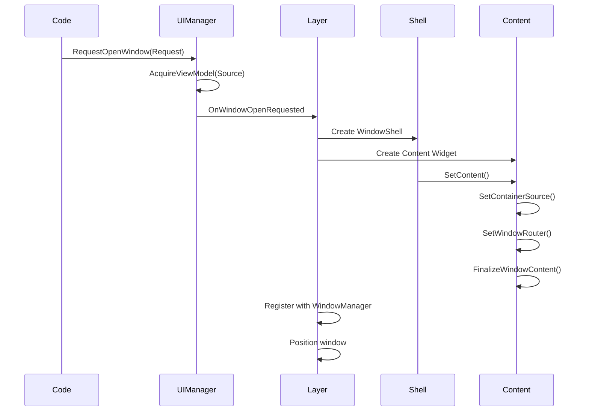
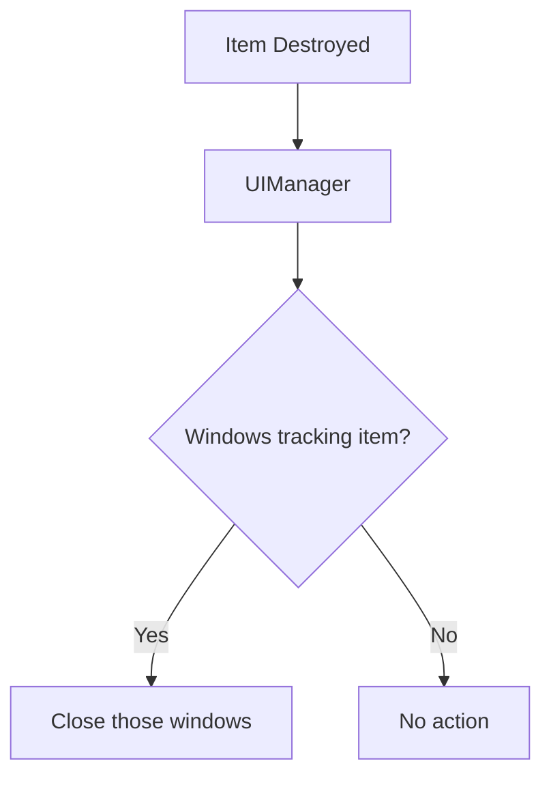
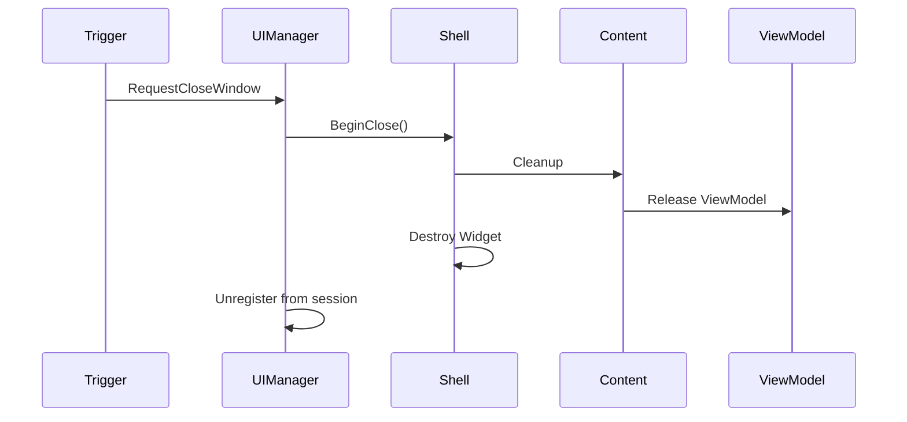
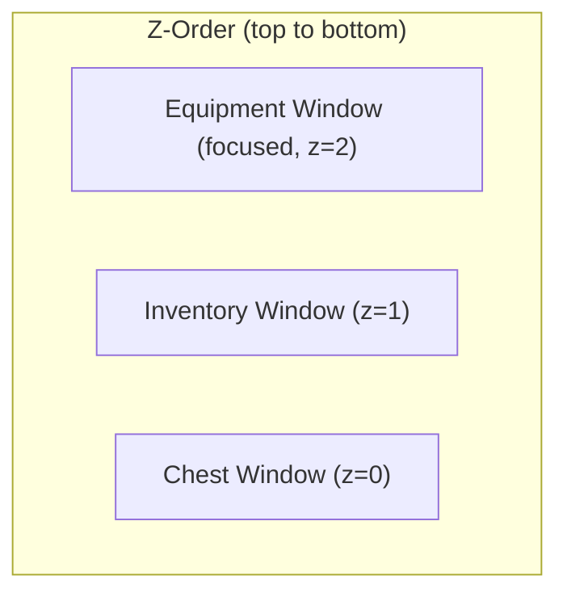

# Window Lifecycle

Windows are the containers for your item container UI. They can be opened, closed, dragged, focused, and layered. This page explains how windows are created, managed, and destroyed.

***

### Opening Windows

#### The Request Pattern

Windows are opened via requests to the UI Manager:

```cpp
FLyraWindowOpenRequest Request;
Request.WindowType = MyWindowTypeTag;           // Identifies content widget class
Request.SourceDesc = ContainerSource;           // The container to display
Request.SessionHandle = ParentSessionHandle;    // Which session owns this window
Request.Placement = EWindowPlacement::Automatic;

UIManager->RequestOpenWindow(Request);
```

#### Window Placement Options

| Placement          | Behavior                                 |
| ------------------ | ---------------------------------------- |
| `Automatic`        | System chooses position (avoids overlap) |
| `CenterScreen`     | Centered on screen                       |
| `RelativeToSource` | Near the triggering UI element           |
| `Explicit`         | Uses `Request.ExplicitPosition`          |
| `Cascade`          | Offset from previous window              |

#### What Happens on Open



#### Content Widget Interface

Content widgets must implement `ILyraItemContainerWindowContentInterface`:

```cpp
class ILyraItemContainerWindowContentInterface
{
    // Called to set the container source
    virtual void SetContainerSource(const FInstancedStruct& Source) = 0;

    // Called to provide the navigation router
    virtual void SetWindowRouter(ULyraNavigationRouter* Router) = 0;

    // Called after setup is complete
    virtual void FinalizeWindowContent() = 0;
};
```

***

### Closing Windows

Windows can close in several ways:

#### Manual Close

```cpp
// User clicks close button
WindowShell->RequestClose();

// Or programmatically
UIManager->RequestCloseWindow(WindowHandle);
```

#### Session Close

When a session closes, all windows in that session close:

```cpp
// Close an entire session
UIManager->CloseSession(SessionHandle);
// All windows registered to this session are destroyed
```

#### Automatic Close (Lifecycle Events)

The UI Manager monitors lifecycle events and closes windows automatically:

| Event                        | Result                           |
| ---------------------------- | -------------------------------- |
| **Item destroyed**           | Windows tracking that item close |
| **Item moved**               | Windows may reparent or close    |
| **Container access revoked** | Windows for that container close |
| **Player moves away**        | External container windows close |



#### Close Sequence



***

### Focus and Z-Order

#### Focus Management

Only one window has focus at a time. The focused window:

* Receives keyboard input
* Appears on top (highest z-order)
* Shows focus visuals

```cpp
// Bring window to front and focus
WindowManager->SetFocusedWindow(WindowShell);

// Get currently focused window
ULyraItemContainerWindowShell* Focused = WindowManager->GetFocusedWindow();
```

#### Z-Order

Windows stack based on **last focus time**, most recently focused on top:



#### Focus Events

```cpp
// Subscribe to focus changes
WindowManager->OnWindowFocusChanged.AddDynamic(
    this, &UMyWidget::HandleFocusChanged
);

void UMyWidget::HandleFocusChanged(
    ULyraItemContainerWindowShell* OldFocus,
    ULyraItemContainerWindowShell* NewFocus)
{
    // Update focus visuals
}
```

***

### Window Dragging

Windows can be dragged by their title bar:

#### Drag Constraints

| Constraint          | Description                           |
| ------------------- | ------------------------------------- |
| **Screen bounds**   | Window can't be dragged off screen    |
| **Minimum visible** | At least N pixels must remain visible |
| **Snap to edge**    | Optional snapping to screen edges     |

#### Drag Events

```cpp
// In WindowShell
OnDragStarted.Broadcast();
OnDragMoved.Broadcast(NewPosition);
OnDragEnded.Broadcast();
```

#### Geometry Updates

When a window moves, its geometry must be updated for cross-window navigation:

```cpp
// Layer updates geometry after drag
WindowManager->UpdateWindowGeometry(WindowShell, NewRect);
```

***

### Opening Windows from Code



<figure><figcaption></figcaption></figure>



```cpp
void UMyGameplayCode::OpenInventoryWindow()
{
    ULyraItemContainerUIManager* UIManager =
        ULocalPlayer::GetSubsystem<ULyraItemContainerUIManager>(GetLocalPlayer());

    FInventoryContainerSource Source;
    Source.InventoryComponent = PlayerInventoryComponent;

    FLyraWindowOpenRequest Request;
    Request.WindowType = TAG_UI_Window_Inventory;
    Request.SourceDesc = FInstancedStruct::Make(Source);
    Request.SessionHandle = UIManager->GetOrCreateBaseSession();

    UIManager->RequestOpenWindow(Request);
}
```



***

### Window Types (GameplayTags)

Window types are identified by GameplayTags, this will be discussed in more detail in the [Item Container Layer](the-item-container-layer.md):

```cpp
// In your GameplayTags file
UE_DEFINE_GAMEPLAY_TAG(TAG_UI_Window_Inventory, "UI.Window.Inventory");
UE_DEFINE_GAMEPLAY_TAG(TAG_UI_Window_Equipment, "UI.Window.Equipment");
UE_DEFINE_GAMEPLAY_TAG(TAG_UI_Window_Container, "UI.Window.Container");
UE_DEFINE_GAMEPLAY_TAG(TAG_UI_Window_Attachment, "UI.Window.Attachment");
```

The Layer maps tags to content widget classes:

```cpp
// Configuration in Layer or Data Asset
TMap<FGameplayTag, TSubclassOf<UUserWidget>> WindowTypeToContentClass;
```
