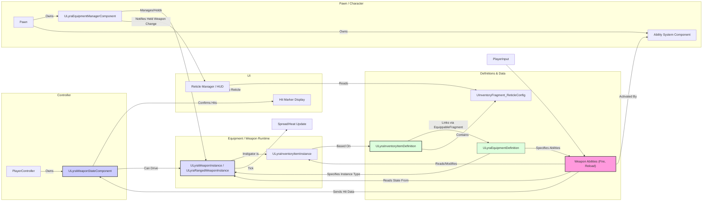

# Weapons

The Weapon System builds directly upon the foundation laid by the **Equipment System**, specializing its concepts to handle the unique requirements of firearms and other wieldable offensive tools within the game. It provides specialized components and data structures for managing weapon state, firing mechanics, visual representation, and UI feedback like reticles and hit markers.

### Purpose: Specialized Equipment Handling

While the core Equipment System handles generic equipping, ability granting, and actor spawning, the Weapon System focuses on aspects specific to weapons:

* **Firing Mechanics:** Implementing logic for ranged combat, including spread, heat, recoil (handled via Abilities, but influenced by Instance data), and damage calculation.
* **Weapon State:** Tracking runtime state specific to weapons, such as time since last fired, current heat/spread values.
* **Animation Integration:** Managing weapon-specific animation layers for equipped and unequipped states.
* **Controller Feedback:** Handling client-side effects like hit marker confirmation and input device properties (haptics).
* **UI Integration:** Linking weapon definitions to specific UI reticle widgets.

### Building on Equipment & Inventory

It's crucial to remember that the Weapon System is **not** entirely separate. It leverages and extends existing systems:

* **Equipment System:**
  * Weapon definitions (`ULyraInventoryItemDefinition`) use `UInventoryFragment_EquippableItem` to link to a `ULyraEquipmentDefinition`.
  * The `ULyraEquipmentDefinition` specifies which `ULyraWeaponInstance` class to spawn and which **Gameplay Abilities** (like Fire, Reload, Aim) to grant when the weapon is held.
  * The `ULyraEquipmentManagerComponent` handles the equipping/holding/unholding of weapons.
* **Inventory System:**
  * Weapon definitions are `ULyraInventoryItemDefinition` assets.
  * Ammo is typically managed using `StatTags` on the `ULyraInventoryItemInstance` for the weapon or separate ammo item instances.
  * Fragments like `UInventoryFragment_Attachment` allow weapons to be customized.
  * Fragments like `UInventoryFragment_ReticleConfig` link weapon definitions to UI elements.
* **Gameplay Ability System (GAS):**
  * Core weapon actions (Fire, Reload, Aim, Melee Attack) are implemented as `UGameplayAbility` instances, granted via the `ULyraEquipmentDefinition`.
  * Abilities read state from the `ULyraWeaponInstance` (e.g., spread, heat) and the associated `ULyraInventoryItemInstance` (e.g., ammo count).

### Key Weapon System Components

This system introduces several specialized classes:

* **`ULyraWeaponInstance` (Equipment Instance):**
  * The base class for runtime weapon instances, derived from `ULyraEquipmentInstance`.
  * Adds logic for animation layers, interaction timing, and applying input device properties (haptics).
* **`ULyraRangedWeaponInstance` (Equipment Instance):**
  * A further specialization for ranged weapons, derived from `ULyraWeaponInstance`.
  * Manages complex spread/heat mechanics via curves.
  * Implements `ILyraAbilitySourceInterface` for detailed damage calculation (distance falloff, material penetration/modifiers).
* **`ULyraWeaponStateComponent` (Controller Component):**
  * Lives on the `APlayerController`.
  * Manages client-side state like confirmed hit marker display.
  * Can drive the `Tick` function for the currently held weapon instance.
* **`UInventoryFragment_ReticleConfig` (Item Fragment):**
  * An inventory fragment added to weapon definitions (`ULyraInventoryItemDefinition`).
  * Specifies which `ULyraReticleWidgetBase` classes should be displayed when this weapon is equipped.

### Simplified Interaction Diagram

_(Note: Simplified view focusing on weapon-specific interactions)_

### Structure of this Section

The following pages will delve into the details of the weapon-specific components:

* **Weapon Instance (`ULyraWeaponInstance`):** The base runtime class for weapons.
* **Ranged Weapon Instance (`ULyraRangedWeaponInstance`):** Detailing spread, heat, and damage calculation for ranged weapons.
* **Weapon State Component (`ULyraWeaponStateComponent`):** Explaining the controller-side logic for hit markers and state management.
* **Reticle Configuration (`UInventoryFragment_ReticleConfig`):** How to link weapon definitions to UI reticle widgets.

***

This overview establishes the Weapon System as a specialized layer built upon the Equipment and Inventory systems, introducing the key components responsible for handling weapon-specific mechanics, state, and UI feedback.
