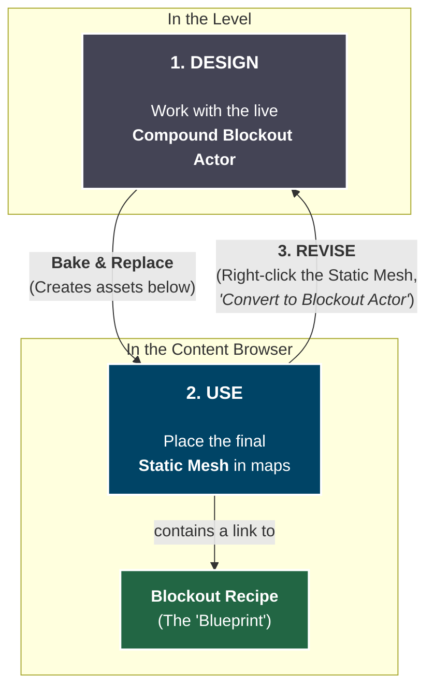

# Compound Blockout Actor

The Compound Blockout Actor is more than just a tool for placing shapes; it's a complete workflow designed for rapid iteration and reusability. To use it effectively, it's essential to understand the relationship between the three key elements in its pipeline: the **Actor**, the **Recipe**, and the final **Static Mesh**.

The core principle is **separation of concerns**: the interactive tool you use to build is separate from the instructions on _how_ it was built, which is also separate from the final, game-ready asset.

### The Three Pillars of the Workflow

When you bake a `Compound Blockout Actor`, you are interacting with a system of three distinct assets, each with a specific purpose.

**1. The Actor (`CompoundBlockoutActor`)**

* **What it is:** The live, interactive object you place in your level. It contains the list of shapes, their properties, and the `DynamicMeshComponent` that performs real-time boolean operations.
* **Its Role: The Workshop.** This is your workspace. It's designed to be heavy, flexible, and completely interactive. You should **never** ship a final game with live Blockout Actors in it; their purpose is strictly for design and creation in the editor.

**2. The Recipe (`CompoundBlockoutAsset`)**

* **What it is:** A lightweight data asset that gets saved into your Content Browser (e.g., in `/GameplayMaps/Blockouts/Recipes/`).
* **Its Role: The Blueprint.** The Recipe is a saved list of instructions. It stores which shapes you used, their transforms, materials, and bake settings. It knows _how_ to build your mesh, but it contains no actual geometry itself. This is the key to the non-destructive workflow.

**3. The Static Mesh (`UStaticMesh`)**

* **What it is:** The final, optimized, game-ready asset. It's a standard `UStaticMesh` that can be Nanite-enabled, have proper collision, and be used across your project just like any mesh modeled in an external program.
* **Its Role: The Final Product.** This is what you use in your final `Gameplay Maps`. To link it back to its source, the mesh is stamped with a small piece of metadata (`BlockoutRecipeUserData`) that points to the Recipe asset used to create it.

### How They Work Together: The Asset Lifecycle

The workflow is a simple, repeatable cycle. You can think of it in three phases: **Design**, **Use**, and **Revise**.

**Step 1: Design**

You start in the level, working with the **Compound Blockout Actor**. This is your creative phase where you add, subtract, and manipulate shapes in real-time.

**Step 2: Bake & Use**

When you're ready to finalize the asset, you **bake** it. This single action does two things:

1. It creates the optimized **Static Mesh** and the instructional **Recipe** in your Content Browser.
2. It typically replaces the live Actor in your level with an instance of the new Static Mesh.

The Static Mesh is now the "real" asset. You can place it anywhere in your project, just like a normal mesh.

**Step 3: Revise**

If you need to make a change, you don't edit the Static Mesh directly. Instead:

1. Find the baked **Static Mesh** in your level or in the Content Browser.
2. Right-click it and select **"Convert to Compound Blockout Actor"**.
3. This uses the linked **Recipe** to respawn the fully editable Actor, and you're back at Step 1, ready to make changes and re-bake.

### Why This is Essential

This separation might seem complex at first, but it is the source of the tool's power and aligns perfectly with the modular philosophy of `Gameplay Maps`.

* **Iteration and Reusability:** Imagine you block out a modular doorway. You bake it and place it 50 times throughout your map. If you later decide the doorway needs to be taller, you don't need to find and edit all 50 Static Mesh actors. Instead, you find the single **Recipe**, use it to respawn the editable **Actor**, make your change, and re-bake. You can then update all 50 Static Mesh assets automatically.
* **Performance:** The live Actor is constantly ready to recalculate complex booleans, making it unsuitable for a packaged game. The baking process converts this complex, dynamic object into a simple, highly-performant Static Mesh that the engine is optimized to render.
* **Collaboration and Source Control:** Recipes are very small data assets, making them easy to manage in source control systems like Git or Perforce. Static Meshes are large binary files. By separating the "source code" (the Recipe) from the "compiled binary" (the Static Mesh), you create a cleaner and more manageable project structure.

### Baking: Linked vs. Unlinked

Your `CompoundBlockoutActor` provides two primary ways to finalize your geometry, each serving a different purpose.

*   **Bake to Static Mesh (Linked)**

    This is the standard, recommended workflow. It creates both the `Static Mesh` and its corresponding `Recipe` asset.

    * **Use When:** Creating any modular or reusable asset (walls, doorways, props, platforms) that you might want to edit or update later. This is the default choice for building out your `Gameplay Maps`.
*   **Bake Unlinked (Found in Level Editor Actor Context Menu)**

    This is a "fire-and-forget" option that creates **only** the `StaticMesh`. It does not generate a Recipe asset.

    * **Use When:** Creating a completely unique, one-off piece of geometry that you are certain you will never need to parametrically edit again. This is useful for organic terrain features or highly specific subtractive cuts that won't be reused, as it avoids cluttering your project with unnecessary Recipe assets.
