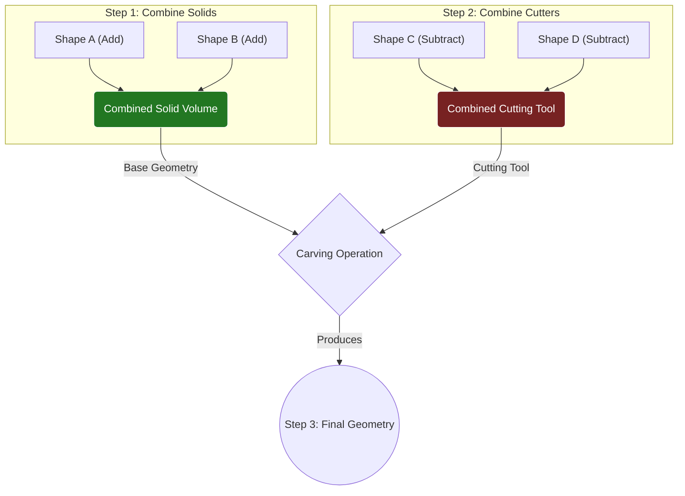

# Working with Shapes & Booleans

A `Compound Blockout Actor` is essentially a container that holds a list of simple geometric "Shapes". It combines these shapes using boolean operations (adding them together or subtracting them from each other) to create a single, complex piece of geometry. Understanding how to manage and manipulate this list of shapes is key to mastering the tool.

### The Shape Stack

When you select a `Compound Blockout Actor`, the Details panel will show a "Shapes" array. This is the heart of the actor.

<figure><figcaption></figcaption></figure>

This is a standard Unreal Engine array, so you can:

* **Add (+):** Add a new shape to the list. You will be prompted to choose the type of shape (Box, Cylinder, etc.).
* **Remove:** Delete a shape from the list.
* **Reorder:** Drag and drop shapes to change their order in the array.
* **Duplicate:** Create a copy of an existing shape and its settings.

Each element in this array is an individual `UBlockoutShapeBase` object with its own transform, material, and boolean operation.

### Boolean Operations: The Core Mechanic

Every shape in the stack has an `Operation` property which can be set to either **Add** or **Subtract**. This determines how the shape contributes to the final mesh.

Think of it like sculpting:

* **Add** shapes are like adding new lumps of clay to build up your form.
* **Subtract** shapes are like using cookie cutters or carving tools to remove clay.

The tool uses a robust process to ensure predictable results, which can be visualized in three simple steps:

**Step 1: All "Add" shapes are merged into a single solid volume.** The tool takes every shape marked as `Add` (e.g., a large box and a cylinder) and unions them together.

**Step 2: All "Subtract" shapes are merged into a single "cutting tool".** Separately, the tool takes every shape marked as `Subtract` (e.g., a smaller box for a doorway and a sphere for a window) and unions them into a single negative shape.

**Step 3: The "cutting tool" is used to carve the final geometry.** Finally, the combined subtractive shape is used to carve away from the combined additive shape, leaving you with the final result.

This approach means you don't need to worry about the order of shapes in the array for booleans to work correctly. You can simply define your solid forms (`Add`) and your negative spaces (`Subtract`), and the builder will resolve them into the final mesh.

Here is a conceptual diagram of that process:

### Applying Materials

You can control materials at two levels:

1. **Actor Level:** The `Compound Blockout Actor` has a main `Material` property. This is the default material applied to any shape that doesn't have its own override.
2. **Shape Level:** Each individual shape has a `Material Override` property. If you set this, that specific shape will be assigned its own material, creating a new material slot on the final Static Mesh.

<figure><figcaption></figcaption></figure>


`Material Overrides` only have a visible effect on shapes with the **Add** operation. Subtractive shapes are "invisible" — they only remove geometry and do not contribute any surface or material slots to the final mesh.


### Interacting with Shapes

You have two complementary ways to edit shapes, allowing you to switch between artistic freedom and numerical precision.

**1. The Details Panel**

This is your home for precise, data-driven changes. You can expand any shape in the "Shapes" array to see all of its properties (e.g., `Dimensions`, `Radius`, `NumSteps`).

To make it easier to work with complex stacks, each shape has a **Select** button next to it.

* **What it does:** Clicking "Select" immediately focuses the 3D transformation gizmo on that specific shape's pivot point within the actor.
* **Why it's useful:** If you have 20 shapes in an actor, finding the right one to move in the viewport can be difficult. This button eliminates the guesswork and lets you instantly grab and transform the exact shape you want to edit.

<figure><figcaption></figcaption></figure>

**2. Viewport Handles**

For a faster, more intuitive workflow, many shapes support interactive **Handles** directly in the viewport.

* **Enabling Handles:** On a shape, toggle the `bUseHandles` property. This will display one or more gizmos in the 3D view that you can click and drag.
* **Live Feedback:** As you drag a handle, the actor provides instant feedback, rebuilding the mesh in real-time.

### **Live Preview / Isolation Mode**

When you are editing a complex actor with many overlapping shapes and subtractions, it can be hard to visualize the true extents of the single shape you are currently modifying.

To solve this, the tool automatically enters a **Live Preview** mode when you click and drag a shape's handle:

* The rest of the compound actor's geometry will temporarily disappear.
* Only the wireframe of the shape you are currently editing will be visible.

This isolates the shape, allowing you to adjust its size and position without any visual clutter. As soon as you release the mouse button, the full actor geometry is rebuilt with your changes applied.
