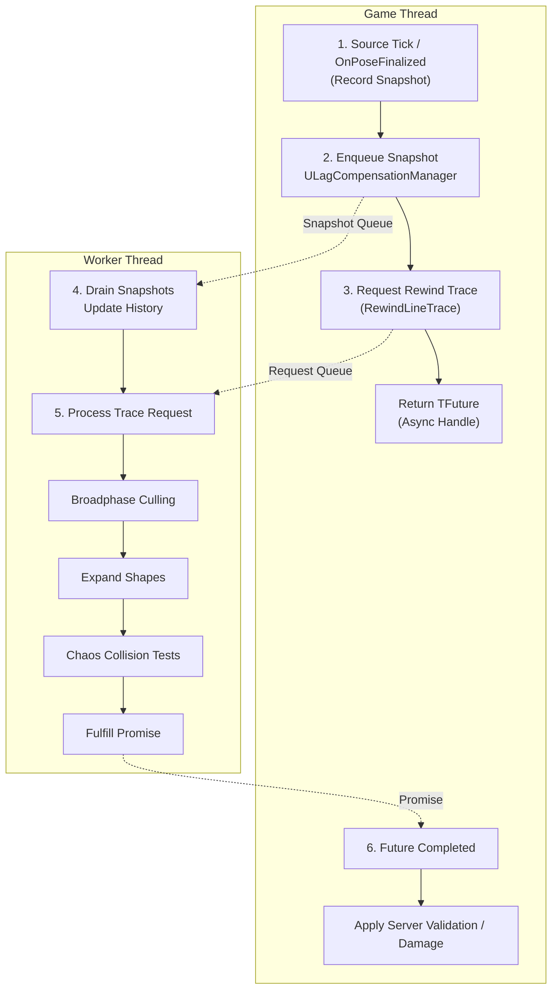

# Architecture

The `LagCompensation` plugin is built around three roles: **hitbox sources** that record history through a common interface, a **Manager** that coordinates requests, and a **Worker Thread** that performs traces without blocking gameplay. This separation keeps expensive computation off the game thread while maintaining server-authoritative results.

***

### Component Overview

| Component                            | Thread        | Role                                                                                                                                                                           |
| ------------------------------------ | ------------- | ------------------------------------------------------------------------------------------------------------------------------------------------------------------------------ |
| **`ILagCompensationHitboxSource`**   | Game Thread   | The interface a backend implements. A source describes one actor's hit geometry and pushes a per-tick trail; the backend it declares decides where the rewound poses come from |
| **`ULagCompensationManager`**        | Game Thread   | Central registry of sources, manages threading, and provides async rewind-trace API                                                                                            |
| **`FLagCompensationThreadRunnable`** | Worker Thread | Owns per-actor history buffers, performs interpolation, and executes rewind traces                                                                                             |

All gameplay interaction occurs through the manager. Sources only push their trail, and the worker performs all heavy operations in isolation. Which backend a source is only matters at the moment [narrowphase](./#broadphase-and-narrowphase) needs a pose; everything up to and including broadphase is identical. The backends themselves, including the default snapshot source and its recording path, are covered in Backends; this page describes the shared machinery every backend runs on.

***

## Chaos Physics Integration

The lag compensation system uses **Unreal's Chaos physics library** directly for collision queries, bypassing the main physics scene entirely. This is critical for thread safety, Chaos geometry queries are stateless and can run on any thread without locks.

### Why Not Use `LineTraceSingleByChannel`?

Standard Unreal trace functions access the physics scene, which requires game thread synchronization. The lag compensation worker thread runs independently and cannot safely call these functions.

### Chaos Queries Used

| Query                   | Purpose                                              |
| ----------------------- | ---------------------------------------------------- |
| `Chaos::SweepQuery()`   | Sweep a shape along a path to find intersection time |
| `Chaos::OverlapQuery()` | Check if shapes overlap at t=0 (starting inside)     |
| `Chaos::FMTDInfo`       | Minimum Translation Distance for overlap resolution  |

### Shape Primitives

Collision shapes are constructed as Chaos types for thread-safe queries. These primitives are built on-demand from stored shape definitions, allowing efficient memory usage while maintaining full collision fidelity.

***

## Hitbox Sources and the Backend Seam

Every actor that participates in lag compensation registers exactly one hitbox source: a component implementing `ILagCompensationHitboxSource`. This interface is the seam that keeps the system open. The manager and the worker are written against it and know nothing about any particular backend.

The contract is deliberately small. A source names the actor it contributes hitboxes for, hands over the collision shape tables built from the physics asset, declares its **pose delivery channel** through `ELagCompensationBackend`, and pushes one `FLagCompensationTrail` entry per tick, the lightweight broadphase record of when and where the actor was, with its bounds and collision responses.

The channel decides where the worker gets a narrowphase pose when a trace rewinds to a past time:

* **`PosesInTrail`** — the source attaches a pose to every trail entry, so the worker already holds it and only interpolates between the two bracketing entries. Eager: the pose is produced each tick whether or not anyone shoots.
* **`PosesOnDemand`** — the trail entry carries no pose. The source hands over an `ILagCompensationOnDemandPoseProvider`, and the worker asks it to reconstruct the two bracketing poses only when a trace survives broadphase. Lazy: the pose is produced on request.

Either way the worker runs the same broadphase and the same interpolation; only where the narrowphase pose comes from differs. The manager registers one source per owning actor and refuses a second, so an actor cannot double-report its hitboxes through two backends.

What implements this contract is a **backend**. The system ships with one, the snapshot source, and Anim Rewind adds another; a project can write its own. The backends, the full contract, and how to add one live in [Backends](backends.md). The rest of this page is the machinery every backend shares: the manager, the worker, and the data flow between them.

***

## `ULagCompensationManager`: Central Coordinator

The manager acts as the bridge between gameplay code and the background worker. It lives on the `GameState` actor, ensuring exactly one instance exists per world.

### Source Management

Sources register and unregister themselves during their lifecycle through `RegisterHitboxSource` and `UnregisterHitboxSource`, which run on the game thread. Registration returns a source id and refuses a second source for an actor that already has one, so an actor cannot double-report its hitboxes through two backends.

### Thread Lifecycle

On experience load, the manager creates the worker thread:

```plaintext
OnExperienceLoaded():
    // Create the worker
    LagCompensationThread = new FLagCompensationThreadRunnable(
        World,
        this,
        &DebugService
    )

    // Worker spawns its own FRunnableThread internally
    // Creates GameTickEvent for synchronization
```

On `EndPlay`, the manager safely shuts down the worker:

```plaintext
EndPlay():
    if LagCompensationThread:
        LagCompensationThread.EnsureCompletion()  // Sets bStopRequested, triggers event
        delete LagCompensationThread
        LagCompensationThread = nullptr
```

### Tick Synchronization

Every `TickComponent`, the manager wakes the worker and processes debug output:

```plaintext
TickComponent(DeltaTime):
    if LagCompensationThread:
        // Wake worker to process any pending snapshots/requests
        LagCompensationThread.GameTickEvent.Trigger()

    // Flush debug drawing to game thread
    DebugService.Flush(World)
```

### Trail Intake

Every backend calls `IngestTrail_GameThread` once per tick with its broadphase trail. Snapshot sources attach their poses to the entry; on-demand sources push it bare. The manager forwards the entry to the worker:

```plaintext
IngestTrail_GameThread(source, trail):
    LagCompensationThread.EnqueueTrail(source, Move(trail))
    LagCompensationThread.GameTickEvent.Trigger()
```

### Public API

The manager exposes asynchronous rewind tracing:

```cpp
TFuture<FRewindLineTraceResult> RewindLineTrace(
    float LatencyInMs,                    // How far back to rewind
    const FVector& Start,                  // Trace start
    const FVector& End,                    // Trace end
    const FRewindTraceInfo& TraceInfo,     // Shape, radius, etc.
    ECollisionChannel Channel,             // Collision channel
    const TArray<AActor*>& ActorsToIgnore  // Excluded actors
);
```

Internally, this creates a `TPromise`, packages a request, and enqueues it:

```plaintext
RewindLineTrace(...):
    request = FRewindLineTraceRequest()
    request.Timestamp = WorldTime - (LatencyMs / 1000.0)
    request.Start = Start
    request.End = End
    request.TraceInfo = TraceInfo
    request.TraceChannel = Channel
    request.ActorsToIgnore = ActorsToIgnore
    request.Promise = MakeShared<TPromise<FRewindLineTraceResult>>()

    LagCompensationThread.EnqueueRequest(Move(request))
    LagCompensationThread.GameTickEvent.Trigger()

    return request.Promise.GetFuture()
```


**`TPromise` / `TFuture` (UE5 async result pair):** Think of this like a **“result that will arrive later.”**

* The **caller** gets a `TFuture<T>` immediately, which is basically a handle to a value that **isn’t ready yet**.
* The **worker thread** holds the matching `TPromise<T>` and, when it finishes the rewind trace, it **fulfills** the promise (sets the result).
* Once the promise is fulfilled, the future becomes ready and the caller can **wait for it**, **poll it**, or attach a continuation.


***

## `FLagCompensationThreadRunnable`: Background Worker

This thread owns all historical data and executes rewind traces asynchronously. It is completely isolated from gameplay and only communicates through lock-free queues.

### Thread Configuration

```plaintext
FLagCompensationThreadRunnable(World, Manager, DebugService):
    // Create synchronization event
    GameTickEvent = FPlatformProcess::GetSynchEventFromPool(false)

    // Spawn thread with above-normal priority
    Thread = FRunnableThread::Create(
        this,
        TEXT("LagCompensationThread"),
        128 * 1024,  // 128KB stack
        TPri_AboveNormal
    )
```



#### Wait for Game Tick Event

Thread sleeps until the manager signals a new tick/work.



#### Update History

Drain all pending snapshots into per-actor history structures.



#### Process Requests

For each pending rewind trace request: process and fulfill its promise.



#### Debug Visualization

If debug is enabled, queue pose drawings for the game thread to render.



### History Data Structure

Each source maintains a doubly-linked list of historical poses:

```plaintext
ActorHistoryData: TMap<HitboxSource, TDoubleLinkedList<FLagCompensationData>*>
```

| Structure                  | Purpose                                                     |
| -------------------------- | ----------------------------------------------------------- |
| `FLagCompensationSnapshot` | Captured per-frame data from sources (game thread)          |
| `FLagCompensationData`     | Processed, thread-owned historical record for interpolation |
| `TDoubleLinkedList`        | Efficient head insertion and tail pruning                   |

### Shutdown Sequence

When shutdown is requested, the worker completes any pending work, cleans up all history data, and returns the synchronization event to the pool.

***

## Data Flow



***

## Phase Summary

| Phase              | Thread         | Operation                                                                                                                                                   |
| ------------------ | -------------- | ----------------------------------------------------------------------------------------------------------------------------------------------------------- |
| Snapshot Recording | Game           | Sources capture poses via delegate or tick                                                                                                                  |
| Snapshot Draining  | Worker         | Move into per-actor history buffers                                                                                                                         |
| Rewind Request     | Game           | Enqueued via manager API                                                                                                                                    |
| Broadphase         | Worker         | Multi-stage AABB filtering                                                                                                                                  |
| On-Demand Poses    | Worker or Game | For on-demand sources that survive broadphase, reconstruct the bracketing poses (on the worker when the provider is worker-safe, otherwise the game thread) |
| Shape Expansion    | Worker         | Transform local shapes to world space                                                                                                                       |
| Collision Testing  | Worker         | Chaos sweep queries                                                                                                                                         |
| Results Returned   | Worker → Game  | Promise fulfilled, callback executed                                                                                                                        |
| Debug Draw         | Game           | Flush deferred commands                                                                                                                                     |

***

## Thread Safety Guarantees

| Guarantee                | Implementation                                                                        |
| ------------------------ | ------------------------------------------------------------------------------------- |
| **No UObject access**    | Worker never touches live game objects after snapshot ingestion                       |
| **Immutable asset data** | Shape tables read from `UPhysicsAsset` and `UBodySetup` which don't change at runtime |
| **Lock-free queues**     | MPSC queues use atomic operations, no mutexes on hot paths                            |
| **Deferred debug**       | Debug drawing enqueued to game thread via `FLagCompensationDebugService`              |
