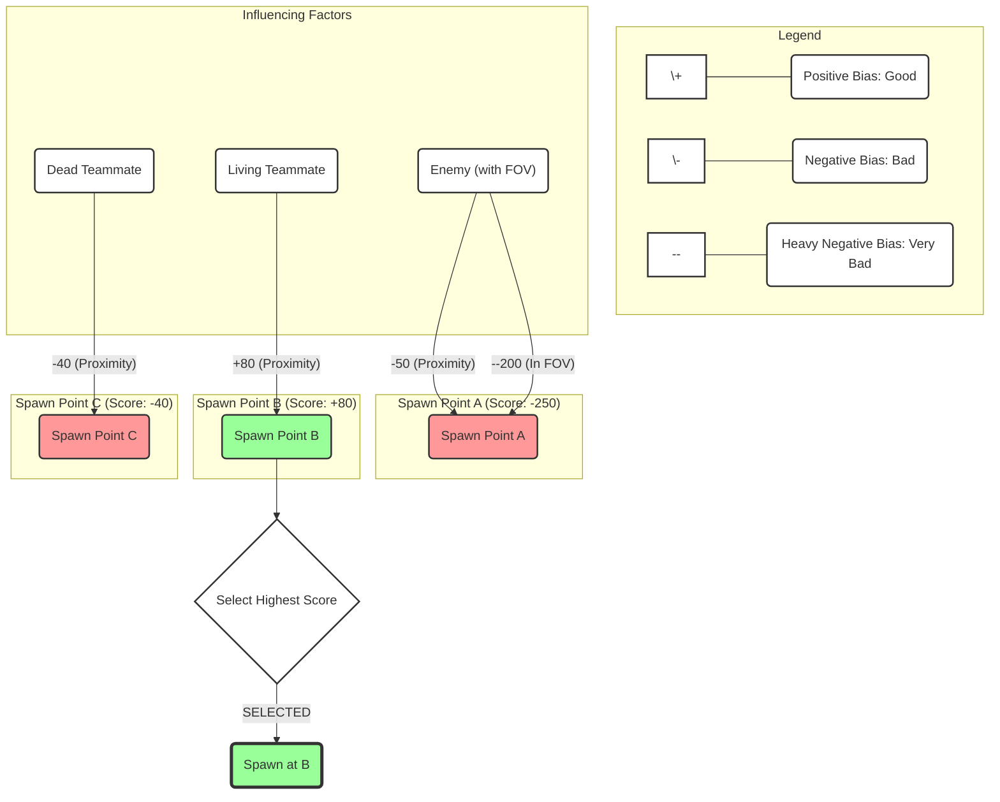

# Core Logic

The heart of the Influence Spawn System is the calculation of a numerical **Bias Score** for each potential spawn point (`ALyraPlayerStart`). This score represents the desirability of spawning at that location _at the current moment_, considering various factors from the ongoing game state. The system ultimately selects the valid spawn point with the highest bias score.

### Overview: Quantifying "Goodness"

Instead of simple random selection or basic distance checks, this system quantifies how "good" a spawn point is relative to others.

* **Goal:** Assign a higher score to safer, more strategically advantageous spawn locations.
* **Method:** Start with a neutral score (typically 0.0f) for each spawn point and incrementally adjust it based on positive and negative influences.
* **Outcome:** The spawn point accumulating the highest positive bias (or least negative bias) is chosen.

### The `CalculateSpawnBias` Function

The primary function responsible for computing this score within `UShooterPlayerSpawningManagmentComponent` is `CalculateSpawnBias`:

```cpp
float UShooterPlayerSpawningManagmentComponent::CalculateSpawnBias(ALyraPlayerStart* PlayerStart, AController* Player) const
{
    // ... Get Team Subsystem, Player's Team ID ...

    float SpawnBias = 0.0f; // Start with a neutral score

    // --- Bias based on proximity to other players ---
    for (APlayerState* PS : GetWorld()->GetGameState()->PlayerArray)
    {
        // ... (Skip spectators, check team ID) ...
        if (APawn* Pawn = PS->GetPawn())
        {
            float Distance = PlayerStart->GetDistanceTo(Pawn);
            if (TeamId == PlayerTeamId) // Teammate
            {
                if(IsPlayerDead(PS))
                {
                    // Negative bias for dead teammates (further is better)
                    SpawnBias -= /* Formula based on distance */;
                }
                else
                {
                    // Positive bias for living teammates (closer is better)
                    SpawnBias += /* Formula based on distance */;
                }
            }
            else // Enemy
            {
                // Negative bias for enemies (further is better)
                SpawnBias -= /* Formula based on distance */;
            }
        }
    }

    // --- Bias based on enemy line of sight ---
    float FOVBias = CalculateEnemyFOVBias(Player, PlayerStart); // This calculates a positive penalty value
    SpawnBias -= FOVBias; // Subtract the penalty (strong negative influence)

    // --- Bias based on game mode logic ---
    SpawnBias += CalculateGameModeBias(Player, PlayerStart); // Add custom bias

    return SpawnBias;
}
```

### Aggregating Influences

As shown in the structure above, the final `SpawnBias` is an aggregation of scores derived from several distinct factors:

1. **Teammate Proximity (Living):** Adds points, favoring spawns closer to living allies.
2. **Teammate Proximity (Dead):** Subtracts points, penalizing spawns near where teammates recently died.
3. **Enemy Proximity:** Subtracts points, penalizing spawns close to known enemy positions.
4. **Enemy Line of Sight (FOV):** Subtracts significant points if the spawn point falls within an enemy's calculated field of view cone.
5. **Game Mode Logic:** Adds or subtracts points based on custom rules defined for the specific game mode (e.g., proximity to objectives).



### Iterating Player State

To calculate proximity and line-of-sight influences, the system iterates through the `PlayerArray` available on the current `AGameStateBase`. For each `APlayerState` in the array, it typically:

* Checks if the player is a spectator (and skips if so).
* Determines the player's team ID using `ULyraTeamSubsystem`.
* Gets the player's current `APawn` (if valid).
* Performs calculations based on the pawn's location, rotation (for FOV), team ID relative to the spawning player, and potentially health/death status (`IsPlayerDead`).

### Next Steps: Factor Breakdowns

The precise calculation and rationale behind each contributing factor (Teammate Proximity, Enemy Proximity, Enemy FOV, Game Mode Bias) will be detailed in the following sub-pages. Understanding how each piece contributes to the final score is key to tuning and extending the system effectively.

***
