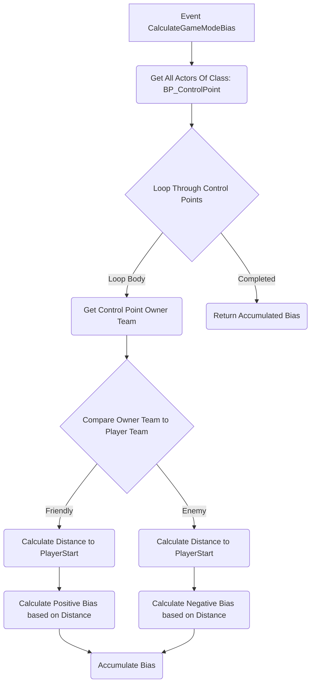
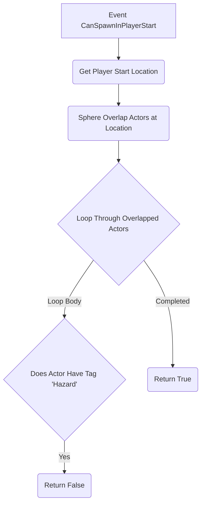

# Customization & extension

While the "Configuration & Tuning" page covers adjusting the pre-defined parameters of the Influence Spawn System, true adaptation to specific game modes and unique gameplay requirements often necessitates adding custom logic or modifying the decision-making process. The `UShooterPlayerSpawningManagmentComponent` is designed with extensibility in mind, primarily through **subclassing** and overriding key functions.

### Primary Method: Subclassing

The most common and recommended way to customize the spawn logic is to create your own Blueprint or C++ class that inherits from `UShooterPlayerSpawningManagmentComponent`.

1. **Create Subclass:** In the Content Browser, right-click -> Blueprint Class -> Search for and select `ShooterPlayerSpawningManagmentComponent`. Give it a specific name (e.g., `BP_SpawningManager_Domination`, `BP_SpawningManager_Payload`).
2. **Implement Overrides:** Within this new subclass, you can override specific functions (`BlueprintNativeEvents`) to inject your custom logic.

### Hook 1: Overriding `CalculateGameModeBias`

This is the **primary hook** for adding game-mode-specific influences to the spawn point selection.

* **Purpose:** To calculate an additional positive or negative bias score for a specific `PlayerStart` based entirely on the rules and state of the current game mode. This bias is added directly to the score derived from proximity and FOV checks.
* **How to Override:**
  * **Blueprint:** In your subclass Blueprint editor, go to the "My Blueprint" panel -> Functions -> Override -> Select `Calculate Game Mode Bias`.
  * **C++:** In your subclass header/source file, declare and define `virtual float CalculateGameModeBias_Implementation(AController* Player, ALyraPlayerStart* PlayerStart) const override;`.
* **Inputs:** Receives the `Player` Controller attempting to spawn and the `PlayerStart` being evaluated.
* **Output:** Must return a `float` representing the custom bias. Positive values make the spawn point more favorable; negative values make it less favorable. The base implementation returns `0.0`.
* **Implementation Examples:**
  * **Objective Proximity:** Get locations of control points, flags, or payload carts. Calculate the distance from the `PlayerStart` to these objectives. Return a positive bias for being near friendly objectives or a negative bias for being near enemy objectives.
  * **Game Phase:** Get the `ULyraGamePhaseSubsystem`. Check the current active phase tag (e.g., `IsPhaseActive(GamePhase.Overtime)`). Return different bias values based on the phase (e.g., heavily favor spawning near a central objective during overtime).
  * **Map Zones:** Use volumes or tags to define different map regions. Apply bias based on which region the `PlayerStart` is in (e.g., favor spawning in "safe zones", penalize spawning in "contested zones").
  * **Player Role/State:** Check the spawning `Player`'s state (e.g., if they are carrying a flag) and bias spawns accordingly (e.g., favor spawning flag carriers in safer, rear locations).

**Blueprint Structure Example (Conceptual for Domination):**

### Hook 2: Overriding `CanSpawnInPlayerStart`

This function provides a way to **completely disqualify** a spawn point _before_ any bias calculations are even performed.

* **Purpose:** To implement hard rules that prevent spawning at certain locations based on criteria not related to desirability scoring. If this returns `false`, the spawn point is immediately skipped.
* **How to Override:**
  * **Blueprint:** Override `Can Spawn In Player Start`.
  * **C++:** Override `virtual bool CanSpawnInPlayerStart_Implementation(AController* Player, ALyraPlayerStart* PlayerStart) override;`.
* **Inputs:** Receives the `Player` Controller and the `PlayerStart`.
* **Output:** Must return a `bool`. `true` means the spawn point is potentially valid (and bias will be calculated); `false` means the spawn point is invalid for this player right now and will be ignored. The base implementation returns `true`.
* **Implementation Examples:**
  * **Tag Filtering:** Check the `StartPointTags` on the `ALyraPlayerStart`. Return `false` if it has a tag indicating it's currently disabled (e.g., `Spawn.Disabled.ObjectiveActive`).
  * **Environmental Hazards:** Perform an overlap check at the `PlayerStart` location. Return `false` if it overlaps with a "LavaVolume", "ToxicGasVolume", or "OutOfBoundsVolume".
  * **Objective Proximity Rules:** Return `false` if the `PlayerStart` is _too close_ to a critical objective that should have a clear zone (e.g., directly on top of the payload cart when it's contested).
  * **Game Mode State:** Return `false` for certain spawns based on game state (e.g., disallow spawning in the enemy base during a setup phase).

**Blueprint Structure Example (Conceptual Hazard Check):**

### Advanced: Modifying Base Calculations (Use with Caution)

While highly discouraged for typical use cases, advanced C++ users _could_ choose to override the core calculation functions directly in their subclass:

* `virtual float CalculateSpawnBias(ALyraPlayerStart* PlayerStart, AController* Player) const override;`
* `virtual float CalculateEnemyFOVBias(AController* Player, ALyraPlayerStart* PlayerStart) const override;`
* **Reasoning:** This might be necessary if you need to fundamentally change how proximity/FOV is calculated or weighted in a way that can't be achieved by just adding/subtracting in `CalculateGameModeBias` or if you want to properly integrate the `Weight` properties into the base calculations.
* **Warning:** Overriding these functions requires replicating _all_ the original logic you want to keep, plus your modifications. It increases complexity and the risk of introducing bugs or breaking expected base behavior. It's generally much safer and more maintainable to use the provided `CalculateGameModeBias` and `CanSpawnInPlayerStart` hooks.

### Summary

The recommended way to customize the Influence Spawn System is by creating a Blueprint or C++ subclass of `UShooterPlayerSpawningManagmentComponent` and overriding:

1. **`CalculateGameModeBias`:** To add positive or negative scoring influence based on game mode objectives and states.
2. **`CanSpawnInPlayerStart`:** To implement hard pass/fail rules for disqualifying specific spawn points entirely.

Using these hooks allows you to tailor the spawning behavior significantly while leveraging the robust base logic for proximity and line-of-sight safety checks. Remember to integrate your custom subclass using Lyra Experiences, as detailed on the next page.

***
