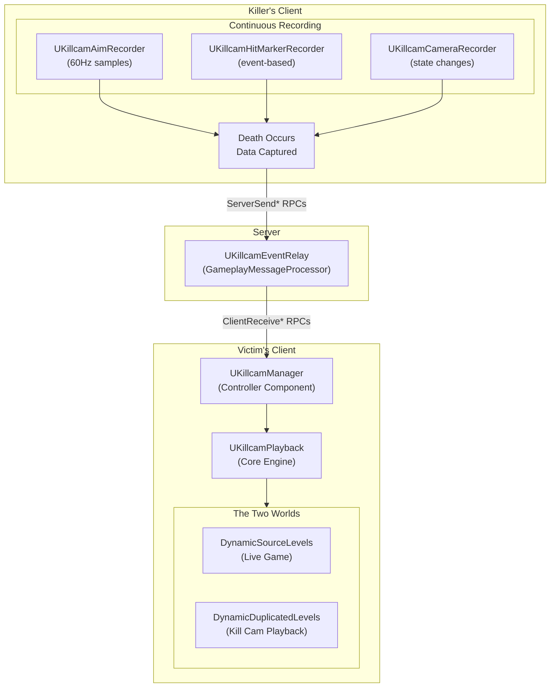
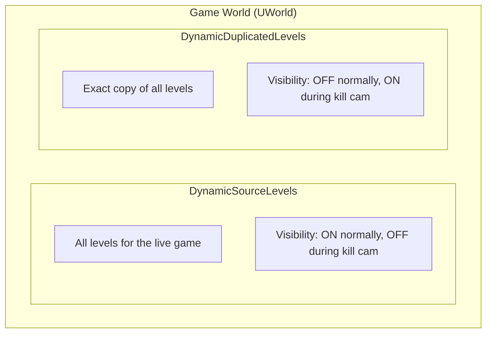
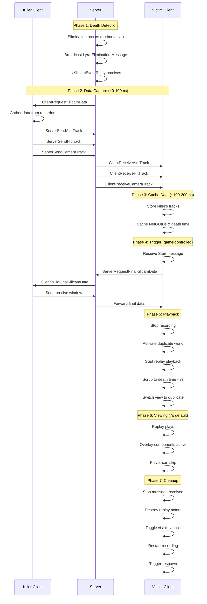

# Architecture Overview

Before diving into individual systems, it's essential to understand how all the pieces of the Kill Cam fit together. This page provides the mental model you need to understand the system's design and troubleshoot issues effectively.

***

## The Big Picture

The Kill Cam system spans multiple machines and involves careful coordination between client and server:

***

### Component Roles

#### Engine Level: `ULyraGameEngine`

The foundation of the entire system. Located in `Source/LyraGame/System/`, this custom engine class overrides `Experimental_ShouldPreDuplicateMap` to enable world duplication at startup. Without this modification, kill cam is impossible.

#### Server Side: `UKillcamEventRelay`

A `UGameplayMessageProcessor` living in the ShooterBase plugin that listens for elimination messages and coordinates data transfer between killer and victim. The server acts purely as a trusted relay, it doesn't store or process replay data, just routes the killer's recorded data to the victim's client.

#### Client Side - Recording

Three components run on every player's controller, continuously buffering the last \~15 seconds of data:

* `UKillcamAimRecorder` continuously samples the player's aim direction at a configurable rate (default 60Hz). This captures the exact crosshair position the player sees.
* `UKillcamHitMarkerRecorder` records hit marker events as they happen, position, hit zone, and whether it was a successful hit. Event-based, not continuous.
* `UKillcamCameraRecorder` tracks camera mode changes and ADS (aim down sights) state transitions. Only records when state actually changes.

When a player gets a kill, all this data is already captured and ready to send.

#### Client Side - Coordination

* `UKillcamManager` is the conductor of the orchestra. This controller component (client only) orchestrates the entire kill cam flow, receiving killer data, handling start/stop messages, and managing the playback instance.
* `UKillcamPlayback` is the core engine. Owned by the Manager, this `UObject` handles the heavy lifting: world switching, replay streaming via `DemoNetDriver`, time scrubbing, and cleanup.

#### Client Side - Playback

During playback, specialized components render the killer's perspective:

* `UKillcamAimPlayback` interpolates between recorded aim samples to provide smooth crosshair movement that matches what the killer saw.
* `UKillcamHitMarkerPlayback` displays hit markers at their correct timestamps during the replay.
* `UKillcamCameraPlayback` applies camera mode and ADS transitions to match the killer's camera state.

#### Gameplay Abilities

The system hooks into Lyra's ability system through four key abilities:

* `GA_Killcam_Death` activates on the death gameplay event. It initiates the kill cam flow and shows the skip UI.
* **G`A_Killcam_Camera`** handles pawn tracking and UI indicators during playback. It keeps track of the killer's pawn (which may not be immediately available or might change during playback), creates the victim indicator (the "you" marker), and spawns the spectator pawn.
* `GA_Skip_Killcam` handles the skip input, allowing players to end playback early.
* `GA_Respawn` / `GA_Manual_Respawn` controls respawn timing after kill cam completes.

***

### The Two Worlds Concept

The most important architectural decision in this system is the dual-world approach. Understanding this is key to understanding everything else.

#### Why Two Worlds?

Playing a replay in the live game world would cause serious problems:

* Actor Conflicts — Replay actors showing past positions would coexist with live actors at current positions, creating visual chaos and confusion.
* Physics Interference — Replay projectiles might collide with live players, replay explosions could trigger live damage calculations.
* State Corruption — Replay events like "pickup weapon" or "open door" could affect live game state.
* Visual Chaos — Two copies of every character visible simultaneously, both moving independently.

### The Solution: Complete Isolation

Instead, the engine pre-creates a complete duplicate of the world:

During kill cam, the system simply toggles visibility. The steps are:



#### Toggle source invisible

Source levels become invisible (but continue simulating in the background).



#### Make duplicate visible

Duplicate levels become visible.



#### Play replay in duplicate

Replay plays back in the duplicate world.



#### Switch player's view

The player's view switches to watch the duplicate.



#### After playback, toggle back

After playback, visibility toggles back to show the live source world again.



Since only one world is ever visible at a time, there's complete isolation between them.

***

## Data Flow Timeline

Here's what happens from the moment of death to respawn:

***

### Design Decisions & Trade-offs

#### Why Client-Side Recording?

Each client records its own aim/camera/hit data, rather than the server recording everyone.

Why this works better:

* The server doesn't need to receive 60Hz aim updates from every player (bandwidth).
* Clients have perfect knowledge of their exact local view (accuracy).
* Recording overhead is distributed across clients, not centralized (scalability).

The trade-off: Requires RPC coordination to transfer data after kills occur.

#### Why In-Memory Replay Streaming?

The system uses `InMemoryNetworkReplayStreaming` instead of disk-based replays.

Why this works better:

* No disk I/O means instant scrubbing and playback (speed).
* No replay files to manage or clean up (simplicity).
* Critical for near-instant kill cam activation (low latency).

The trade-off: Limited history, bounded by memory buffer size.

#### Why Visibility Toggling?

The system completely hides one world while showing the other.

Why this works well:

* Complete isolation between worlds with minimal complexity.
* No edge cases with dynamic actor spawning.
* Seamless transitions, just toggle visibility.

The trade-off: Source world continues simulating while hidden.

***

### Key Files

All Kill Cam files live in `Plugins/GameFeatures/ShooterBase/Source/ShooterBaseRuntime/.../Game/Killcam/`

Core System:

* `KillcamPlayback.h/.cpp` — The core playback engine
* `KillcamManager.h/.cpp` — Client-side coordinator
* `KillcamEventRelay.h/.cpp` — Server-side data relay
* `LyraGameEngine.h/.cpp` — World duplication enablement (in `Source/LyraGame/System/`)

Recording:

* `KillcamAimRecorder.h/.cpp` — Aim data recording
* `KillcamHitMarkerRecorder.h/.cpp` — Hit marker recording
* `KillcamCameraRecorder.h/.cpp` — Camera state recording

Playback:

* `KillcamAimPlayback.h/.cpp` — Aim data playback
* `KillcamHitMarkerPlayback.h/.cpp` — Hit marker playback
* `KillcamCameraPlayback.h/.cpp` — Camera state playback

Data Structures:

* `KillcamAimTypes.h` — Aim track structures
* `KillcamHitMarkerTypes.h` — Hit marker structures
* `KillcamCameraTypes.h` — Camera track structures

***
