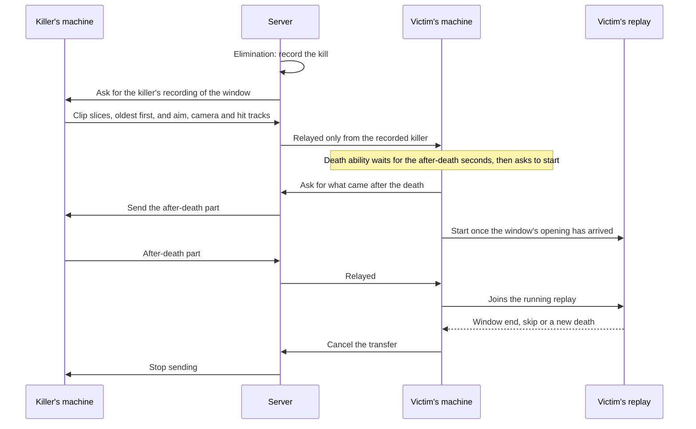

# How a Kill Cam Plays

A kill cam shows the victim the last seconds before their death, seen the way the killer saw them, while the match carries on around them. Four parties take part: the killer's machine, the server, the victim's machine, and the replay running on the victim's machine. This page follows one kill from start to finish, then lays the window out on a timeline and lists which piece does what.

The replay itself is a [Visual Replay](../../visual-replay/) session. This section covers what the kill cam adds on top: deciding whose recording to play, getting it from the killer safely, and presenting it.

***

## Before Anyone Dies

Every player's machine is recording its own view of the match all the time, so the moment a kill happens the material for its replay already exists.

* **The recording.** `UKillcamManager` sits on each player's controller. On the local player's machine it sets the Visual Replay recorder's clock to server time and asks the recorder to keep running. Every machine therefore holds the last `Replay.WindowSeconds` (10 by default) of what it drew, stamped with times that line up across machines.
* **The killer's own tracks.** Three small recorders on the controller keep 15 seconds of the player's aim, camera mode and aiming-down-sights changes, and the hit markers they were shown. For a bot they run on the server.
* **The server's listener.** `UKillcamEventRelay` on the game state listens for eliminations, on the server only.

***

## One Kill, End to End


```mermaid
sequenceDiagram
    participant K as Killer's machine
    participant S as Server
    participant V as Victim's machine
    participant R as Victim's replay
    S->>S: Elimination: record the kill
    S->>K: Ask for the killer's recording of the window
    K->>S: Clip slices, oldest first, and aim, camera and hit tracks
    S->>V: Relayed only from the recorded killer
    Note over V: Death ability waits for the after-death seconds, then asks to start
    V->>S: Ask for what came after the death
    S->>K: Send the after-death part
    V->>R: Start once the window's opening has arrived
    K->>S: After-death part
    S->>V: Relayed
    V->>R: Joins the running replay
    R-->>V: Window end, skip or a new death
    V->>S: Cancel the transfer
    S->>K: Stop sending
```



#### The server records the kill

When an elimination names a killing player and a victim with a player controller, the relay writes a **kill record** on the victim's server-side manager: who the killer was, the server time of the death, and an id for the clip that will describe it. Everything the killer sends later is checked against this record. The relay then asks the killer's machine for its recording of the window, telling it where the window starts.

A bot killer has no machine of its own to ask. The server gathers the bot's tracks itself and sends them straight to the victim.



#### The victim notes its death

The victim's machine notes the local time of the death and whether a player made the kill. It also tells the recorder to keep its history back to the window's start for a while, so the replay's opening isn't trimmed away while the kill cam gets ready.



#### The killer sends its recording

The killer's machine cuts its recording of the window into slices of 1.5 seconds and sends them oldest first. Each slice is a perspective clip of the killer, the victim as the killer saw them, and up to four other characters that were on the killer's screen. Encoding runs off the game thread, and sending is paced so the clip never crowds out the game's own traffic. The aim, camera and hit tracks go alongside.

The server relays each piece to the victim only if it comes from the recorded killer for the recorded kill. The victim reassembles and decodes each slice as it completes. [Getting the Killer's Recording](data-transfer-and-networking.md) covers the transport and the checks.



#### The kill cam is asked to start

The death ability waits for the window's after-death seconds, so the killer has had time to record them, then broadcasts the kill cam start message. The manager then asks the server for the part recorded after the death. The server forwards the request to the killer, which sends it as one final part along with its tracks trimmed to the window.



#### The start decision

The kill cam begins as soon as the first second of the window has arrived from the killer. If it hasn't, the manager broadcasts a waiting message, which the kill cam UI shows, and waits up to `Killcam.PerspectiveClipWaitSeconds` (3 seconds), checking again as each part arrives. If time runs out it plays the victim's own recording instead.

Whichever recording the kill cam starts with, it keeps. Switching part way through would make everything jump to where the other machine saw it. A kill by a bot, or a death the victim caused themselves, has no clip to wait for and starts straight from the victim's own recording.



#### Playing

`UKillcamReplay` starts a Visual Replay session with the chosen recording. Bringing the stand-ins up is spread over several frames and shown as waiting. When they are ready, it finds the killer's and the victim's stand-in player states and sends `GameplayEvent.Killcam` to the viewer's ability system, which starts the kill cam camera ability. The camera follows the killer's stand-in, and team colours and markers take the killer's side. [Playback and Presentation](playback-system.md) covers this part.

Later slices and the after-death part join the running replay as they arrive. If playback catches up with what has arrived, it waits for more, again showing the waiting message, for up to `Killcam.BufferingTimeoutSeconds` (3 seconds) before ending.



#### Ending

The kill cam ends when the replay reaches the end of the window, when the player skips, or when the player dies again. The manager tells the server the clip is no longer wanted, the server drops anything still queued and tells the killer to stop sending, the recorder's history is released, and the live match reappears.



***

## The Window

The window is two settings on `UKillcamManager`: `KillcamSecondsBeforeDeath` (8) and `KillcamSecondsAfterDeath` (3). They are config properties, so a game can change them per project. Blueprints read them through `GetKillcamTiming`, which also gives sensible defaults for a controller without a manager, such as a bot's.

```
           |<------------------- 8 s before the death ------------------->|<-- 3 s after -->|
   clip    window                                                       death         window
   start   start                                                          |             end
     |--------|========|========|========|========|========|========|=====|================|
     0.25 s     slice 0  slice 1  ...  1.5 s slices, sent oldest first     |  after-death part
     early   |<- 1 s ->|                                                   |  sent at start
             must arrive before playback begins
```

* **The clip starts 0.25 seconds before the window**, so it still covers the window's first frame when the victim's clock or its estimate of the death differs slightly from the server's.
* **The first second of the window must have arrived** before playback begins (`Killcam.PerspectiveClipStartLeadSeconds`). The rest streams in ahead of playback.
* **The after-death part** is sent once the kill cam is about to start, because until then the killer hasn't recorded it.
* **The window opens where the killer is first recorded.** The kill cam follows the killer, so when the killer spawned or arrived partway into the window, it opens where both their pawn and their player state were first recorded, and the kill cam plays for that shorter span. A pawn the killer took up after the kill leaves the window as it is.

[Setup and Integration](setup-and-integration.md) covers how these settings relate to the recorder's own history length.

***

## Who Does What

All C++ lives under `Plugins/GameFeatures/ShooterBase/Source/ShooterBaseRuntime`, in the `Game/Killcam` folders, about 4.9k lines.

| Piece | Runs on | Does | Files |
| --- | --- | --- | --- |
| `UKillcamManager` | Every player's controller, on their machine and on the server | The kill cam's lifecycle: the kill record, the start decision, the transfer and its RPCs, waiting and buffering | `KillcamManager`, with `_PerspectiveClip` and `_Tracks` parts and `KillcamManagerPrivate.h` for shared limits |
| `UKillcamEventRelay` | The game state, server only | Turns each elimination into a kill record and a request to the killer | `KillcamEventRelay` |
| Aim, camera and hit marker recorders | Controllers | Keep 15 seconds of the player's aim, camera mode and hit markers | `KillcamAimRecorder`, `KillcamCameraRecorder`, `KillcamHitMarkerRecorder`, with their `Types` headers |
| `UKillcamReplay` | The victim's machine, while playing | Owns the Visual Replay session, finds the stand-ins, starts the camera ability, runs the track playbacks | `KillcamReplay` |
| Track playbacks | The replay | Play the killer's aim, camera and hit markers on the replay's clock | `KillcamTrackPlayback` and its aim, camera and hit marker subclasses |
| `UKillcamRecordedViewCameraMode` | The viewer's camera | Shows the killer's recorded camera exactly | `KillcamRecordedViewCameraMode` |
| Kill cam debug facts | Any machine | Add kill cam facts and anomalies to the Visual Replay debug suite | `KillcamDebug` |

The Blueprint side is the death, camera and skip abilities (`GA_Killcam_Death`, `GA_Killcam_Camera`, `GA_Skip_Killcam`), the kill cam layout widget (`W_KillcamLayout`) and the spectator the camera ability spawns (`B_KillcamSpectator`). The action set `LAS_ShooterBase_Death_Killcam` adds all of it to an experience. The Lyra-specific replay support, such as gameplay cues and the gameplay message filter, lives in the separate `LyraReplay` module described in [Integrating a Game](../../visual-replay/integrating-a-game.md).
