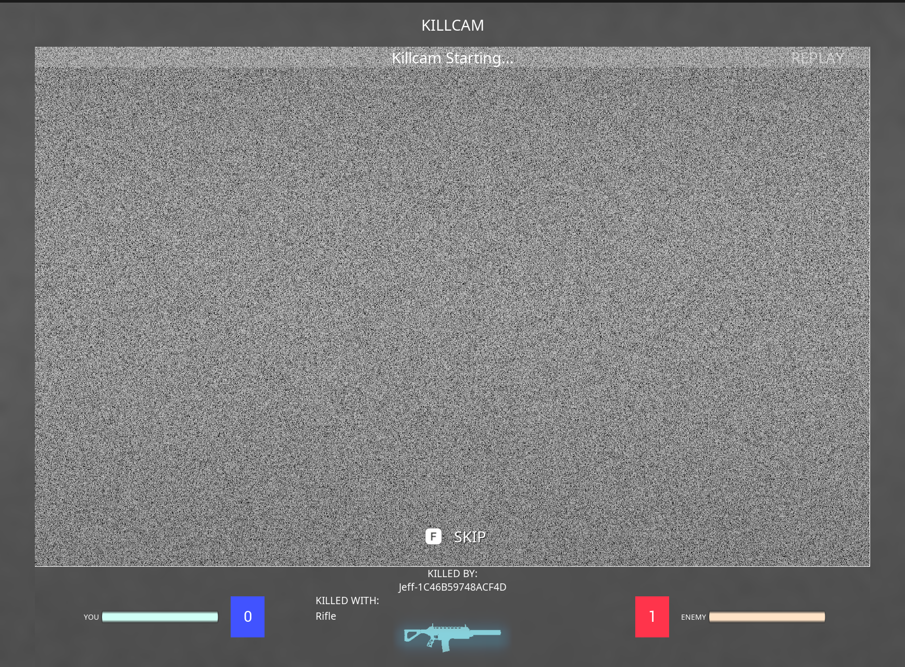

# Playback and Presentation

Once the kill cam knows which recording to play, it has to turn a replay into a kill cam. That means following the killer, showing the match from the killer's side, using the killer's camera, aim and hit markers, keeping the replay's sound apart from the live game's, and telling the UI when it is waiting. This page covers that presentation layer, from the moment the replay starts to the moment it ends.

***

## The Replay

`UKillcamReplay` owns the kill cam's [Visual Replay session](../../visual-replay/sessions.md) on the victim's machine. It starts the session with the chosen recording, a preparation budget of `Killcam.PrepareBudgetMs` (8 ms per frame), the kill cam's sound settings, and the session set to hold its last frame rather than stop by itself. The manager, not the replay, decides when the kill cam is over.

When every stand-in holds its starting state, the replay finds the **stand-ins of the victim's and the killer's player states** and hands them to the camera ability by sending `GameplayEvent.Killcam` to the viewer's ability system. That event is the boundary between the C++ replay and the Blueprint presentation:

| Event field | Holds |
| --- | --- |
| `EventTag` | `GameplayEvent.Killcam` |
| `Instigator` | The victim's stand-in player state, or the live one if it has no stand-in |
| `Target` | The killer's stand-in player state, or the live one if it has no stand-in |
| `EventMagnitude` | The kill cam's duration in seconds |

`GA_Killcam_Camera` is triggered by this event. Anything that replaces the camera ability needs only these four fields.

***

## Seeing the Match from the Killer's Side

The camera ability spawns a kill cam spectator and has it spectate the killer's stand-in. Spectating a player tells the team subsystem who the **current viewer** is, so for the length of the kill cam every system that colours or marks things "for the viewer" does so for the killer:

* the killer's team shows as the friendly team;
* the victim shows as an enemy;
* objective markers and nameplates show the killer's side of the match at that moment.

The replay's shells run their own logic, so a marker on a replayed objective is the shell's marker, showing what the objective was then. The live objective's marker is hidden while it has a stand-in. [Team Visuals](../../../base-lyra-modified/team/team-visuals.md) covers the viewer system, and [Making Game Modes Killcam-Ready](killcam-ready-game-modes.md) covers what a game mode needs for its objectives to show correctly.

***

## The Camera

The kill cam can show the killer's view in two ways.

* **Copied camera mode**, the default. The spectator uses the killer's camera mode, such as third person or first person, applied to the killer's replayed pawn and aim. This works with any recording, including the victim's own.
* **Recorded view.** The camera shows exactly where the killer's camera was, frame by frame, with its field of view, and the killer's pawn is drawn the way the killer saw themselves: first-person arms shown, the parts hidden from its owner hidden. This needs a recorded camera, which the killer's clip carries and the victim's own recording doesn't.

| `Killcam.RecordedView` | `bPreferRecordedView` on the manager | Result |
| --- | --- | --- |
| `-1` (default) | `false` (default) | Copied camera mode |
| `-1` | `true` | Recorded view, when the recording has a camera |
| `0` | any | Copied camera mode |
| `1` | any | Recorded view, when the recording has a camera |

When the recorded view can't be used because there is no recorded camera, the kill cam falls back to the copied camera mode.

In code: the camera choice

`UKillcamManager` picks the camera mode for the replay from the console variable and `bPreferRecordedView`. `UKillcamReplay::HandleStandInsReady` then uses the recorded view only if the session has a camera and the killer's pawn is known, in which case it calls `UVisualReplaySession::SetOwnerView` with the killer's pawn. `UKillcamRecordedViewCameraMode` is the camera mode that reads the session's recorded camera, and `RecordedViewCameraMode` on the manager can swap in another.

***

## The Killer's Aim, Camera Modes and Hit Markers

Three track playbacks run on the killer's stand-in player state, each playing one of the killer's tracks on the replay's clock.

* **Aim** gives the session the killer's exact recorded aim as the view of whichever pawn the killer's player state names at that moment, since a killer can have more than one pawn during a window. Past the end of the track, the view this machine recorded for the pawn takes over, so the view keeps following the pawn.
* **Camera** re-broadcasts the killer's camera mode and aiming-down-sights changes on the spectator's message channels, owned by the killer's stand-in, so the spectator camera and the HUD follow them. A kill cam without the killer's camera track still announces one: the killer's default camera mode, or the recorded view mode. The playback announces its current mode again whenever the spectator starts watching a player, and a spectator with no mode yet takes the watched pawn's default camera mode, so the camera never waits without one.
* **Hit markers** show the killer's hit markers on the viewer's HUD as the replay reaches each one.

All three map replay time to track time the same way: the session's time, less where the track starts, plus a **latency offset**. When the kill cam plays the killer's own recording, the tracks and the clip share one timeline and the offset is zero. When it plays the victim's own recording, the victim saw the killer late, so the killer's tracks run ahead of what the victim recorded. The offset of the two players' one-way latencies lines them up again, and is updated if the aim track arrives after the replay has started.

***

## Sound

While a kill cam plays, the live game is silenced and the replay is heard.

* Every sound the replay makes plays in `SC_Killcam`, the manager's `ReplaySoundClass`.
* A sound mix silences the live classes listed in `SilencedLiveSoundClasses`, by default `SFX` and `Overall`. Only those exact classes are silenced, not their child classes, so music, interface sounds and voice chat with classes of their own carry on.

The replay sound class must not be one of the silenced classes.

***

## Waiting

The kill cam can wait at three points: for the killer's clip to arrive, for its stand-ins to be prepared, and for more of the clip while playing. Each time waiting starts or stops, the manager broadcasts `ShooterGame.KillCam.Message.Waiting` with a `FKillcamWaitingMessage`, which holds the victim's player state and whether it is waiting. The kill cam layout listens for it, shows its waiting screen, and pauses its countdown, so time spent waiting doesn't count against the kill cam.

<figure><figcaption>
The layout's waiting screen, static over the replay until the kill cam is ready
</figcaption></figure>

***

## Ending

A kill cam ends when the replay reaches the end of the window, when the buffering timeout passes, when the player skips, or when the player dies again. Each way ends with `ShooterGame.KillCam.Message.Stop`, carrying the victim's and killer's player states in a `FLyraKillCamMessage`. The manager broadcasts it, except for a skip, where the skip ability broadcasts it and the manager reacts. The UI, the abilities and anything else that reacts to the kill cam listen for it. The session stops, the live match reappears, and the transfer is cancelled, as [Getting the Killer's Recording](data-transfer-and-networking.md) describes.
