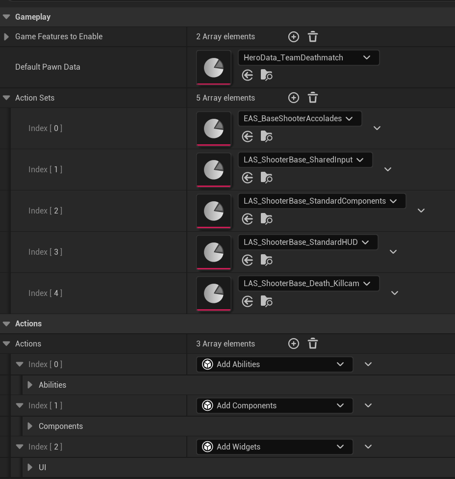
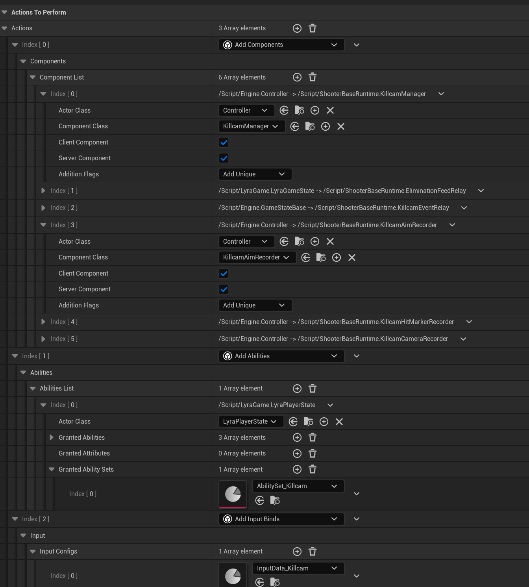
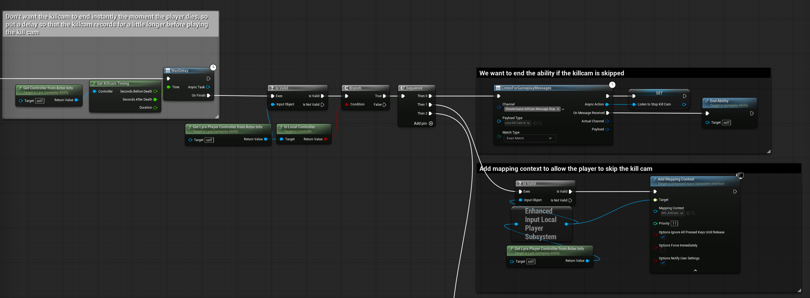
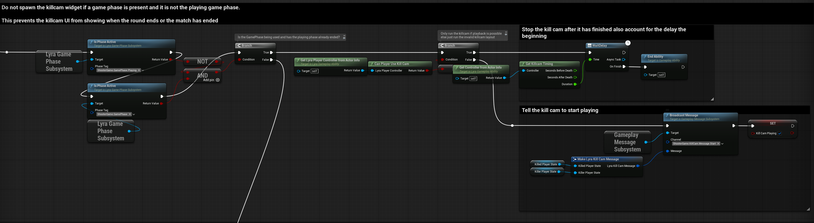
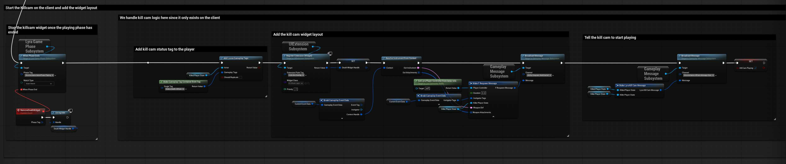

# Setup and Integration

This page covers turning the kill cam on for an experience, what that adds, the settings that shape it, and how to test it. A shooter experience that already includes the kill cam action set needs nothing more.

***

## What the Kill Cam Needs

The kill cam lives in ShooterBase and depends on two other pieces, both already wired into the project:

* **The Visual Replay plugin**, which ShooterBase lists as a plugin dependency. It records and plays the replays.
* **The LyraReplay module**, in `Source/LyraReplay`, which connects Lyra's cues, effects, indicators and messages to Visual Replay. It is listed in the project file and in the Game, Client, Server and Editor targets. [Integrating a Game](../../visual-replay/integrating-a-game.md) covers what it does.

No engine configuration or custom game engine class is involved, and the kill cam works in Play In Editor as well as in standalone games.

***

## Adding the Kill Cam to an Experience



#### Open the experience definition

Open the experience the kill cam should run in, such as `B_TeamDeathmatch`.



#### Add the action set

In **Action Sets**, add `LAS_ShooterBase_Death_Killcam`, or the variant for the mode (see below).

<figure><figcaption>
B_TeamDeathmatch lists the kill cam action set alongside its other action sets
</figcaption></figure>



The action set adds:

| What | Where | Does |
| --- | --- | --- |
| `UKillcamManager` | Controllers | Runs the kill cam for its player, on the player's machine and its server copy |
| `UKillcamAimRecorder`, `UKillcamCameraRecorder`, `UKillcamHitMarkerRecorder` | Controllers | Keep the player's aim, camera modes and hit markers, on the server for bots |
| `UKillcamEventRelay` | Game state | Turns eliminations into kill records on the server |
| `UEliminationFeedRelay` | Game state | Relays eliminations to the elimination feed |
| `GA_Killcam_Death` | Granted to players | On death, waits for the window's after-death seconds, then adds the kill cam layout to the HUD and asks for the kill cam |
| `GA_Killcam_Camera` | Granted to players | Started by `GameplayEvent.Killcam`; follows the killer's stand-in through a spectator, marks the victim with an indicator, and tells the layout who the killer and victim are and how long the kill cam lasts |
| `GA_Respawn` | Granted to players | Respawns the player |
| `AbilitySet_Killcam` with `InputData_Killcam` | Granted to players | `GA_Skip_Killcam`, bound to `InputTag.Ability.SkipKillcam` through `IA_Skip_Killcam` |

<figure><figcaption>
LAS_ShooterBase_Death_Killcam adds the components, grants the abilities and binds the skip input
</figcaption></figure>

### Mode variants

Four modes ship their own copy of the action set with their own death ability, for death flows that differ from the base, such as rounds without respawns:

| Action set | Death ability | Plugin |
| --- | --- | --- |
| `LAS_ShooterBase_Death_Killcam_Arena` | `GA_Killcam_Death_Arena` | Arena |
| `LAS_ShooterBase_Death_Killcam_Headquarters` | `GA_Killcam_Death_Headquarters` | Headquarters |
| `LAS_ShooterBase_Death_Killcam_PropHunt` | `GA_Killcam_Death_PropHunt` | PropHunt |
| `LAS_ShooterBase_Death_Killcam_SearchAndDestroy` | `GA_Killcam_Death_SearchAndDestroy` | SearchAndDestroy |

A new mode with its own death flow follows the same pattern: duplicate the action set into the mode's plugin, create the mode's death ability, swap it in, and add the new action set to the mode's experience. The death ability's one obligation is to broadcast the kill cam start message once the after-death seconds have passed, as the timing rules below explain.

The shipped death ability is the flow to copy. Once the after-death seconds have passed, it takes one of two paths. While the playing phase runs, or in a mode without game phases, it adds the kill cam layout to the HUD and broadcasts the start message. Once the playing phase has ended, such as at the end of a round, it broadcasts the start message without the layout, and if no kill cam can play it waits out the window and ends.



<figure><figcaption>
Wait for the after-death seconds, then listen for the stop message and add the skip input
</figcaption></figure>



<figure><figcaption>
Once the playing phase has ended, start the kill cam without its layout, or wait out the window when none can play
</figcaption></figure>



<figure><figcaption>
Add the kill cam layout to the HUD, then broadcast the start message
</figcaption></figure>



***

## Settings

### On the kill cam manager

| Setting | Default | Controls |
| --- | --- | --- |
| `KillcamSecondsBeforeDeath` | 8 | How much of the window comes before the death. Config. |
| `KillcamSecondsAfterDeath` | 3 | How much comes after it. Config. |
| `bPreferRecordedView` | false | Show the killer's recorded camera rather than copying their camera mode, when the recording has a camera. |
| `RecordedViewCameraMode` | `UKillcamRecordedViewCameraMode` | The camera mode used for the recorded view. |
| `ReplaySoundClass` | `SC_Killcam` | The class every replayed sound plays in. Config. |
| `SilencedLiveSoundClasses` | `SFX`, `Overall` | Live sound classes silenced while a kill cam plays, without their child classes. Config. |

The config settings live in `DefaultGame.ini` under `[/Script/ShooterBaseRuntime.KillcamManager]`. Blueprints read the window through `GetKillcamTiming`.

The three recorders each keep `MaxRecordLengthSeconds` (15) of history, and the aim recorder samples at up to `MaxSampleRateHz` (60).

### Console variables

| Variable | Default | Controls |
| --- | --- | --- |
| `Killcam.PerspectiveClipWaitSeconds` | 3 | How long to wait for the killer's clip before playing the victim's own recording |
| `Killcam.PerspectiveClipStartLeadSeconds` | 1 | How much of the window must have arrived before playback starts |
| `Killcam.BufferingTimeoutSeconds` | 3 | How long playback may wait for more of the clip before the kill cam ends |
| `Killcam.PerspectiveClipBytesPerSecond` | 131072 | Byte budget per connection for sending clips; 0 sends as fast as the connection drains |
| `Killcam.PerspectiveClipSliceSeconds` | 1.5 | Length of each slice of the clip before the death |
| `Killcam.PerspectiveClipPieceBytes` | 8192 | Size of each piece a slice is sent in, from 256 to 8192 |
| `Killcam.PerspectiveClipExtraCharacters` | 4 | How many other on-screen characters the killer's clip carries |
| `Killcam.PerspectiveClipRotationBits` | 12 | Precision of bone rotations in the clip, from 8 to 16 bits |
| `Killcam.PerspectiveClipKeyToleranceDegrees` | 0.25 | How far a dropped bone rotation sample may be from what blending reproduces |
| `Killcam.PerspectiveClipKeyToleranceUnits` | 0.03 | The same for translations and scales |
| `Killcam.RecordedView` | -1 | `1` forces the recorded view, `0` forces the copied camera mode, `-1` leaves it to `bPreferRecordedView` |
| `Killcam.PrepareBudgetMs` | 8 | Milliseconds per frame spent preparing the replay before it plays. More prepares it in fewer, longer frames, so it appears sooner. 0 prepares it in one frame and removes it in one frame as it ends |

The Visual Replay recorder has settings of its own, listed on Visual Replay's [Debugging](../../visual-replay/debugging.md) page.

***

## Timing Rules

The window and the recorder have to agree, or the kill cam loses part of its window.


**The opening must still be recorded at the moment of death.** The recorder keeps `Replay.WindowSeconds` (10) of history, and the kill cam needs the window's start plus a one-second margin. `KillcamSecondsBeforeDeath` plus one second must therefore fit inside `Replay.WindowSeconds`. With the default window of 10 seconds, the before-death time can be at most 9 seconds; raise `Replay.WindowSeconds` to go longer.



**The kill cam must start after the after-death seconds have passed.** The killer only sends the part recorded after the death once the kill cam starts. A death ability that starts the kill cam earlier than `KillcamSecondsAfterDeath` after the death gets a shorter after-death part, and the kill cam ends early. The shipped death abilities wait exactly that long through `GetKillcamTiming`.


***

## Testing

The kill cam needs a killer and a victim on different machines, so test with at least two players. In Play In Editor, set the number of players to two or more with a client net mode, have one player kill the other, and the victim's kill cam plays after the death delay. A bot killer works too, playing the victim's own recording with the bot's tracks.

To see what the kill cam decided and why, turn on the debug suite before the kill with `Replay.Debug all`. Each replay writes a report, and [Debugging](debugging.md) explains how to read it for kill cam problems.

***

## Checklist

* [ ] The experience includes `LAS_ShooterBase_Death_Killcam` or a mode variant.
* [ ] A custom death ability broadcasts the start message only after `KillcamSecondsAfterDeath`.
* [ ] `KillcamSecondsBeforeDeath` plus one second fits inside `Replay.WindowSeconds`.
* [ ] The mode's objectives replay correctly ([Making Game Modes Killcam-Ready](killcam-ready-game-modes.md)).
* [ ] A kill cam has been watched with two players, and its report shows no anomalies.
