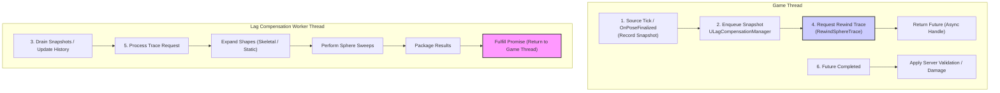

# How It Works

Understanding the sequence of events involved in recording history and processing a rewind request is key to grasping the lag compensation system.

### High-Level Overview

ShooterBase’s lag compensation pipeline runs continuously while the server is active:

1. **Sources Record Snapshots (Game Thread)**\
   Each `ULagCompensationSource` component captures a lightweight snapshot of its current world state every tick.
2. **Manager Queues Snapshots (Game Thread)**\
   The `ULagCompensationManager` collects these snapshots and enqueues them for background processing.
3. **Worker Maintains History (Thread)**\
   The `FLagCompensationThreadRunnable` drains snapshot queues, stores per-source history, and prunes outdated data.
4. **Trace Requests Arrive (Game Thread)**\
   Gameplay code calls `RewindLineTrace` or `RewindSphereTrace` to validate a client action at a past timestamp.
5. **Worker Processes Request (Thread)**\
   The worker expands shapes from the relevant historical data, performs the rewind trace, and computes intersection results.
6. **Results Return (Async)**\
   The worker fulfills the `TFuture<FRewindLineTraceResult>`, which the calling code consumes asynchronously on the game thread.

This structure isolates the heavy math to a background thread, ensuring that hit validation never stalls gameplay.

### Interaction Diagram

This diagram illustrates how the lag compensation system works:



### High-Level Conceptual Flow

Understanding the sequence of events involved in recording history and processing a rewind request is key to grasping the lag compensation system. Here's a high-level conceptual flow:

#### 1. Source Snapshot Recording (Game Thread)

Every actor that should be lag-compensated owns a `ULagCompensationSource` component.\
This component is responsible for **recording its own history**, ensuring thread safety and modularity.

* **Skeletal Sources:**\
  Each tick, after the skeletal mesh finalizes bone transforms (`OnBoneTransformsFinalized`), the source captures:
  * Timestamp (`World->GetTimeSeconds()`)
  * Bone world transforms for all bodies used in its Physics Asset
  * Actor bounds and collision responses
* **Static Sources:**\
  On tick, the source captures:
  * Component’s `ComponentToWorld` transform
  * Bounds and collision responses
  * Timestamp

These values are stored in a lightweight `FLagCompensationSnapshot` struct and pushed to the manager.

#### 2. Snapshot Queuing (Game Thread → Worker Thread)

The `ULagCompensationManager` collects incoming snapshots from all sources and queues them for asynchronous processing.

* Each snapshot is associated with its owning source.
* The manager never blocks; it simply pushes the data into a concurrent queue.
* The worker thread drains that queue once per tick cycle.

Snapshots are small, typically just transform and bounds data, making this transfer extremely cheap.

#### 3. History Maintenance (Worker Thread)

Inside the `FLagCompensationThreadRunnable`, the worker maintains a **time-ordered buffer** of snapshots for each source.

* **Storage:**\
  Each source gets a `TDoubleLinkedList<FLagCompensationSnapshot>` representing its history.
* **Draining:**\
  The worker periodically drains the manager’s queue and appends new snapshots to each source’s list.
* **Pruning:**\
  Any snapshot older than the configured `MaxLatencyInMilliseconds` (e.g. 500 ms) is removed to cap memory usage.

This ensures the system always retains a rolling window of recent world states that can be rewound efficiently.

#### 4. Rewind Trace Request (Game Thread)

When a server-side ability or projectile needs to validate a hit:

```cpp
TFuture<FRewindLineTraceResult> ULagCompensationManager::RewindSphereTrace(
    double Timestamp,
    const FVector& Start,
    const FVector& End,
    float SphereRadius,
    ECollisionChannel Channel,
    const TArray<AActor*>& ActorsToIgnore
);
```

* **Timestamp:** The target time in the past (usually the client’s fire time).
* **Shape:** Always a sphere; a radius of `0` produces a pure line trace.
* **Ignored Actors:** Prevents self-hits or rechecking the shooter.

The manager packages this request into a `FRewindTraceRequest`, attaches a `TPromise`, and enqueues it to the worker.

#### 5. Rewind Processing (Worker Thread)

When the worker dequeues a rewind request, it runs the core algorithm:

* **Interpolate Historical Data**
  * Find the two snapshots (`Older`, `Newer`) that bracket the requested timestamp.
  * Interpolate between them to reconstruct an approximate actor state at that exact time.
* **Expand Shapes at Runtime**
  * For skeletal meshes, apply interpolated bone transforms to each body in the Physics Asset using `ExpandSkeletalShapesAtTime`.
  * For static meshes, apply the stored `ComponentToWorld` using `ExpandStaticShapesAtTime`.
  * This yields a complete list of hitboxes (`FLagHitboxInfo`) in world space, representing the actor’s state in the past.
* **Perform Trace**
  * Sweep a sphere (the shot volume) from `Start` to `End`.
  * Check intersections against every expanded shape.
  * Each intersection produces an `FPenetrationHitResult` with entry/exit points, normals, and depth.
* **Combine & Sort Hits**
  * Merge results across all actors and sort them by distance from the trace start.
* **Return Results**
  * Package all hits into an `FRewindLineTraceResult` and fulfill the promise.
  * The future on the game thread becomes ready.

#### 6. Result Handling (Game Thread)

When the async future completes, gameplay logic reads the results:

```
ResultFuture.Then([this](TFuture<FRewindLineTraceResult> Future)
{
    const FRewindLineTraceResult& Result = Future.Get();
    AsyncTask(ENamedThreads::GameThread, [Result]()
    {
        // Apply validation, damage, effects, etc.
    });
});
```

`FRewindLineTraceResult.HitResults` contains an ordered array of `FPenetrationHitResult`s, each describing a single intersection, including historical impact and exit points.

If a hit originated from a rewound shape, \``bNeedsMapping` is true. \
Calling `GetMappedHitResult()` returns the equivalent position on the actor’s current mesh for applying visuals.

#### Thread Synchronization

* The worker waits on a shared event (`GameTickEvent`) that the manager triggers each tick.
* This keeps snapshot draining and rewind requests roughly synchronized with game updates.
* The event mechanism ensures the worker sleeps efficiently when idle, consuming minimal CPU.

#### Debug Flow

* The worker does **not** draw directly.\
  It enqueues visualization commands (`FLagDebugPoseCmd`, `FLagDebugCollisionCmd`) to the **debug service**.
* The game thread flushes these each frame via `DebugService.Flush(World)`.
* This lets you visualize:
  * Historical hitbox poses (`DrawPoses`)
  * Collision intersections (`DrawCollisions`)
  * Entry/exit markers (`DrawHitOnly`)\
    without any unsafe cross-thread rendering calls.

#### Summary

1. **Game thread**: Sources record → Manager queues → Gameplay requests traces.
2. **Worker thread**: Maintains history → Expands shapes → Performs sphere traces → Returns results.
3. **Game thread**: Applies validated hits and debug visualizations.

This clean division allows extremely accurate server-side rewind validation with near-zero impact on gameplay performance.

***
