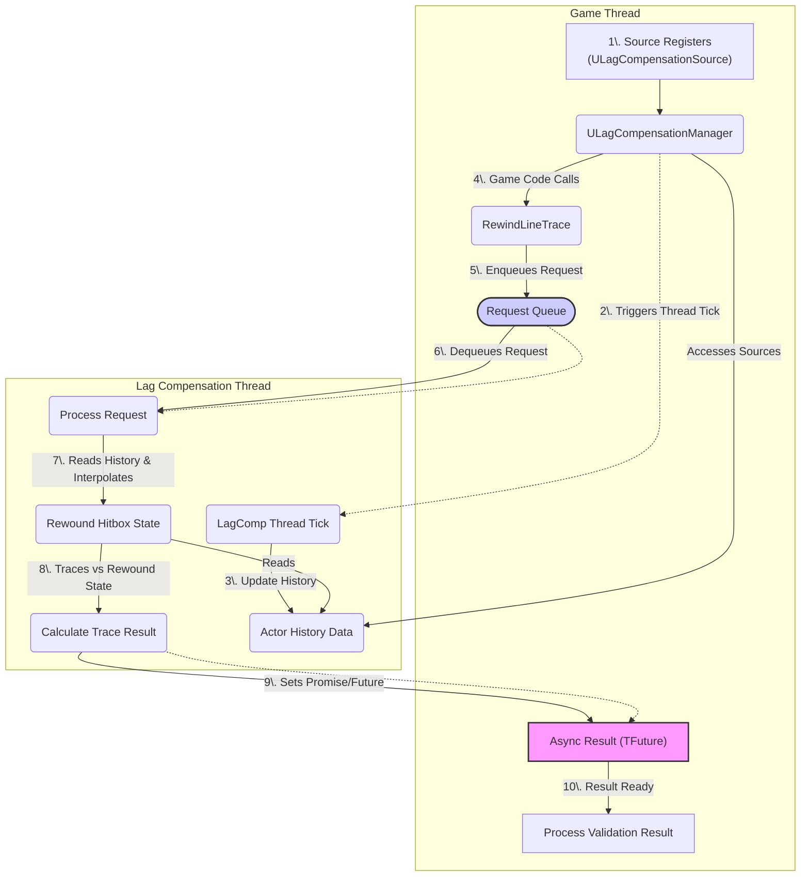

# How It Works

Understanding the sequence of events involved in recording history and processing a rewind request is key to grasping the lag compensation system.

### High-Level Interaction Diagram

This diagram illustrates how the lag compensation system works:

### High-Level Conceptual Flow

Understanding the sequence of events involved in recording history and processing a rewind request is key to grasping the lag compensation system. Here's a high-level conceptual flow:

### 1. Source Registration & History Recording (Continuous Process)

* **Component Attachment:** An actor intended to be subject to lag compensation (e.g., a player Pawn) has the `ULagCompensationSource` component added to it.
* **Registration:**
  * When the `ULagCompensationSource` component initializes (`BeginPlay`/`OnExperienceLoaded`), it broadcasts a message (`TAG_Lyra_LagCompensation_Add_Message`).
  * The `ULagCompensationManager` (on the server's GameState) listens for this message and adds the source component to its list of tracked sources (`LagCompensationSources`).
  * If the manager initializes _after_ a source, the source listens for a `TAG_Lyra_LagCompensation_Discover_Message` broadcast by the manager and registers itself upon receiving it.
* **History Capture (Lag Compensation Thread):**
  * The dedicated lag compensation thread (`FLagCompensationThreadRunnable`) periodically (synchronized roughly with the game tick via `GameTickEvent`) accesses the `ULagCompensationManager`'s list of tracked sources (using thread-safe access like `FScopeLock`).
  * For each `ULagCompensationSource`:
    * It retrieves the associated `UMeshComponent` (Static or Skeletal).
    * It extracts the current world location, rotation, and collision shape data for _each relevant collision primitive_ (box, sphere, capsule) defined in the mesh's physics asset or simple collision (`StoreStaticMeshHitBoxInfo`, `StoreSkeletalMeshHitBoxInfo`). This detailed data, including bone names/indices and physical materials, is stored in `FLagHitboxInfo` structs.
    * It packages the current timestamp (`World->GetTimeSeconds()`), actor location/bounds, collision profile name, and the array of `FLagHitboxInfo` into a `FLagCompensationData` snapshot.
    * It adds this snapshot to the head of a time-ordered `TDoubleLinkedList<FLagCompensationData>` associated with that specific `ULagCompensationSource` component in the thread's `ActorHistoryData` map.
* **History Pruning (Lag Compensation Thread):**
  * After adding a new snapshot, the thread checks the timestamp of the oldest entry (tail of the list) for that actor.
  * If the oldest entry is older than the configured maximum history time (`MaxLatencyInMilliseconds`), it's removed from the list to prevent unbounded memory growth.

### 2. Rewind Request (Event-Driven)

* **Initiation:** Server-side code (e.g., a hitscan Gameplay Ability's validation function, the Projectile Manager, or a Blueprint using the Async Action) needs to perform a trace against a past world state.
* **Call `RewindLineTrace`:** It calls `ULagCompensationManager::RewindLineTrace`, providing:
  * `Timestamp` or `Latency`: The specific point in the past to rewind to.
  * `Start` & `End`: The world-space start and end points of the trace.
  * `TraceChannel`: The collision channel to use for the trace.
  * `ActorsToIgnore`: A list of actors to explicitly ignore during the trace.
  * `FRewindTraceInfo`: Details about the trace shape (Line, Sphere) and parameters (Radius, Rotation).
* **Queueing Request:** The `ULagCompensationManager` packages this information into an `FRewindLineTraceRequest` struct, creates a `TPromise` to hold the eventual result, and enqueues the request into the `FLagCompensationThreadRunnable`'s `RewindLineTraceRequests` queue.
* **Return Future:** The Manager immediately returns a `TFuture` linked to the `TPromise`. The calling code can asynchronously wait for this future to be set with the result.

### 3. Rewind Processing (Lag Compensation Thread)

* **Dequeue Request:** The lag compensation thread dequeues an `FRewindLineTraceRequest` from its queue.
* **Iterate Tracked Actors:** It iterates through its `ActorHistoryData` map (containing the history for each tracked `ULagCompensationSource`).
* **Check Relevancy:** It skips actors that are in the request's `ActorsToIgnore` list or whose collision profile doesn't interact with the requested `TraceChannel` (`IsCollisionAllowed`).
* **Find Historical Data (`ShouldRewind`):** For each relevant actor, it searches its `TDoubleLinkedList<FLagCompensationData>`:
  * It finds the two history snapshots (`MiddleNode`, `NewerNode`) whose timestamps bracket the requested `Timestamp`.
  * **Optimization:** It performs a broad-phase check first. It creates a bounding box encompassing the actor's bounds at both the `MiddleNode` and `NewerNode` timestamps. It performs a quick intersection test between the trace segment and this combined bounding box. If the trace doesn't even intersect this broad volume, it skips detailed hitbox checks for this actor, assuming no hit is possible.
* **Interpolate Hitboxes:** If the broad-phase check passes:
  * It calculates an interpolation alpha based on the requested `Timestamp` relative to the `MiddleNode` and `NewerNode` timestamps.
  * It creates a temporary `FLagCompensationData RewoundData` structure.
  * It interpolates the `ActorLocation` and `ActorBounds`.
  * Crucially, it iterates through the `FLagHitboxInfo` arrays from both snapshots and interpolates the `Location` (Lerp) and `Rotation` (Slerp) of _each individual hitbox_, storing the result in `RewoundData.HitBoxes`. Collision shapes, bone names, etc., are copied directly as they don't change.
* **Perform Trace Against Rewound Hitboxes:** It performs the requested trace (line or sphere) against _each interpolated hitbox_ in `RewoundData.HitBoxes` using detailed geometry intersection functions (`CalculateTraceIntersections` -> `PerformLineTraceAgainstBox`, `PerformSphereTraceAgainstCapsule`, etc.). These functions calculate precise entry and exit points and normals for each intersecting hitbox.
* **Collate Hits:** It gathers all intersection results for the current actor, keeping track of the closest entry point and furthest exit point to represent the overall interaction with the actor. It stores necessary mapping information (body/primitive indices) within the `FPenetrationHitResult` for later use.
* **Perform Non-Hitbox Trace:** After checking all tracked actors, the thread also performs a standard world trace (`PerformNonHitBoxTrace`) against the _current_ state of the world, but _excluding_ the actors that were already processed via hitbox history. This ensures collisions with static world geometry or non-compensated actors are still detected.
* **Sort and Package Results:** It collects all hit results (from both historical hitbox traces and the standard world trace), sorts them by distance (`SortCollisionByDistance`), and packages them into an `FRewindLineTraceResult` structure.
* **Fulfill Promise:** It sets the calculated `FRewindLineTraceResult` into the `TPromise` associated with the original request.

### 4. Result Retrieval (Game Thread)

* **Future Ready:** The `TFuture` returned in step 2 becomes ready.
* **Get Result:** The original calling code (e.g., the Gameplay Ability or Async Action) retrieves the `FRewindLineTraceResult` from the completed future.
* **Process Results:** The calling code now has the list of hits (`HitResults` array within the result struct), ordered by distance, representing the outcome of the trace performed against the historically accurate world state. It can use this information for validation, damage application, etc.

This flow allows the server to accurately validate client actions against past states while offloading the computationally intensive parts to a background thread, preserving game thread performance.

***
