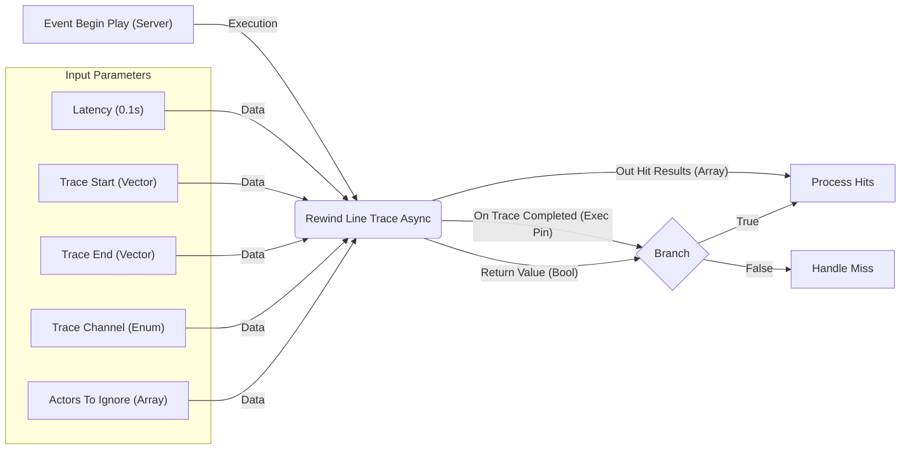

# Requesting Rewind Traces

## Requesting Rewind Traces

Once the Lag Compensation system is running and tracking historical data, server-side game logic needs a way to request a trace against a specific point in the past. This is typically done during hit validation for client actions. ShooterBase provides methods for requesting these traces from both C++ and Blueprints.

### Requesting from C++ (`ULagCompensationManager::RewindLineTrace`)

The primary way to initiate a rewind trace from C++ is by calling one of the `RewindLineTrace` functions on the `ULagCompensationManager` instance (obtained from the GameState).

*   **Signatures:**

    ```cpp
    // Request using latency relative to current server time
    TFuture<FRewindLineTraceResult> RewindLineTrace(
        float LatencyInMilliseconds, // How far back in time (ms)
        const FVector& Start,
        const FVector& End,
        const FRewindTraceInfo& RewindTraceInfo,
        const ECollisionChannel& TraceChannel,
        const TArray<AActor*>& AActorsToIgnore
    );

    // Request using an absolute server timestamp
    TFuture<FRewindLineTraceResult> RewindLineTrace(
        double Timestamp, // Specific past server time (World->GetTimeSeconds())
        const FVector& Start,
        const FVector& End,
        const FRewindTraceInfo& RewindTraceInfo,
        const ECollisionChannel& TraceChannel,
        const TArray<AActor*>& AActorsToIgnore
    );
    ```
* **Parameters:**
  * `LatencyInMilliseconds` / `Timestamp`: Specify the point in the past. Using `Timestamp` (often provided by the client in the `TargetDataHandle`) is generally more precise for validating client actions. The latency version calculates the target timestamp internally (`World->GetTimeSeconds() - (LatencyInMilliseconds / 1000.0f)`).
  * `Start`, `End`: World-space start and end points of the trace. These should generally match the trace vectors reported by the client.
  * `RewindTraceInfo` (`FRewindTraceInfo` struct): Specifies the shape and parameters of the trace:
    * `TraceType` (`ERewindTraceType::Line` or `ERewindTraceType::Sphere`): Determines if it's a line trace or a sphere sweep.
    * `SphereRadius`: Required if `TraceType` is `Sphere`.
    * `Rotation`: _Currently seems unused in the core sphere/line trace logic but included in the struct, potentially for future expansion like box or capsule traces._
  * `TraceChannel`: The `ECollisionChannel` to use for the trace (e.g., `Lyra_TraceChannel_Weapon`, `Lyra_TraceChannel_Weapon_Multi`). Must match a channel the target actors' collision profiles are set to interact with.
  * `AActorsToIgnore`: An array of `AActor*` to explicitly ignore during _all_ phases of the trace (both historical hitbox and standard world trace).
* **Return Value:** `TFuture<FRewindLineTraceResult>`
  * The function returns _immediately_ with a `TFuture`.
  * The actual trace calculation happens asynchronously on the lag compensation thread.
  * You use the `TFuture` object to check when the result is ready and retrieve it.
*   **Usage Example (Inside a Gameplay Ability):**

    ```cpp
    // Inside PerformServerSideValidation or similar server function
    ULagCompensationManager* LagCompManager = GetWorld()->GetGameState()->FindComponentByClass<ULagCompensationManager>();
    if (LagCompManager && ClientHitResult) // ClientHitResult from TargetDataHandle
    {
        double ClientTimestamp = ExtractTimestampFromTargetData(TargetDataHandle.Get(i)); // Get timestamp
        FVector ClientTraceStart = ClientHitResult->TraceStart;
        FVector ClientTraceEnd = ClientHitResult->TraceEnd;

        FRewindTraceInfo TraceInfo;
        TraceInfo.TraceType = ERewindTraceType::Line; // Or Sphere if needed
        // TraceInfo.SphereRadius = WeaponData->GetBulletTraceSweepRadius(); // If sphere

        TFuture<FRewindLineTraceResult> ResultFuture = LagCompManager->RewindLineTrace(
            ClientTimestamp,
            ClientTraceStart,
            ClientTraceEnd,
            TraceInfo,
            Lyra_TraceChannel_Weapon, // Or appropriate channel
            ActorsToIgnoreList // Your list of ignored actors
        );

        // Attach a callback to handle the result when ready
        ResultFuture.Then([this, AssociatedData...](TFuture<FRewindLineTraceResult> Future)
        {
            FRewindLineTraceResult ServerResult = MoveTemp(Future).Get();
            // neccessary to perform the logic back in the game thread
            AsyncTask(ENamedThreads::GameThread, [this, ServerResult, AssociatedData...]()
            {
                // Process the ServerResult on the game thread...
                CompareClientHitToServerResult(ClientHitResult, ServerResult);
                // ...
            });
        });
    }
    ```

### Requesting from Blueprints (`UAsyncAction_RewindLineTrace`)

To make lag-compensated traces accessible from Blueprints (primarily for server-side logic in Blueprint-based abilities or actors), an Async Action node is provided.

* **Node:** `Rewind Line Trace (Async)`
* **Class:** `UAsyncAction_RewindLineTrace`
* **Inputs:** Takes similar inputs as the C++ function: `WorldContextObject`, `Latency` (in seconds for BP), `Trace Start`, `Trace End`, `Trace Rotation`, `Trace Shape` (Enum), `Sphere Radius`, `Trace Channel`, `Actors To Ignore`.
* **Outputs (Execution Pins):**
  * `On Trace Completed`: Execution pin that fires when the asynchronous trace finishes.
  * `Return Value` (`bool`): True if any blocking hits were found, false otherwise.
  * `Out Hit Results` (`TArray<FPenetrationHitResult>`): The array of hits found by the rewind trace, ordered by distance.
* **Usage:**
  1. Place the `Rewind Line Trace (Async)` node in your server-side Blueprint graph.
  2. Connect the input execution pin and provide the necessary trace parameters.
  3. Connect logic to the `On Trace Completed` output pin. This logic will execute once the lag compensation thread returns the result.
  4. Inside the logic connected to `On Trace Completed`, use the `Return Value` and `Out Hit Results` pins to determine the outcome and process the hits (e.g., apply damage, check against client data).



* **Underlying Logic:** The static `K2_RewindLineTrace` function on `UAsyncAction_RewindLineTrace` creates an instance of the action. The action's `Activate` method calls the C++ `ULagCompensationManager::RewindLineTrace`. It uses the `TFuture` internally and triggers the `OnTraceCompleted` delegate when the future is ready.

Whether using C++ or Blueprints, these methods provide the necessary interface to query the Lag Compensation system for historical trace results, forming the basis of authoritative hit validation.

***
