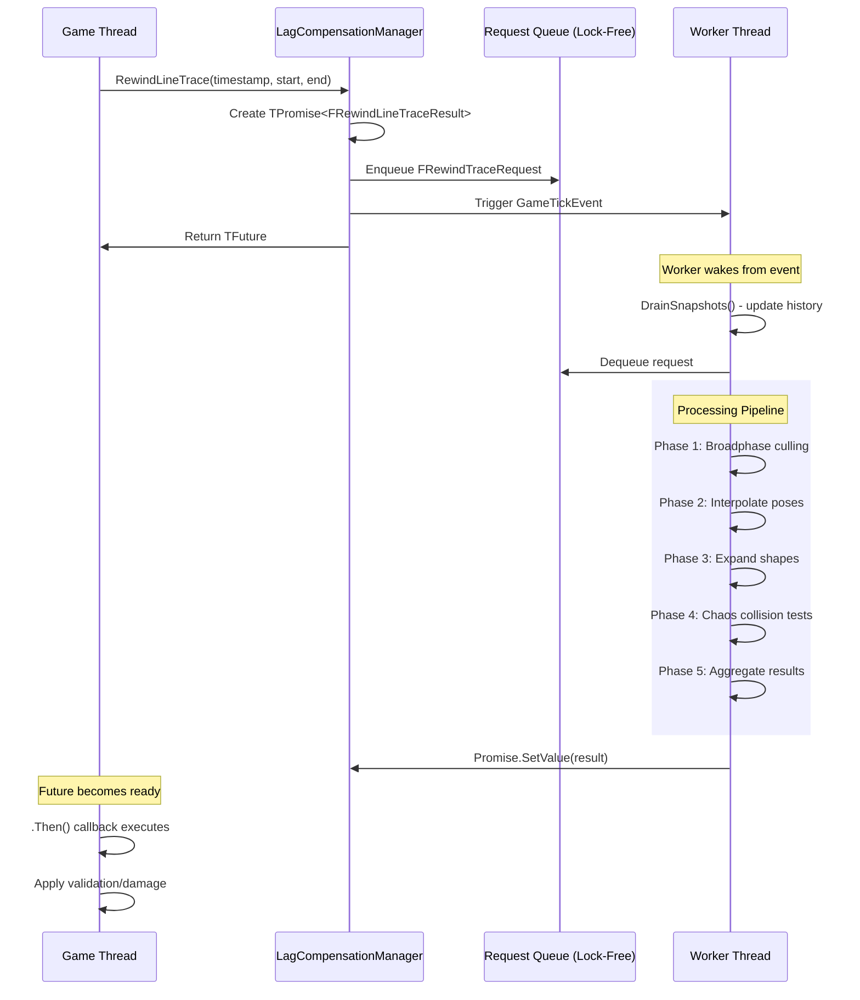

# Rewind Traces

The Rewind Trace API is how gameplay code queries historical world states. It returns asynchronously, allowing hit validation without blocking the game thread. This page covers both the public API and the internal processing pipeline.

***

### When to Use Rewind Traces

**Hitscan Validation (Primary Use Case)**

When a client reports a hit, the server needs to verify it was valid at the time the client fired. The client was seeing the world 50-150ms in the past due to network latency. A trace against the server's current world state would often register misses for shots that looked perfect on the client.

**Projectile Manager Integration**

The struct-based projectile system uses rewind traces internally for its collision checks, allowing bullet-drop projectiles to benefit from lag compensation.

**Custom Server-Side Validation**

Any server-side logic that needs to validate a client action against historical positions can use this API.

***

### C++ API

The manager exposes two overloads: one using **absolute timestamp** and one using **relative latency**.

```cpp
// Rewind to an absolute timestamp
TFuture<FRewindLineTraceResult> RewindLineTrace(
    double Timestamp,
    const FVector& Start,
    const FVector& End,
    const FRewindTraceInfo& TraceInfo,
    ECollisionChannel TraceChannel,
    const TArray<AActor*>& ActorsToIgnore);

// Rewind using latency in milliseconds
TFuture<FRewindLineTraceResult> RewindLineTrace(
    float LatencyMs,
    const FVector& Start,
    const FVector& End,
    const FRewindTraceInfo& TraceInfo,
    ECollisionChannel TraceChannel,
    const TArray<AActor*>& ActorsToIgnore);
```

#### Parameters

| Parameter                 | Description                                                                                   |
| ------------------------- | --------------------------------------------------------------------------------------------- |
| **Timestamp / LatencyMs** | When to rewind. Use a precise client timestamp if available; otherwise provide known latency. |
| **Start / End**           | World-space trace endpoints (usually from the client-reported shot).                          |
| **TraceInfo**             | `FRewindTraceInfo` describing shape, radius, and orientation.                                 |
| **TraceChannel**          | Unreal collision channel to evaluate (e.g., `ECC_GameTraceChannel2`).                         |
| **ActorsToIgnore**        | Optional array of actors excluded from the historical and world trace phases.                 |

#### Return Value

`TFuture<FRewindLineTraceResult>`, the trace runs asynchronously. Attach a continuation with `.Then()` or poll its readiness.


```cpp
ULagCompensationManager* LagComp = GetWorld()->GetGameState()->FindComponentByClass<ULagCompensationManager>();
if (!LagComp) return;

FRewindTraceInfo TraceInfo;
TraceInfo.TraceType = ERewindTraceType::Sphere;
TraceInfo.SphereRadius = 6.0f;

double ClientTimestamp = TargetData.Timestamp;
FVector Start = TargetData.TraceStart;
FVector End = TargetData.TraceEnd;

TFuture<FRewindLineTraceResult> Future = LagComp->RewindLineTrace(
    ClientTimestamp, Start, End, TraceInfo,
    Lyra_TraceChannel_Weapon, ActorsToIgnore);

Future.Then([this](TFuture<FRewindLineTraceResult> InFuture)
{
    FRewindLineTraceResult Result = MoveTemp(InFuture).Get();

    AsyncTask(ENamedThreads::GameThread, [this, Result]()
    {
        if (Result.HitResults.Num() > 0)
        {
            const FPenetrationHitResult& Hit = Result.HitResults[0];
            ApplyDamageOrEffect(Hit);
        }
    });
});
```


***

### Blueprint API

The system provides an asynchronous action node for Blueprint access:

<figure><figcaption></figcaption></figure>

#### Inputs

* `Latency` — How far back to rewind (seconds)
* `Trace Start`, `Trace End` — World-space endpoints
* `Trace Rotation` — Optional orientation for future shape types
* `Trace Shape` — `Line` or `Sphere`
* `Sphere Radius` — Only relevant for sphere traces
* `Trace Channel` — Collision channel
* `Actors To Ignore` — Optional list

#### Outputs

| Pin                     | Description                           |
| ----------------------- | ------------------------------------- |
| **On Trace Completed**  | Fired when the async trace finishes   |
| **Return Value (bool)** | `true` if a blocking hit was found    |
| **Out Hit Results**     | Array of all hits, sorted by distance |

#### **Blueprint Example**

<figure><figcaption></figcaption></figure>

Under the hood, the node wraps the C++ call. `Activate()` triggers the manager's `RewindLineTrace`, waits for its `TFuture`, then broadcasts `OnTraceCompleted` back on the game thread.

***

### Request Lifecycle

When you call `RewindLineTrace()`, here's exactly what happens:



#### Create promise & package request

* The manager creates a promise for the eventual result.
* The request is packaged with all trace parameters.



#### Enqueue to worker

* The packaged request is enqueued to the worker thread via a lock-free queue.
* The worker is woken via a synchronization event.



#### Return future

* The function returns a `TFuture` that gameplay code can attach callbacks to.



#### Worker processes & fulfills

* The worker processes the request asynchronously and fulfills the promise when complete.
* If you attached a `.Then()` continuation, it executes on the worker thread, use `AsyncTask(ENamedThreads::GameThread, ...)` to perform gameplay operations on the game thread.



***

### Processing Pipeline

This is the core algorithm that transforms a trace request into validated hit results. Each step builds on the previous.

#### Overview

```plaintext
ProcessRewindLineTrace(request):
    // Phase 1: Identify candidates
    candidates = BroadphaseCull(request)

    // Phase 2: Reconstruct historical states
    for each candidate in candidates:
        pose = InterpolatePoseAtTime(candidate, request.Timestamp)
        shapes = ExpandShapesFromPose(pose)
        candidate.ExpandedShapes = shapes

    // Phase 3: Collision testing
    hits = PerformCollisionTests(candidates, request)

    // Phase 4: Result aggregation
    result = AggregateAndSortHits(hits)

    return result
```



#### Phase 1: Broadphase Culling

The broadphase quickly eliminates actors that couldn't possibly be hit, avoiding expensive narrow-phase tests.

<details>

<summary>Pseudocode</summary>

```
BroadphaseCull(request):
    candidates = []

    for each source in ActorHistoryData:
        // Skip ignored actors
        if source.Owner in request.ActorsToIgnore:
            continue

        // Get windowed bounds at target time
        bounds_result = GetWindowedBoundsAtTime(source, request.Timestamp)
        if NOT bounds_result.Valid:
            continue  // No history at this timestamp

        // Build swept sphere for trace
        trace_sphere = FSphere(
            Center: (request.TraceStart + request.TraceEnd) / 2,
            Radius: Distance(request.TraceStart, request.TraceEnd) / 2 + request.TraceInfo.SphereRadius
        )

        // Stage 1: AABB intersection test
        if NOT trace_sphere.Intersects(bounds_result.WindowedBounds):
            // Try bypass conditions before rejecting
            if NOT ShouldBypass(source, request, bounds_result):
                EnqueueDebugBroadphase(source, bounds_result, REJECT)
                continue
            EnqueueDebugBroadphase(source, bounds_result, BYPASS)
        else:
            EnqueueDebugBroadphase(source, bounds_result, PASS)

        // Stage 2: Collision channel response check
        if NOT CheckCollisionChannelResponse(bounds_result.CollisionResponses, request.TraceChannel):
            continue

        candidates.Add({
            Source: source,
            OlderSnapshot: bounds_result.Older,
            NewerSnapshot: bounds_result.Newer,
            Alpha: bounds_result.Alpha
        })

    return candidates
```

</details>



#### Phase 2: Pose Interpolation and Shape Expansion

For each candidate that passed broadphase, reconstruct their exact pose at the target timestamp.

<details>

<summary>Interpolation pseducode</summary>

```plaintext
InterpolatePoseAtTime(candidate, timestamp):
    older = candidate.OlderSnapshot
    newer = candidate.NewerSnapshot
    alpha = candidate.Alpha

    pose = FInterpolatedPose()
    pose.Timestamp = timestamp

    // Interpolate bounds
    pose.ActorBounds = Lerp(older.ActorBounds, newer.ActorBounds, alpha)

    // For skeletal meshes: interpolate each bone
    if candidate.Source.MeshType == Skeletal:
        for i = 0 to older.BoneWorld.Num():
            older_transform = older.BoneWorld[i]
            newer_transform = newer.BoneWorld[i]

            // Position: linear interpolation
            pos = Lerp(older_transform.Location, newer_transform.Location, alpha)

            // Rotation: spherical interpolation (shortest path)
            rot = Slerp(older_transform.Rotation, newer_transform.Rotation, alpha)

            // Scale: linear interpolation
            scale = Lerp(older_transform.Scale, newer_transform.Scale, alpha)

            pose.BoneWorld.Add(FTransform(rot, pos, scale))

    // For static meshes: interpolate component transform
    else:
        pose.ComponentToWorld = LerpTransform(
            older.StaticComponentToWorld,
            newer.StaticComponentToWorld,
            alpha
        )

    return pose
```

</details>

<details>

<summary>Shape expansion pseduocode</summary>

<pre><code><strong>ExpandShapesFromPose(candidate, pose):
</strong>    shapes = []
    source = candidate.Source

    if source.MeshType == Skeletal:
        // Each shape definition maps to a bone
        for i = 0 to source.BoneShapeTable.Num():
            shape_def = source.BoneShapeTable[i]
            bone_transform = pose.BoneWorld[shape_def.BoneIndex]

            // Apply local offset to get world transform
            world_transform = bone_transform * shape_def.LocalOffset

            // Build expanded shape info
            info = FLagHitboxInfo()
            info.ShapeType = shape_def.Type
            info.WorldCenter = world_transform.Location
            info.WorldRotation = world_transform.Rotation
            info.BoneName = shape_def.BoneName
            info.BoneIndex = shape_def.BoneIndex

            // Apply non-uniform scale based on shape type
            switch shape_def.Type:
                case Sphere:
                    // Use maximum axis scale for radius
                    max_scale = Max(world_transform.Scale.X, world_transform.Scale.Y, world_transform.Scale.Z)
                    info.Radius = shape_def.Radius * max_scale

                case Box:
                    // Scale extents per-axis
                    info.Extents = shape_def.Extents * world_transform.Scale

                case Capsule:
                    // Height scales along capsule axis, radius by perpendicular
                    info.HalfHeight = shape_def.HalfHeight * world_transform.Scale.Z
                    info.Radius = shape_def.Radius * Max(world_transform.Scale.X, world_transform.Scale.Y)

            shapes.Add(info)

    else:  // Static mesh
        for shape_def in source.StaticShapeTable:
            world_transform = pose.ComponentToWorld * shape_def.LocalOffset
            // Similar expansion as above...
            shapes.Add(BuildExpandedShape(shape_def, world_transform))

    return shapes
</code></pre>

</details>



#### Phase 3: Collision Testing

Test the trace against each expanded shape using Chaos queries.

<details>

<summary>pseudocode</summary>

```
PerformCollisionTests(candidates, request):
    all_hits = []

    // Build the sweep geometry
    sweep_start = request.TraceStart
    sweep_end = request.TraceEnd
    sweep_direction = Normalize(sweep_end - sweep_start)
    sweep_length = Distance(sweep_start, sweep_end)
    sweep_radius = request.TraceInfo.SphereRadius

    for each candidate in candidates:
        for each shape in candidate.ExpandedShapes:
            // Build Chaos geometry for this shape
            chaos_shape = BuildChaosShape(shape)

            // Perform sweep query
            sweep_result = Chaos::SweepQuery(
                StartPos: sweep_start,
                Direction: sweep_direction,
                Length: sweep_length,
                SweepRadius: sweep_radius,
                TargetShape: chaos_shape,
                TargetTransform: shape.WorldTransform
            )

            if sweep_result.bHit:
                // Check if trace started inside shape (overlap)
                if sweep_result.Time == 0:
                    overlap_info = Chaos::OverlapQuery(sweep_start, sweep_radius, chaos_shape)
                    if overlap_info.bOverlapping:
                        hit = BuildOverlapHitResult(candidate, shape, overlap_info)
                        all_hits.Add(hit)
                        continue

                // Normal hit - calculate entry and exit points
                entry_point = sweep_start + sweep_direction * (sweep_result.Time * sweep_length)
                entry_normal = sweep_result.Normal

                // Calculate exit point by continuing through shape
                exit_info = CalculateExitPoint(
                    entry_point,
                    sweep_direction,
                    chaos_shape,
                    shape.WorldTransform
                )

                hit = FPenetrationHitResult()
                hit.bBlockingHit = true
                hit.Time = sweep_result.Time
                hit.Location = entry_point
                hit.ImpactPoint = entry_point
                hit.ImpactNormal = entry_normal
                hit.Normal = entry_normal
                hit.Distance = sweep_result.Time * sweep_length
                hit.TraceStart = sweep_start
                hit.TraceEnd = sweep_end

                // Penetration data
                hit.ExitPoint = exit_info.ExitPoint
                hit.ExitNormal = exit_info.ExitNormal
                hit.PenetrationDepth = Distance(entry_point, exit_info.ExitPoint)

                // Actor/component references
                hit.Actor = candidate.Source.Owner
                hit.Component = candidate.Source.MeshComponent
                hit.BoneName = shape.BoneName
                hit.ExitBoneName = shape.BoneName  // Same bone for simple shapes

                // Mark for coordinate mapping
                hit.bNeedsMapping = true
                hit.HistoricalTransform = shape.WorldTransform
                hit.CurrentTransform = GetCurrentBoneTransform(candidate.Source, shape.BoneIndex)

                all_hits.Add(hit)

                // Debug visualization
                if DebugSettings.DrawCollisions:
                    EnqueueDebugCollision(hit, candidate.ExpandedShapes)

    return all_hits
```

</details>



#### Phase 4: Result Aggregation

Sort hits by distance and package into the final result.

<details>

<summary>Pseudocode</summary>

```
AggregateAndSortHits(all_hits):
    result = FRewindLineTraceResult()

    if all_hits.IsEmpty():
        return result  // Miss - empty array

    // Sort by distance (closest first)
    all_hits.Sort((a, b) => a.Distance < b.Distance)

    // Remove duplicates (same actor, same bone)
    seen = Set<(Actor, BoneName)>()
    for hit in all_hits:
        key = (hit.Actor, hit.BoneName)
        if key in seen:
            continue
        seen.Add(key)
        result.HitResults.Add(hit)

    return result
```

</details>



***

### Understanding Results

#### `FRewindLineTraceResult`

```cpp
USTRUCT(BlueprintType)
struct FRewindLineTraceResult
{
    GENERATED_BODY()
    UPROPERTY(EditAnywhere, BlueprintReadWrite)
    TArray<FPenetrationHitResult> HitResults;
};
```

**`HitResults`** contains zero or more hits:

* Sorted by distance from `TraceStart` (closest first)
* Includes hits against both rewound historical hitboxes and current world geometry
* Empty array indicates a miss

#### `FPenetrationHitResult`

An enhanced version of `FHitResult` with extra data for penetration scenarios:

```cpp
struct FPenetrationHitResult : public FHitResult
{
    // Standard FHitResult fields inherited:
    // bBlockingHit, Time, Location, ImpactPoint, Normal, ImpactNormal,
    // Component, BoneName, PhysMaterial, Distance, TraceStart, TraceEnd

    // Penetration-specific data
    FVector ExitPoint;        // Where the trace exited the primitive
    FVector ExitNormal;       // Surface normal at exit point
    FName ExitBoneName;       // Bone at exit (if skeletal)
    float PenetrationDepth;   // Distance from entry to exit

    // Mapping data
    bool bNeedsMapping = false;  // True if hit was against historical hitbox
    FPenetrationHitResult GetMappedHitResult() const;
};
```

***

### Coordinate Mapping

When a trace hits a rewound historical hitbox, the hit coordinates are in "historical space", where the actor was at the rewound timestamp. For gameplay effects like damage, this is fine. But for visual effects like decals and particles, you need coordinates in "current space", where the actor is now.

#### Why Mapping Matters

```plaintext
Scenario: Player shot at timestamp T-100ms
- At T-100ms: Target was at position (100, 0, 0)
- At T-now: Target has moved to position (150, 10, 0)

Historical hit location: (105, 5, 0) - relative to where target WAS
Mapped hit location: (155, 15, 0) - relative to where target IS NOW

If you spawn a blood decal at (105, 5, 0), it appears floating in empty space.
If you spawn it at (155, 15, 0), it appears correctly on the target's body.
```

### Using `GetMappedHitResult()`

Call `GetMappedHitResult()` on any hit where `bNeedsMapping` is true. This transforms all position and normal fields from historical space to current space.

#### When to Use Each

| Operation              | Use Historical (Raw) | Use Mapped |
| ---------------------- | -------------------- | ---------- |
| **Damage Application** | Yes                  | No         |
| **Hit Validation**     | Yes                  | No         |
| **Blood/Impact VFX**   | No                   | Yes        |
| **Decal Spawning**     | No                   | Yes        |
| **Ragdoll Impulse**    | No                   | Yes        |
| **Sound at Impact**    | Either               | Either     |

***

### Processing Flow Diagram



***

### Edge Cases and Error Handling

<details>

<summary>Timestamp Outside History Window</summary>

If the requested timestamp is older than `MaxLatencyInMilliseconds` (default 500 ms), the system cannot rewind that far.

```
Behavior:
- Returns empty result (no hits)
- Does NOT fall back to current-time trace
- Caller should handle this as "unable to validate"
```

**Recommendation:** Clamp client timestamps to reasonable bounds before requesting rewind traces.

</details>

<details>

<summary>Actor Destroyed During Processing</summary>

If a tracked actor is destroyed while a request is queued:

```
Behavior:
- Broadphase checks source validity before processing
- Invalid sources are skipped (treated as miss for that actor)
- Other valid actors in the trace still process normally
```

</details>

<details>

<summary>Lag Compensation Disabled</summary>

If `lyra.LC.Disable` is `1`:

```
Behavior:
- Rewind traces fall back to synchronous traces against current world state
- Uses standard Unreal LineTraceSingleByChannel
- No historical interpolation occurs
- bNeedsMapping is always false in results
```

This is useful for A/B comparison testing to verify lag compensation is working correctly.

</details>

***
