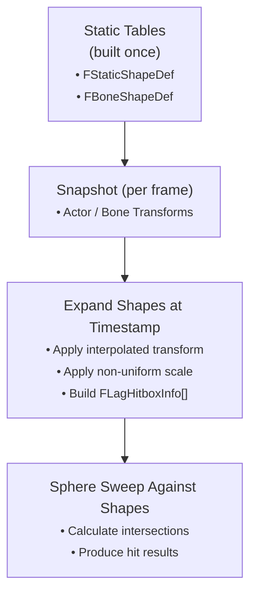

# Shape Expansion & Collision

The **shape expansion system** converts stored local-space collision definitions into **fully realized world-space hitboxes** at a specific historical moment.\
This process happens during rewind tracing, when the server reconstructs the physical state of tracked actors.

Unlike many older lag-compensation systems that store baked world-space hitboxes every frame, ShooterBase records only **lightweight transform and bone data**, then **expands** the shapes on demand.\
This design keeps memory usage low and guarantees perfect fidelity with the most recent mesh data.

### **Why Expand Instead of Store?**

| Approach                        | Pros                                                                                                                                                                    | Cons                                                                                                                                                  |
| ------------------------------- | ----------------------------------------------------------------------------------------------------------------------------------------------------------------------- | ----------------------------------------------------------------------------------------------------------------------------------------------------- |
| **Store Pre-Expanded Hitboxes** | – Simple to trace.– Fast lookup.                                                                                                                                        | – Extremely memory-heavy for complex skeletal meshes.– Limited accuracy when scale or pose changes.– Hard to version or extend (e.g., convex shapes). |
| **Expand at Rewind Time**       | – Minimal per-frame memory footprint.– Always uses exact transform data from snapshot.– Easy to extend for new shape types.– Keeps data deterministic across platforms. | – Slightly more CPU cost per rewind trace (but amortized on a background thread).                                                                     |

In short: _expanding on demand_ trades a small amount of computation for huge gains in accuracy, scalability, and maintainability.

***

### **Shape Data Flow**

Each `ULagCompensationSource` builds a static description of its collision shapes:

* **`FStaticShapeDef`** — simple collision from static meshes
* **`FBoneShapeDef`** — per-body shapes from a skeletal mesh’s physics asset

At runtime, when the rewind system needs to reconstruct an actor:

1. The source’s recorded snapshot provides transforms for the actor (and bones if skeletal).
2. The thread looks up the static shape table.
3. Each shape definition is transformed into an `FLagHitboxInfo` — a full world-space collision primitive ready for tracing.

***

#### **Supported Shape Types**

ShooterBase supports the core Unreal primitive types, plus convex hulls when available.

<table><thead><tr><th width="161">Primitive</th><th>Source</th><th>Expansion Behavior</th></tr></thead><tbody><tr><td><strong>Box</strong></td><td><code>FKBoxElem</code></td><td>Converts half-extents into an oriented box using the interpolated transform’s rotation and non-uniform scale.</td></tr><tr><td><strong>Sphere</strong></td><td><code>FKSphereElem</code></td><td>Scaled by the largest component of the transform scale to preserve containment volume.</td></tr><tr><td><strong>Capsule</strong></td><td><code>FKSphylElem</code></td><td>Combines radius + half-height, scales uniformly, and orients along the local X-axis.</td></tr><tr><td><strong>Convex</strong></td><td><code>FKConvexElem</code></td><td>Transforms all plane equations or vertices into world space; falls back to an oriented box approximation if plane data is missing.</td></tr></tbody></table>

Each expanded shape produces an `FLagHitboxInfo` containing:

* World location, rotation, and scale
* `FCollisionShape` instance
* Physical material pointer (if available)
* Body setup / primitive indices for mapping hit results back to the asset

***

#### **Non-Uniform Scale Handling**

Because actors may be scaled differently along each axis, all shapes must apply scale correctly:

* **Boxes:** each axis scaled independently.
* **Spheres:** uniform scale by the largest component (`FMath::Max3`).
* **Capsules:** uniform scale for both radius and height using the largest axis.
* **Convexes:** every vertex or plane normal scaled before transformation.

This ensures accurate collisions even for stretched meshes.

***

### **Collision Testing**

All rewind traces in ShooterBase are **sphere sweeps** — even when conceptually “line” traces are used.\
Sphere sweeps produce consistent intersection behavior across shape types and eliminate edge cases where a true line trace might tunnel through thin geometry.

For each expanded shape, the system performs precise geometric intersection tests:

| Shape Type  | Intersection Check                                                        |
| ----------- | ------------------------------------------------------------------------- |
| **Sphere**  | Sphere–sphere overlap and time-of-impact test.                            |
| **Box**     | Closest-point distance from swept sphere center to oriented box.          |
| **Capsule** | Segment-sphere distance test between capsule line segment and sweep path. |
| **Convex**  | Iterative plane clipping of the sweep path (Cyrus–Beck method).           |

When a hit occurs, an `FPenetrationHitResult` is produced containing:

* Entry point / normal
* Exit point / normal
* Penetration depth
* Associated bone or shape indices
* Physical material

The earliest hit (by distance along the trace) is considered the blocking impact.

***

#### **Broad-Phase Filtering**

Before detailed intersection checks, a fast **bounding-box test** eliminates irrelevant actors:

1. Compute the swept sphere’s AABB from start → end.
2. Compare against each actor’s historical bounds.
3. Skip actors with no intersection.

This early rejection keeps performance stable regardless of scene complexity.

***

### **Shape Expansion Lifecycle**

***

### **Extending Shape Support**

Developers can extend the system by:

1. Adding a new `EHitboxShapeType` enum value.
2. Implementing expansion in `ConvertCollisionToShape()`.
3. Adding intersection math in `CalculateTraceIntersections()`.

Because all shapes share the same data format (`FLagHitboxInfo`), new primitives integrate seamlessly with existing rewind and trace logic.

***

#### **Design Benefits**

* **Low Memory Overhead** – only transform and bone data are stored per frame.
* **Deterministic Reconstruction** – shapes are rebuilt exactly from asset data.
* **Future-Proof Extensibility** – new collision types or deformation rules can be added easily.
* **Debuggable** – every expanded shape can be drawn through the debug service for visualization.

***

#### **Summary**

The shape-expansion system is the foundation of ShooterBase’s accurate and efficient lag-compensation pipeline.\
By deferring world-space geometry construction to rewind time, it avoids the heavy memory cost of traditional snapshotting while preserving perfect accuracy and extensibility, allowing the server to replay the past world state down to the millimeter.

***
