# Advanced: Lag Compensation Integration

A critical feature enabling accurate hit registration for the fast-moving projectiles handled by the `UProjectileManager` is its direct integration with the [**Lag Compensation system**](../lag-compensation/). Without this, projectiles simulated purely on the server would frequently miss targets that players clearly hit on their screen due to latency.

### The Connection: Rewound Collision Checks

The core of the integration lies within the Projectile Manager's simulation thread (`FProjectileThreadRunnable`) during its collision detection phase:

* **Instead of Standard Traces:** When a projectile moves from point A to point B in a simulation step, the thread does **not** simply perform a standard world trace (like `LineTraceByChannel` or `SweepSingleByChannel`) against the _current_ state of the world.
* **`InitiateRewindLineTrace()`:** The thread calls this internal function.
* **Calling the Manager:** This function, in turn, calls `ULagCompensationManager::RewindLineTrace`.
* **Passing Key Data:** Crucially, it passes not just the trace segment (`Start`, `NewLocation`) and shape (`ProjectileRadius`), but also the **`Timestamp` and `Latency`** associated with the projectile (`FTraceProjectile::Timestamp`, `FTraceProjectile::Latency`).
  * The `Timestamp` represents the server time when the client fired the shot.
  * The `Latency` represents the client's ping when the shot was fired.
  * _(Note: The lag compensation manager uses these to calculate the precise point in the past (`TargetTimestamp = CurrentServerTime - EffectiveLatency`) against which to rewind the hitboxes)._

### Why is Lag Compensation Necessary Here?

Consider a fast bullet fired by Client A at Client B:

1. **Client A Fires:** Client A sends the fire request with Timestamp T1 and Latency L1.
2. **Server Receives:** Server receives the request at time T2 (T2 > T1).
3. **Projectile Spawns (Thread):** The Projectile Manager thread starts simulating the projectile.
4. **Simulation Step:** The projectile moves from P1 to P2 over a small DeltaTime. Let the current server time be T3.
5. **Collision Check Needed:** The thread needs to know if the projectile hit Client B between P1 and P2.
6. **The Problem:** If the thread checked Client B's _current_ position at time T3, Client B might have already moved significantly since time T1 (when Client A actually aimed and fired).
7. **The Solution:** The thread requests a rewind trace from the Lag Compensation Manager using Client A's original `Timestamp` (T1) and `Latency` (L1). The Lag Compensation system rewinds Client B's hitboxes to where they were _at the time Client A fired_ (or more accurately, interpolates to that time). The trace from P1 to P2 is performed against these _historical_ hitboxes.

This ensures that the collision check honors the perspective of the firing client, making hits feel accurate despite network latency and projectile travel time.

```mermaid
sequenceDiagram
    participant ClientA
    participant Server
    participant ProjectileManager
    participant LagCompManager
    participant ClientB

    ClientA->>Server: Fire Request (Timestamp T1, Latency L1)
    Note right of Server: Receives at T2 (T2 > T1)
    Server->>ProjectileManager: Spawn Projectile (Start Simulation)
    Note right of ProjectileManager: Simulates movement P1 -> P2 at T3
    ProjectileManager->>LagCompManager: Rewind Trace (T1, L1)
    LagCompManager->>ClientB: Rewind Hitbox to T1
    LagCompManager-->>ProjectileManager: Return Historical Hitbox
    ProjectileManager->>ProjectileManager: Perform Collision Check P1->P2
    Note right of ProjectileManager: Accurate from Client A’s POV

```

### Interaction Details

* **Asynchronous Operation:** The call to `ULagCompensationManager::RewindLineTrace` is asynchronous. The projectile thread initiates the request and continues other work (or waits) until the Lag Compensation thread returns the result via the `TFuture`.
* **`bRewindLineTraceInProgress` Flag:** The projectile thread uses this flag on the `FTraceProjectile` struct to prevent attempting further movement simulations or collision checks for a projectile while its lag compensation trace is still pending. This avoids race conditions and ensures results are processed correctly.
* **Result Handling:** The `HandleRewindLineTraceCompleted` and `HandleCollision` functions within the projectile thread process the `FRewindLineTraceResult` returned by the lag compensation system, applying penetration logic (`ShouldProjectilePenetrate`) and determining the final outcome of the simulation step.

### Reference Lag Compensation Documentation

For a detailed understanding of _how_ the lag compensation system itself performs the rewind, interpolation, and historical tracing, please refer to the main [**Lag Compensation** section](../lag-compensation/) of this documentation. This Projectile Manager section focuses on _how it utilizes_ that system.

By integrating lag compensation directly into its collision detection loop, the Projectile Manager provides a robust solution for achieving accurate, server-authoritative hit registration for high-velocity projectiles in a networked environment.

***
