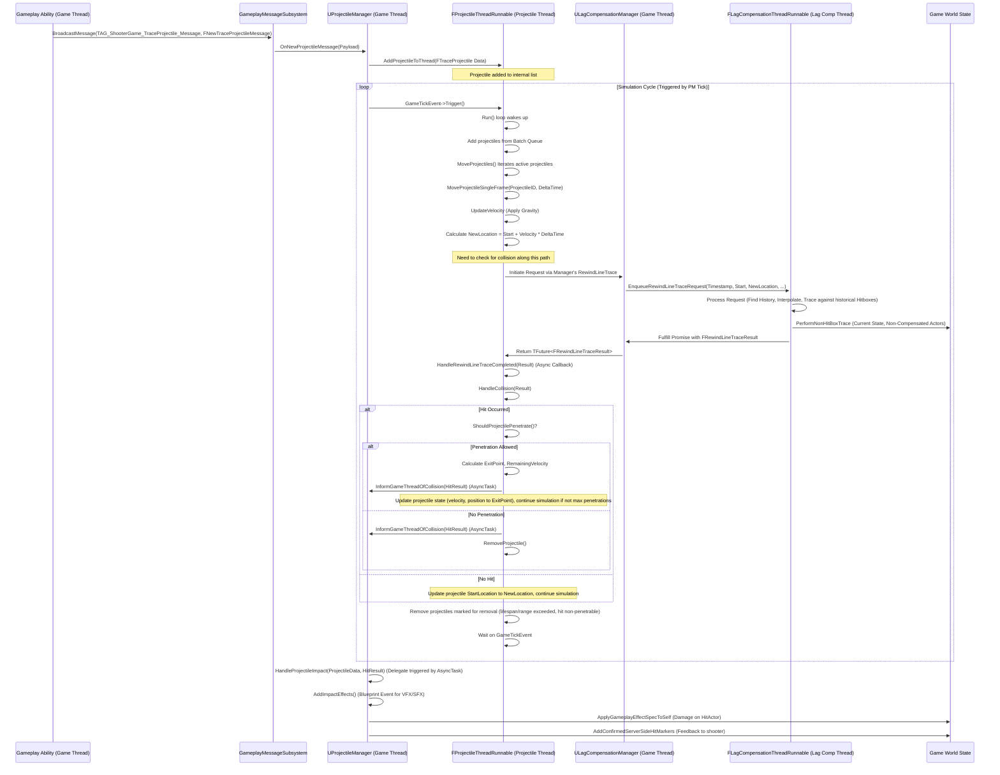

# Conceptual Workflow

This page details the step-by-step process of how a projectile is requested, simulated, and its impact handled within the Projectile Manager system. Understanding this flow helps clarify the roles of the different components and threads involved.

**(Diagram: Request -> Manager -> Thread (Simulate + LagComp Trace) -> Manager (Impact) -> Effects/Damage)**

**(Note: The diagram simplifies the async nature of lag compensation for clarity).**

### Step-by-Step Breakdown

1. **Spawn Request (Game Thread):**
   * Origin: Typically occurs within a server-side Gameplay Ability execution (e.g., inside `OnTargetDataReadyCallback` after `CommitAbility` succeeds).
   * Action: The ability gathers necessary parameters (start location, velocity vector derived from trace results, weapon stats like range/lifespan, penetration rules, instigator, latency/timestamp).
   * Message: It populates an `FNewTraceProjectileMessage` struct with this data.
   * Broadcast: It uses the `UGameplayMessageSubsystem` to broadcast this message with the specific tag `TAG_ShooterGame_TraceProjectile_Message`.
2. **Manager Reception (Game Thread):**
   * Listener: The `UProjectileManager` component (on the GameState) is registered as a listener for `TAG_ShooterGame_TraceProjectile_Message`.
   * Callback: Its `OnNewProjectileMessage` function is triggered when the message is broadcast.
   * Conversion: It creates an `FTraceProjectile` struct from the data in the received `FNewTraceProjectileMessage`.
3. **Thread Handover (Game Thread -> Projectile Thread):**
   * Function Call: The `UProjectileManager` calls `ProjectileThreadHandler->AddProjectileToThread(NewTraceProjectile)`.
   * Queueing: The `FProjectileThreadRunnable::AddProjectileToThread` function enqueues the `FTraceProjectile` data into a thread-safe `ProjectileBatch` queue. This prevents direct modification of the main simulation list from the game thread.
4. **Simulation Cycle (Projectile Thread):**
   * Synchronization: The thread's main `Run()` loop waits on the `GameTickEvent` triggered by the `UProjectileManager`'s `TickComponent`.
   * Batch Processing (`AddProjectileBatch`): At the start of its cycle, the thread dequeues any pending projectiles from `ProjectileBatch` and adds them to its main `Projectiles` TMap, assigning a unique `NextProjectileId`. It calculates the initial latency offset here.
   * Movement Update (`MoveProjectiles` -> `MoveProjectileSingleFrame`):
     * Iterates through all active `FTraceProjectile` entries in the `Projectiles` map.
     * Calculates `DeltaTime` since the last update.
     * Checks if a lag compensation trace is already in progress (`bRewindLineTraceInProgress`); if so, it skips movement for this frame to avoid race conditions and accumulates `DeltaTime`.
     * Checks lifespan (`CurrentLifespan > MaxLifespan`) and removes the projectile if expired.
     * Applies physics (gravity) by calling `UpdateVelocity`.
     * Calculates the potential `NewLocation` for the end of the frame (`StartLocation + Velocity * AccumulatedDeltaTime`).
   * Collision Check (`InitiateRewindLineTrace`):
     * Marks `bRewindLineTraceInProgress = true`.
     * Makes an **asynchronous** request to the `ULagCompensationManager`'s `RewindLineTrace` function, passing the projectile's current `StartLocation`, the calculated `NewLocation`, the projectile's `Timestamp` (when it was fired, adjusted for latency), radius (for sphere traces), and other necessary parameters.
     * Attaches a callback (`.Then(...)`) to the returned `TFuture`.
5. **Lag Compensation Trace (Lag Comp Thread):**
   * The lag compensation thread processes the `RewindLineTrace` request asynchronously (as detailed in the Lag Compensation documentation), performing historical interpolation and tracing.
6. **Collision & Penetration Handling (Projectile Thread - Async Callback):**
   * Callback Trigger: When the lag compensation trace finishes, the `.Then(...)` callback attached in Step 4 executes (scheduled back onto the Game Thread via AsyncTask, then potentially back to the projectile thread or handled directly depending on implementation details - the provided code seems to enqueue results processed on the game thread back to the projectile thread via `ProjectileTraceCompleted` queue).
   * Process Results (`HandleRewindLineTraceCompleted` -> `HandleCollision`):
     * Retrieves the `FRewindLineTraceResult`.
     * Iterates through the `HitResults`.
     * For each hit:
       * Checks range (`TotalDistanceTraveled > MaxRange`).
       * Calls `ShouldProjectilePenetrate` using the projectile's data and the hit result.
       * **If Penetrates:** Calculates the `ExitPoint` and `RemainingVelocity`. Notifies the game thread of the impact (`InformGameThreadOfCollision`). Updates the projectile's internal state (`Velocity`, `NumPenetrationsSoFar`, `PenetratedActors`). Updates the simulation start point for the remaining time step to the `ExitPoint`. Continues simulation if `MaxPenetrations` not reached.
       * **If Blocks:** Notifies the game thread of the impact (`InformGameThreadOfCollision`). Marks the projectile for removal (`RemoveProjectile`). Stops processing further hits for this projectile.
   * Update Position: If no blocking hit occurred during the time step, updates the projectile's `StartLocation` to the calculated `NewLocation` for the next frame. Checks final range limit.
   * Mark Complete: Sets `bRewindLineTraceInProgress = false` for the projectile, allowing it to move again next cycle.
7. **Impact Notification (Projectile Thread -> Game Thread):**
   * Function: `InformGameThreadOfCollision` is called by the thread when a hit (penetrating or blocking) needs to be reported.
   * Mechanism: It creates `TSharedPtr` copies of the relevant `FTraceProjectile` and `FPenetrationHitResult` data (to ensure data validity across threads). It then uses `AsyncTask(ENamedThreads::GameThread, ...)` to queue a task that calls the `UProjectileManager`'s `OnProjectileImpact` delegate back on the main game thread, passing the shared pointers.
8. **Impact Handling (Game Thread):**
   * Delegate Execution: The `UProjectileManager::HandleProjectileImpact` function (bound to the `OnProjectileImpact` delegate) executes on the game thread.
   * Apply Effects:
     * Applies Gameplay Effects (damage) to the `HitActor` using the `HitEffect` specified in the projectile data, applying damage reduction based on penetration history.
     * Calls the `AddImpactEffects` Blueprint Implementable Event, passing the projectile and hit data so designers can spawn appropriate visuals (particles, decals) and sounds based on the hit surface (`HitResult.PhysMaterial`) and the projectile's `ImpactCueNotify` tag.
     * Triggers hit marker display for the instigator using `UWeaponStateComponent::AddConfirmedServerSideHitMarkers`.

This detailed workflow highlights the separation of concerns: the game thread handles requests and final effects, while the dedicated projectile thread performs the continuous simulation and lag-compensated collision checks for high performance.

***

**Next Steps:**

