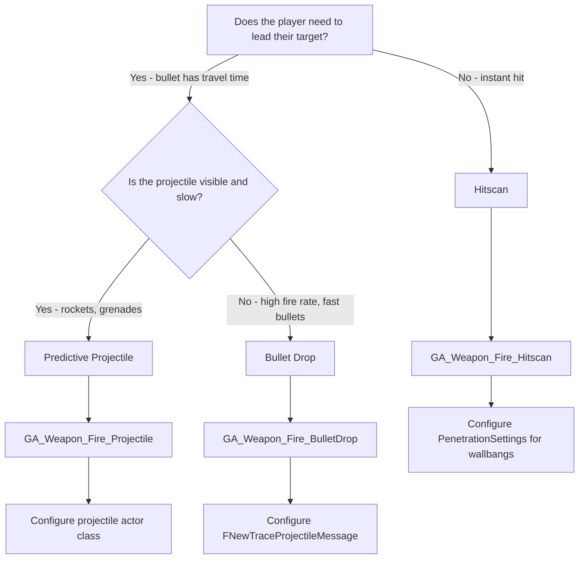

# Shooting Gameplay Abilities

ShooterBase provides three firing abilities, each designed for different weapon types and combat requirements. This guide explains the trade-offs and helps you choose the right one for your weapon.

GAS is used to define _how_ a weapon fires, handles its targeting, applies effects, and interacts with the network prediction and validation systems.

<figure><figcaption>
Base Shooter Gameplay Abilities in ShooterBase
</figcaption></figure>

### Building on Lyra GAS

ShooterBase weapon abilities inherit from Lyra's foundation:

* **`ULyraGameplayAbility`:** The base class for all abilities in Lyra, providing common functionality.
* **`ULyraGameplayAbility_FromEquipment`:** A specialized Lyra ability subclass designed to be granted by and associated with a `ULyraEquipmentInstance`. This is the direct parent for most ShooterBase weapon firing abilities, providing easy access to the owning weapon instance via `GetAssociatedEquipment()`.

### ShooterBase Ability Structure

ShooterBase provides a hierarchy of abstract and concrete ability classes specifically for ranged weapons:

1. **`UGameplayAbility_RangedWeapon` (Abstract Base):**
   * Establishes the common interface and shared logic for all ranged weapon firing abilities in ShooterBase.
   * Handles activating/ending the ability, binding target data callbacks, basic weapon validation (`GetWeaponInstance`), defining targeting sources, performing traces, and calculating spread.
   * Requires subclasses to implement specific logic for _what to do_ with trace results (e.g., deal hitscan damage, spawn projectiles) and how to handle server validation if needed.
2. **Concrete Firing Mode Abilities:** These inherit from `UGameplayAbility_RangedWeapon` (or other intermediate abilities like the hitscan ones) and implement specific firing behaviors:
   * **`UGameplayAbility_RangedWeapon_Hitscan`:** Implements instant, line-trace-based firing with robust server-side validation using lag compensation.
   * **`UGameplayAbility_HitScanPenetration`:** Extends the hitscan ability to allow bullets to penetrate surfaces based on material properties, including adapted server validation.
   * **`UGameplayAbility_RangedWeapon_Projectile`:** Implements firing logic that results in spawning a projectile actor, but _without_ client-side prediction (server authoritative only).
   * **`UGameplayAbility_PredictiveProjectile`:** The most complex ability, implementing projectile firing _with_ client-side prediction, synchronization, and the merge point trajectory system, using `AProjectileBase`.

### Why Use GAS for Firing?

* **Composition/Modularity:** Each firing mode (hitscan, projectile, penetration) is a self-contained ability asset. You can easily assign different abilities to different weapons.
* **Data-Driven:** Many ability properties (cooldowns, costs, targeting types, effects to apply) can be configured directly in Blueprint subclasses of these C++ bases.
* **Network Integration:** GAS has built-in support for client prediction (`FPredictionKey`, `FScopedPredictionWindow`), server validation, and replicating gameplay events and effects, which ShooterBase leverages heavily.
* **Extensibility:** Adding new firing types (e.g., charge weapons, beam weapons) involves creating new GAS ability subclasses without modifying the core weapon instance classes extensively.


**Hint:** If you're new to the concept of composition in game development, check out the video [_"Composition Over Inheritance"_](https://www.youtube.com/watch?v=HNzP1aLAffM). It provides a clear explanation of how this approach applies to Object-Oriented Programming in games.


***

### The Three Firing Types

#### Hitscan

Instant hit detection with server-side validation. When a player fires, the trace is performed immediately and the result is known within the same frame. The server validates hits using lag compensation to ensure fairness across network latency.

**Best for**: Rifles, pistols, shotguns, snipers, weapons where players expect immediate feedback.


**Blueprint Ability**: `GA_Weapon_Fire_Hitscan`\
Penetration and ricochets are configurable, leave settings empty for pure hitscan, or add materials to enable wallbangs.


#### Predictive Projectile

Visible actor projectiles with client-side prediction. The client spawns a visual-only projectile immediately, then smoothly transitions to the server's authoritative projectile when it replicates. This eliminates the perceived 100ms+ delay that would otherwise occur.

**Best for**: Rocket launchers, grenade launchers, bows, plasma rifles, slow, visible projectiles that players watch travel.


**Blueprint Ability**: `GA_Weapon_Fire_Projectile`\
Uses the [Predictive Projectile System](../projectile-system/) for actor spawning and handoff.


#### Bullet Drop

High-volume struct-based simulation on a background thread. Instead of spawning actors, bullets exist as lightweight `FTraceProjectile` structs with gravity, penetration, and lag-compensated hit detection. This supports thousands of simultaneous projectiles without actor overhead.

**Best for**: Miniguns, high-RPM SMGs, mounted turrets, weapons that fire many bullets with travel time.


**Blueprint Ability**: `GA_Weapon_Fire_BulletDrop`\
Uses the [Projectile Manager](../../projectile-manager/) for struct-based simulation.


### Choosing the Right Ability

### Trade-off Comparison

| Aspect                      | Hitscan                  | Predictive Projectile         | Bullet Drop                  |
| --------------------------- | ------------------------ | ----------------------------- | ---------------------------- |
| **Player Feel**             | Instant, responsive      | Satisfying to watch           | Realistic arcs               |
| **Server Cost**             | Low (one trace per shot) | Medium (actor per projectile) | Low (struct-based, threaded) |
| **Network Cost**            | Low (just hit results)   | Medium (actor replication)    | Very Low (no replication)    |
| **Complexity**              | Simple                   | Complex (fake/real sync)      | Complex (threading)          |
| **Penetration**             | Configurable             | No                            | Yes                          |
| **Gravity**                 | No                       | Yes (projectile physics)      | Yes                          |
| **Homing/Special Behavior** | No                       | Yes (actor logic)             | No                           |

Limitations:

* Hitscan cannot simulate gravity or travel time
* Bullet Drop cannot implement homing, detonation, or complex projectile behavior
* Predictive Projectile has the highest complexity and actor overhead

### Shared Foundation

All three abilities inherit from `UGameplayAbility_RangedWeapon`, which provides:

| Feature                | Description                                                         |
| ---------------------- | ------------------------------------------------------------------- |
| **Targeting System**   | 6 configurable aiming sources (camera, weapon muzzle, custom)       |
| **Spread Calculation** | Normal-distributed cone with configurable exponent                  |
| **Weapon Traces**      | Multi-hit support with actor deduplication                          |
| **Extension Event**    | `OnRangedWeaponTargetDataReady` for cosmetics (muzzle flash, sound) |

### Quick Reference

| Blueprint Ability           | C++ Base Class                             | Uses System                                           |
| --------------------------- | ------------------------------------------ | ----------------------------------------------------- |
| `GA_Weapon_Fire_Hitscan`    | `UGameplayAbility_HitScanPenetration`      | [Lag Compensation](../../lag-compensation/)           |
| `GA_Weapon_Fire_Projectile` | `UGameplayAbility_PredictiveProjectile`    | [Predictive Projectile System](../projectile-system/) |
| `GA_Weapon_Fire_BulletDrop` | `UGameplayAbility_RangedWeapon_Projectile` | [Projectile Manager](../../projectile-manager/)       |

Targeting Defaults:

* Hitscan uses `WeaponTowardsFocus` (muzzle socket, aimed at camera focus)
* Projectile abilities use `CameraTowardsFocus` (camera location, aimed at focus)

This difference exists because hitscan needs accurate muzzle-to-target traces, while projectiles benefit from camera-aligned trajectories for aiming.

### Recommended Reading

* Building a rifle, pistol, or sniper? Start with [Hitscan](hitscan.md) and [Bullet Drop](bullet-drop.md). Most weapons in most shooters use hitscan or bullet drop depending on the game type.
* Building a rocket launcher or grenade launcher? Start with [Predictive Projectile](predictive-projectile.md). You need the player to see the projectile fly.
