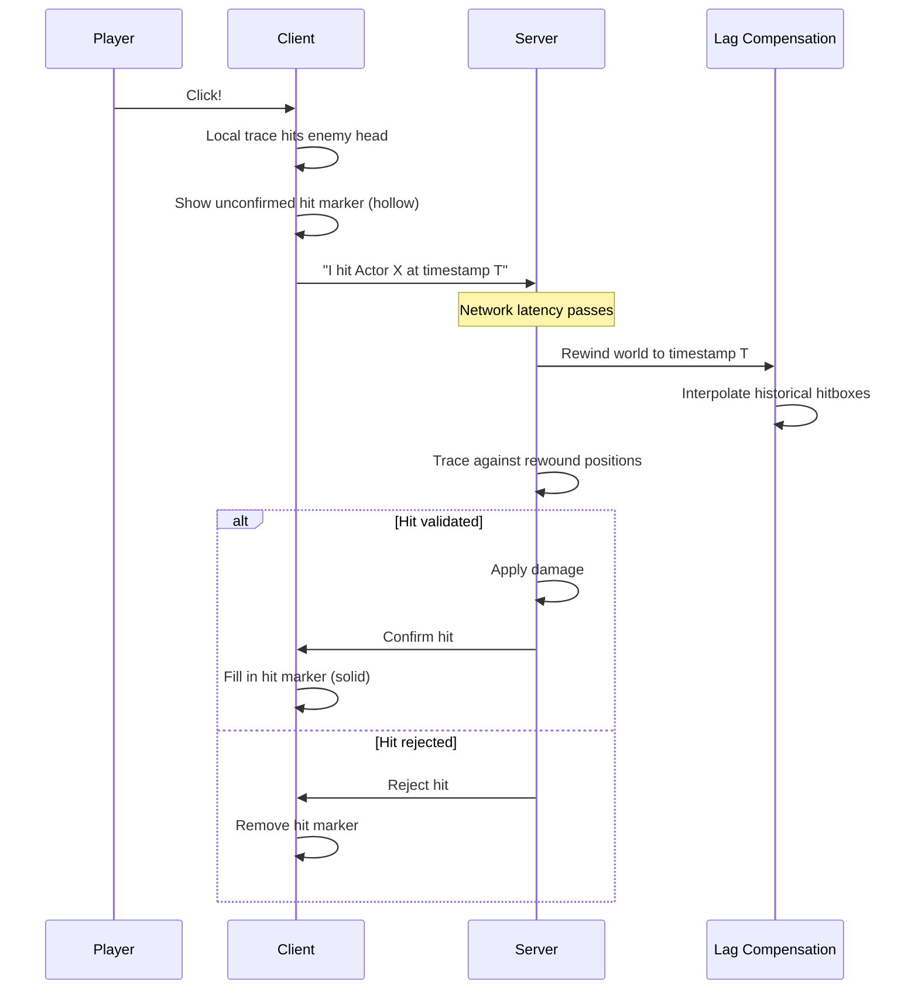

# Hitscan

Hitscan weapons provide instant hit detection, when a player fires, the result is determined immediately. The challenge is validating these hits fairly across a network where clients and servers are 50–150ms apart.

This page covers the trust-but-verify architecture, lag compensation integration, and the penetration/ricochet system.

***

### Player Expectations

Players expect immediate feedback when their crosshair is on target. A 100ms delay between clicking and seeing a hit marker creates a disconnect between input and response.

Two naive approaches fail:

**Pure client-side detection:**

```plaintext
Client: "I hit them in the head!"
Server: "Okay, dealing damage."
```

The client can lie. This enables aimbots, wallhacks, and position manipulation.

**Pure server-side detection:**

```plaintext
Client: "I fired toward position X"
Server: [waits for packet, traces, checks hit]
Server: "Yes, that was a hit"
Client: [100ms later] "Oh, now I know I hit"
```

The player sees themselves hit 100ms before confirmation. If the server says "miss," the game feels unfair—they _saw_ the crosshair on the head.

***

### Trust-But-Verify Architecture

The solution: the client performs a local trace and shows immediate feedback, while the server validates using lag compensation to rewind hitboxes to the moment the player fired.



The client shows feedback immediately (unconfirmed hit marker). The server has final authority. Most of the time, the server confirms what the client saw. When they disagree, the server wins.

***

### Why Lag Compensation Matters

With 100ms ping, when you fire at an enemy:

| Time | What You See                | What Server Sees        |
| ---- | --------------------------- | ----------------------- |
| 0ms  | Enemy at position A         | Enemy at position A     |
| 50ms | Your packet reaches server  | Enemy now at position B |
| 50ms | Server traces at position B | Miss! Enemy moved       |

Without lag compensation, you'd have to lead targets by their movement over your ping time.

**With lag compensation:**

| Time | What Happens                                |
| ---- | ------------------------------------------- |
| 0ms  | You fire, client records timestamp          |
| 50ms | Server receives: "Hit at T=0ms, ping=100ms" |
| 50ms | Server rewinds to T=0ms                     |
| 50ms | Server traces against historical positions  |
| 50ms | Hit validates—enemy WAS at position A       |

#### The Timestamp Formula

```plaintext
Timestamp = ServerTime - (ClientPing / 2)
```

The client's local time is roughly `ServerTime - (Ping/2)` due to the round-trip. This estimates when the player actually clicked, accounting for network delay.

#### When Rewinding Fails

Lag compensation is not perfect. It fails when:

* **Enemy teleported**: Abilities that move characters instantly aren't captured in historical positions
* **Extreme latency**: 300ms+ ping means rewinding 300ms—positions may be too stale
* **Rapid direction changes**: Interpolation between historical samples may not capture sharp movement

The system is tuned for typical competitive latency (50–150ms). Beyond that, accuracy degrades.

***

### The Firing Flow

Below is the firing flow presented as sequential steps (client and server behaviors). Each step corresponds to the stages in the firing/validation pipeline.



#### Calculate spread & local traces

Client - StartRangedWeaponTargeting():

* Calculate spread:
  * `SpreadAngle = Weapon.GetCalculatedSpreadAngle()`
  * `SpreadMultiplier = Weapon.GetCalculatedSpreadAngleMultiplier()`
  * `ActualSpread = SpreadAngle * SpreadMultiplier`
* Perform local traces (one per bullet):
  * For each bullet in `BulletsPerCartridge`:
    * `Direction = VRandConeNormalDistribution(AimDir, ActualSpread, Exponent)`
    * `Hit = DoSingleBulletTrace(Start, Direction * MaxRange)`
* Package result with timestamp:
  * `TargetData.Add(Hit, CartridgeID, Timestamp)`
* Continue to callback:
  * `OnTargetDataReadyCallback(TargetData)`



#### Send to server & cosmetics

Client - OnTargetDataReadyCallback():

* If locally controlled and not authority:
  * `SendTargetDataToServer(TargetData)`
* Show unconfirmed hit markers:
  * `AddUnconfirmedHitMarkers(TargetData)`
* Fire cosmetic event:
  * `OnRangedWeaponTargetDataReady(TargetData)` // Blueprint event



#### Server receives & validates

Server - OnTargetDataReadyCallback():

* Validate asynchronously:
  * `PerformServerSideValidation(TargetData)`

Server - PerformServerSideValidation():

* For each Hit in `TargetData`:
  * `LagCompManager.RewindLineTrace(Start, End, Hit.Timestamp, OnComplete: CompareWithClientHit)`



#### Rewind result comparison

Server - OnRewindTraceComplete():

* Compare server result with client claim:
  * If `ServerHit.Actor == ClientHit.Actor`:
    * Accept hit → `ProcessValidatedHit(ClientHit)`
  * Else:
    * Replace with server's hit (or miss) → `ProcessValidatedHit(ServerHit)`



***

### Penetration & Ricochet

Standard hitscan stops at the first hit. The penetration system allows bullets to punch through materials or ricochet off surfaces based on impact angle and material properties.

#### Impact Angle Zones

When a bullet hits a surface, the angle of impact determines what happens:

```
Surface Normal
      ↑
      |
      |╲ Impact angle
      | ╲
      |  ╲ Bullet
      |   ╲
──────┴────────── Surface

Angle zones:
  0° - 25°:  PENETRATION (bullet goes through)
  25° - 60°: DEAD ZONE (bullet stops)
  60° - 90°: RICOCHET (bullet bounces)
```

* **Penetration zone (0°–25°)**: Head-on hits. The bullet has enough perpendicular force to punch through.
* **Dead zone (25°–60°)**: Neither head-on enough to penetrate nor grazing enough to bounce. The bullet stops.
* **Ricochet zone (60°–90°)**: Grazing hits. The bullet deflects off the surface.


These are the default values, the penetration, dead and ricochet zone can be customised per material.


#### Segment-Based Tracing

Penetration traces in segments, evaluating each surface:

```plaintext
DoSingleBulletTrace_Penetrating():
    RemainingRange = MaxRange
    HitActors = []
    RicochetCount = 0

    while RemainingRange > 0:
        // Trace current segment
        Hits = TraceSegment(CurrentStart, Direction, RemainingRange)

        // Find first new actor (skip already-hit actors)
        Hit = ChooseFirstValidHit(Hits, HitActors)

        if no valid hit:
            break  // Bullet flew into open air

        // Get material rules
        MaterialInfo = PenetrationSettings[Hit.PhysicalMaterial]

        // Decision tree
        if ShouldRicochet(Hit, MaterialInfo):
            Direction = Reflect(Direction, Hit.Normal)
            Direction = ApplyExitSpread(Direction, MaterialInfo.MaxExitSpreadAngle)
            RicochetCount++
            CurrentStart = Hit.ImpactPoint

        else if ShouldPenetrate(Hit, MaterialInfo):
            // Step through the material
            CurrentStart = Hit.ImpactPoint + Direction * MaterialInfo.MaxPenetrationDepth
            RemainingRange -= PenetrationDepth

        else:
            // Dead zone - bullet stops
            RecordFinalHit(Hit)
            break

        // Record this hit for damage/effects
        RecordHit(Hit)
        HitActors.Add(Hit.Actor)
```

#### Material Configuration

Each physical material can have penetration rules:

| Property                     | Default | Description                                              |
| ---------------------------- | ------- | -------------------------------------------------------- |
| `MaxPenetrationDepth`        | 20cm    | How far the bullet travels through the material          |
| `MaxPenetrationAngle`        | 25°     | Maximum angle from perpendicular that allows penetration |
| `MinimumPenetrationVelocity` | 1000    | Speed threshold below which penetration fails            |
| `MinRicochetAngle`           | 60°     | Minimum grazing angle for ricochet eligibility           |
| `RicochetProbability`        | 0.5     | Chance of ricochet when angle qualifies (50%)            |
| `MaxRicochetBounces`         | 0       | Max bounces per material (0 = disabled)                  |
| `DamageChangePercentage`     | 0.75    | Damage retained after penetration (75%)                  |
| `MaxExitSpreadAngle`         | 10°     | Random deviation after penetration/ricochet              |

#### Deterministic Seeding

Ricochet probability needs to be reproducible, the client and server must agree on whether a ricochet occurred. The system uses deterministic seeding:

```plaintext
Seed = MakeDeterministicSeed(ImpactPoint, BulletId, SegmentIndex)
RandomValue = SeededRandom(Seed)

ShouldRicochet = RandomValue < RicochetProbability
```

Same impact point, same bullet, same segment = same random decision on both client and server.

***

### Targeting System

Hitscan defaults to `WeaponTowardsFocus` targeting:

```plaintext
Targeting Sources:
  CameraTowardsFocus   - Start at camera, aim toward focus point
  PawnForward          - Start at pawn center, aim pawn direction
  PawnTowardsFocus     - Start at pawn center, aim toward focus point
  WeaponForward        - Start at muzzle socket, aim pawn direction
  WeaponTowardsFocus   - Start at muzzle socket, aim toward focus point (DEFAULT)
  Custom               - Blueprint-specified transform
```

**Why `WeaponTowardsFocus` for hitscan?**

For instant-hit weapons, the trace should originate from where the bullet actually exits, the muzzle socket. This ensures:

* Bullets don't clip through walls the player is standing next to
* Close-range shots originate from the correct visual position
* The aim direction still points toward the camera's focus for accurate feel

#### Spread Calculation

Spread uses a normal distribution within a cone:

```plaintext
Direction = VRandConeNormalDistribution(
    AimDirection,
    SpreadAngle / 2,      // Half-angle of the cone
    SpreadExponent        // Clustering (higher = tighter center)
)
```

The exponent controls how shots cluster toward the center. Higher values = more shots near the center, fewer at the edges.

***

### Configuration

#### Pure Hitscan (No Penetration)

Leave `PenetrationSettings` empty. The ability will trace once and stop at the first hit.

#### Enabling Wallbangs

Add entries to `PenetrationSettings` for each material that should be penetrable:

```plaintext
PenetrationSettings = {
    PM_Wood_Thin: {
        MaxPenetrationDepth: 15,
        DamageChangePercentage: 0.85,
        MaxPenetrationAngle: 45
    },
    PM_Glass: {
        MaxPenetrationDepth: 5,
        DamageChangePercentage: 0.95,
        MaxPenetrationAngle: 60
    },
    PM_SheetMetal: {
        MaxPenetrationDepth: 10,
        DamageChangePercentage: 0.7,
        MinRicochetAngle: 70,
        RicochetProbability: 0.8,
        MaxRicochetBounces: 2
    }
}
```

Materials NOT in the map block all penetration. You don't need to explicitly configure blocking, just don't add them.

#### Physical Material Setup

1. Create `UPhysicalMaterial` assets in Content Browser (e.g., `PM_Concrete`, `PM_Wood_Thin`)
2. Assign these materials to your world surfaces via material instances or collision settings
3. Add penetration rules for each material you want bullets to pass through

***

### Server Validation

The server validates the entire penetration sequence, not just individual hits.

#### Per-Segment Grouping

When a bullet penetrates multiple surfaces, the server groups all hits with the same segment key (start position, end position, timestamp). One rewind trace validates all hits in that segment.

```plaintext
ClientHits = [
    Hit1: { Actor: Enemy, Segment: (A→B) },
    Hit2: { Actor: Wall,  Segment: (A→B) },  // Same segment
    Hit3: { Actor: Enemy2, Segment: (B→C) }  // Different segment
]

// Server performs 2 rewind traces:
//   Segment (A→B): validates Hit1 and Hit2
//   Segment (B→C): validates Hit3
```

#### Tolerance Check

The server compares each client hit against the rewound result:

```plaintext
IsHitWithinTolerance(ClientHit, ServerHit):
    return ClientHit.Actor == ServerHit.Actor
           AND ClientHit.PhysicalMaterial == ServerHit.PhysicalMaterial
```


**Current Implementation**: The validation checks actor and material only, not impact position proximity. Additionally, spread seed validation is not yet implemented, the server trusts the client's spread direction rather than recalculating it.


***

### Extension Points

#### `OnRangedWeaponTargetDataReady`

This Blueprint event fires after targeting completes. Use it for cosmetics:

```plaintext
OnRangedWeaponTargetDataReady(TargetData):
    // Play muzzle flash
    PlayMuzzleFlash()

    // Play firing sound
    PlaySound(FireSound)

    // Spawn tracer particle (visual only)
    for each Hit in TargetData:
        SpawnTracer(MuzzleLocation, Hit.ImpactPoint)
```

#### When to Subclass

Use `GA_Weapon_Fire_Hitscan` (Blueprint) when:

* Standard hitscan behavior fits your weapon
* You only need to configure damage, spread, penetration settings
* Cosmetics via `OnRangedWeaponTargetDataReady` are sufficient

Subclass `UGameplayAbility_HitScanPenetration` (C++) when:

* You need custom targeting logic (lock-on, beam weapons)
* You need to modify validation beyond material checks
* You're building fundamentally different firing patterns

***

### Quick Reference

**Blueprint Ability**: `GA_Weapon_Fire_Hitscan`\
**C++ Base**: `UGameplayAbility_HitScanPenetration`\
**Targeting Default**: `WeaponTowardsFocus`

**Key Properties**:

* `PenetrationSettings` - Map of physical material → penetration rules
* `BulletTraceSweepRadius` - 0 for line trace, >0 for sphere sweep
* `MaxDamageRange` - Maximum trace distance

**Key Events**:

* `OnRangedWeaponTargetDataReady` - BlueprintImplementableEvent for cosmetics

**Related Systems**:

* [Lag Compensation](../../lag-compensation/) - Historical hitbox management
* [Weapon State Component](../../../../base-lyra-modified/weapons/weapon-state-component.md) - Hit marker display

***
