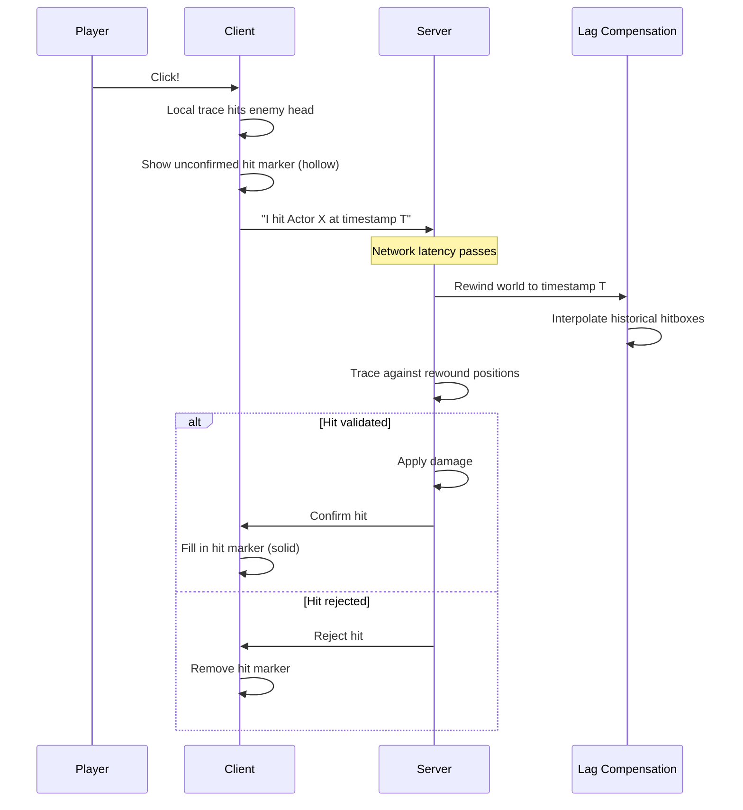

# Hitscan

Hitscan weapons provide instant hit detection, when a player fires, the result is determined immediately. The challenge is validating these hits fairly across a network where clients and servers are 50–150ms apart.

This page covers the trust-but-verify architecture, lag compensation integration, how the server rebuilds each shot, and the penetration/ricochet system.

***

### Player Expectations

Players expect immediate feedback when their crosshair is on target. A 100ms delay between clicking and seeing a hit marker creates a disconnect between input and response.

Two naive approaches fail:

**Pure client-side detection:**

```plaintext
Client: "I hit them in the head!"
Server: "Okay, dealing damage."
```

The client can lie. This enables aimbots, wallhacks, and position manipulation.

**Pure server-side detection:**

```plaintext
Client: "I fired toward position X"
Server: [waits for packet, traces, checks hit]
Server: "Yes, that was a hit"
Client: [100ms later] "Oh, now I know I hit"
```

The player sees themselves hit 100ms before confirmation. If the server says "miss," the game feels unfair, they _saw_ the crosshair on the head.

***

### Trust-But-Verify Architecture

The solution: the client performs a local trace and shows immediate feedback, while the server validates using lag compensation to rewind hitboxes to the moment the player fired.


```mermaid
sequenceDiagram
    participant P as Player
    participant C as Client
    participant S as Server
    participant LC as Lag Compensation

    P->>C: Click!
    C->>C: Local trace hits enemy head
    C->>C: Show unconfirmed hit marker (hollow)
    C->>S: "I hit Actor X at timestamp T"

    Note over S: Network latency passes

    S->>LC: Rewind world to timestamp T
    LC->>LC: Interpolate historical hitboxes
    S->>S: Trace against rewound positions

    alt Hit validated
        S->>S: Apply damage
        S->>C: Confirm hit
        C->>C: Fill in hit marker (solid)
    else Hit rejected
        S->>C: Reject hit
        C->>C: Remove hit marker
    end
```

The client shows feedback immediately (unconfirmed hit marker). The server has final authority. Most of the time, the server confirms what the client saw. When they disagree, the server wins.

***

### Why Lag Compensation Matters

With 100ms ping, when you fire at an enemy:

| Time | What You See                | What Server Sees        |
| ---- | --------------------------- | ----------------------- |
| 0ms  | Enemy at position A         | Enemy at position A     |
| 50ms | Your packet reaches server  | Enemy now at position B |
| 50ms | Server traces at position B | Miss! Enemy moved       |

Without lag compensation, you'd have to lead targets by their movement over your ping time.

**With lag compensation:**

| Time | What Happens                                |
| ---- | ------------------------------------------- |
| 0ms  | You fire, client records timestamp          |
| 50ms | Server receives: "Hit at T=0ms, ping=100ms" |
| 50ms | Server rewinds to T=0ms                     |
| 50ms | Server traces against historical positions  |
| 50ms | Hit validates, enemy WAS at position A      |

#### The Timestamp Formula

```plaintext
Timestamp = ServerTime - (ClientPing / 2)
```

The client's local time is roughly `ServerTime - (Ping/2)` due to the round-trip. This estimates when the player actually clicked, accounting for network delay.

#### When Rewinding Fails

Lag compensation is not perfect. It fails when:

* **Enemy teleported**: Abilities that move characters instantly aren't captured in historical positions
* **Extreme latency**: 300ms+ ping means rewinding 300ms, positions may be too stale
* **Rapid direction changes**: Interpolation between historical samples may not capture sharp movement

The system is tuned for typical competitive latency (50–150ms). Beyond that, accuracy degrades.

***

### The Firing Flow

Below is the firing flow presented as sequential steps (client and server behaviors). Each step corresponds to the stages in the firing/validation pipeline.



#### Calculate spread & local traces

Client - StartRangedWeaponTargeting():

* Take the next shot index from the controller's weapon state component:
  * `ShotIndex = WeaponState.AllocateLocalShotIndex()`
* Calculate the spread once for the cartridge:
  * `SpreadHalfAngle = Weapon.GetCalculatedSpreadAngle() * Weapon.GetCalculatedSpreadAngleMultiplier() / 2`
* Round the aim origin and direction to the precision they are sent at, so the server rebuilds exactly the lines the client traces
* Perform local traces (one per bullet):
  * For each `BulletIndex` in `BulletsPerCartridge`:
    * `Direction = ComputeSeededSpreadDirection(AimDir, SpreadHalfAngle, Exponent, ShotIndex, BulletIndex)`
    * `Hit = DoSingleBulletTrace(Start, Start + Direction * MaxRange)`
* Package each hit with the shot geometry and its bullet index:
  * `TargetData.Add(Hit, CartridgeID, Timestamp, ShotGeometry, BulletIndex)`
* Continue to callback:
  * `OnTargetDataReadyCallback(TargetData)`



#### Send to server & cosmetics

Client - OnTargetDataReadyCallback():

* If locally controlled and not authority:
  * `SendTargetDataToServer(TargetData)`
* Show unconfirmed hit markers:
  * `AddUnconfirmedHitMarkers(TargetData)`
* Fire cosmetic event:
  * `OnRangedWeaponTargetDataReady(TargetData)` // Blueprint event



#### Server receives & validates

Server - OnTargetDataReadyCallback():

* Validate asynchronously:
  * `PerformServerSideValidation(TargetData)`

Server - PerformServerSideValidation():

* Check the shot geometry, see [Server Validation](hitscan.md#server-validation). A refused shot still spends its ammo, but none of its hits deal damage.
* Group the hits by bullet index, refusing any index beyond the weapon's `BulletsPerCartridge`
* For each bullet:
  * Rebuild its line from the shot geometry: `Direction = ComputeSeededSpreadDirection(AimDir, SpreadHalfAngle, Exponent, ShotIndex, BulletIndex)`
  * `LagCompManager.RewindLineTrace(Origin, Origin + Direction * MaxRange, Timestamp, OnComplete: CompareWithClientHits)`



#### Rewind result comparison

Server - OnRewindTraceComplete():

* If the rebuilt line hit nothing, refuse every hit the bullet claimed
* Compare the bullet's first claim with the first thing the line hit:
  * Same actor and physical material: accept it, using the server's hit result
  * Otherwise: refuse it. The client is told the hit was replaced, so its hit marker is removed.
* Each further claim on the same bullet must name a different actor the rebuilt line also passed through, or it is refused. One bullet can't count as several hits on the same target.



***

### Penetration & Ricochet

Standard hitscan stops at the first hit. The penetration system allows bullets to punch through materials or ricochet off surfaces based on impact angle and material properties.

#### Impact Angle Zones

When a bullet hits a surface, the angle of impact determines what happens:

```
Surface Normal
      ↑
      |
      |╲ Impact angle
      | ╲
      |  ╲ Bullet
      |   ╲
──────┴────────── Surface

Angle zones:
  0° - 25°:  PENETRATION (bullet goes through)
  25° - 60°: DEAD ZONE (bullet stops)
  60° - 90°: RICOCHET (bullet bounces)
```

* **Penetration zone (0°–25°)**: Head-on hits. The bullet has enough perpendicular force to punch through.
* **Dead zone (25°–60°)**: Neither head-on enough to penetrate nor grazing enough to bounce. The bullet stops.
* **Ricochet zone (60°–90°)**: Grazing hits. The bullet deflects off the surface.


These are the default values, the penetration, dead and ricochet zone can be customised per material.


#### Segment-Based Tracing

Penetration traces in segments, evaluating each surface:

```plaintext
DoSingleBulletTrace_Penetrating():
    RemainingRange = MaxRange
    HitActors = []
    RicochetCount = 0

    while RemainingRange > 0:
        // Trace current segment
        Hits = TraceSegment(CurrentStart, Direction, RemainingRange)

        // Find first new actor (skip already-hit actors)
        Hit = ChooseFirstValidHit(Hits, HitActors)

        if no valid hit:
            break  // Bullet flew into open air

        // Get material rules
        MaterialInfo = PenetrationSettings[Hit.PhysicalMaterial]

        // Decision tree
        if ShouldRicochet(Hit, MaterialInfo):
            Direction = Reflect(Direction, Hit.Normal)
            Direction = ApplyExitSpread(Direction, MaterialInfo.MaxExitSpreadAngle)
            RicochetCount++
            CurrentStart = Hit.ImpactPoint

        else if ShouldPenetrate(Hit, MaterialInfo):
            // Step through the material
            CurrentStart = Hit.ImpactPoint + Direction * MaterialInfo.MaxPenetrationDepth
            RemainingRange -= PenetrationDepth

        else:
            // Dead zone - bullet stops
            RecordFinalHit(Hit)
            break

        // Record this hit for damage/effects
        RecordHit(Hit)
        HitActors.Add(Hit.Actor)
```

#### Material Configuration

Each physical material can have penetration rules:

| Property                     | Default | Description                                              |
| ---------------------------- | ------- | -------------------------------------------------------- |
| `MaxPenetrationDepth`        | 20cm    | How far the bullet travels through the material          |
| `PenetrationDepthMultiplierRange` | 0.9 to 1.1 | Random multiplier applied to `MaxPenetrationDepth` per hit |
| `MaxTotalWallDepth`          | 0       | Cap on the total wall depth one bullet may cross, 0 for no cap |
| `MaxPenetrationAngle`        | 25°     | Maximum angle from perpendicular that allows penetration |
| `MinRicochetAngle`           | 60°     | Minimum grazing angle for ricochet eligibility           |
| `RicochetProbability`        | 0.5     | Chance of ricochet when angle qualifies (50%)            |
| `MaxRicochetBounces`         | 0       | Max bounces per material (0 = disabled)                  |
| `DamageChangePercentage`     | 0.75    | Damage retained after penetration (75%)                  |
| `MaxExitSpreadAngle`         | 10°     | Random deviation after penetration/ricochet              |

#### Deterministic Seeding

Ricochet probability needs to be reproducible, the client and server must agree on whether a ricochet occurred. The system uses deterministic seeding:

```plaintext
Seed = MakeDeterministicSeed(ImpactPoint, BulletId, SegmentIndex)
RandomValue = SeededRandom(Seed)

ShouldRicochet = RandomValue < RicochetProbability
```

Same impact point, same bullet, same segment = same random decision on both client and server.

***

### Targeting System

Hitscan defaults to `WeaponTowardsFocus` targeting:

```plaintext
Targeting Sources:
  CameraTowardsFocus   - Start at camera, aim toward focus point
  PawnForward          - Start at pawn center, aim pawn direction
  PawnTowardsFocus     - Start at pawn center, aim toward focus point
  WeaponForward        - Start at muzzle socket, aim pawn direction
  WeaponTowardsFocus   - Start at muzzle socket, aim toward focus point (DEFAULT)
  Custom               - Blueprint-specified transform
```

**Why `WeaponTowardsFocus` for hitscan?**

For instant-hit weapons, the trace should originate from where the bullet actually exits, the muzzle socket. This ensures:

* Bullets don't clip through walls the player is standing next to
* Close-range shots originate from the correct visual position
* The aim direction still points toward the camera's focus for accurate feel

#### Spread Calculation

Spread uses a normal distribution within a cone, drawn from a random stream seeded by the shot index and the bullet index:

```plaintext
Direction = ComputeSeededSpreadDirection(
    AimDirection,
    SpreadAngle / 2,      // Half-angle of the cone
    SpreadExponent,       // Clustering (higher = tighter center)
    ShotIndex,            // Counts up with every shot this controller fires
    BulletIndex           // Which pellet of the cartridge
)
```

The exponent controls how shots cluster toward the center. Higher values = more shots near the center, fewer at the edges.

Because the seed comes from the shot and bullet index, the same shot produces the same pellet directions on the client and the server. That is what lets the server rebuild every bullet's line itself instead of trusting the one the client traced.

***

### Configuration

#### Pure Hitscan (No Penetration)

Leave `PenetrationSettings` empty. The ability will trace once and stop at the first hit.

#### Enabling Wallbangs

Add entries to `PenetrationSettings` for each material that should be penetrable:

```plaintext
PenetrationSettings = {
    PM_Wood_Thin: {
        MaxPenetrationDepth: 15,
        DamageChangePercentage: 0.85,
        MaxPenetrationAngle: 45
    },
    PM_Glass: {
        MaxPenetrationDepth: 5,
        DamageChangePercentage: 0.95,
        MaxPenetrationAngle: 60
    },
    PM_SheetMetal: {
        MaxPenetrationDepth: 10,
        DamageChangePercentage: 0.7,
        MinRicochetAngle: 70,
        RicochetProbability: 0.8,
        MaxRicochetBounces: 2
    }
}
```

Materials NOT in the map block all penetration. You don't need to explicitly configure blocking, just don't add them.

#### Physical Material Setup

1. Create `UPhysicalMaterial` assets in Content Browser (e.g., `PM_Concrete`, `PM_Wood_Thin`)
2. Assign these materials to your world surfaces via material instances or collision settings
3. Add penetration rules for each material you want bullets to pass through

***

### Server Validation

The client reports where the shot started, where it was aimed and how wide its spread was. The server checks that report, then rebuilds every bullet's line from it rather than tracing the lines the client sent.

#### Shot Geometry

Every hit carries the shot geometry of the cartridge it came from: the shot index, the aim origin, the aim direction and the spread the client used. Before tracing anything, the server checks that:

* every hit in the shot carries the same geometry
* every value is finite
* the shot index is newer than any it has seen from this controller, and skips no more than `MaxSkippedShotIndices` shots, which defaults to 4
* `IsShotGeometryPlausible` accepts it

A shot that fails any of these is refused whole. Skipped indices happen legitimately when the server refuses to activate a shot the client fired. Each skip allowed is one more spread pattern a client could choose between, so keep `MaxSkippedShotIndices` small.

Once the geometry is accepted, the server works out each bullet's direction from the shot index and bullet index. A client can't send pellet directions of its own choosing, and one bullet can't be reported as several hits on the same target.


The origin and aim are taken as the client reports them. How far a shot may start from the pawn, or how far its aim may differ from the server's view of the player, depends on your game's cameras, vehicles and movement. If your game has limits it can enforce, override `IsShotGeometryPlausible`.


<details>

<summary>Example: limiting how far a shot may start from the pawn</summary>

```cpp
// MyHitscanAbility.h
virtual bool IsShotGeometryPlausible(const FLyraShotGeometry& ShotGeometry) const override;

// MyHitscanAbility.cpp
bool UMyHitscanAbility::IsShotGeometryPlausible(const FLyraShotGeometry& ShotGeometry) const
{
	// A first person game with no vehicles always fires from close to the pawn
	const APawn* Pawn = Cast<APawn>(GetAvatarActorFromActorInfo());
	return Pawn && FVector::Dist(Pawn->GetActorLocation(), ShotGeometry.AimOrigin) < 150.0;
}
```

</details>

#### Penetration Paths

For a penetrating bullet, the server traces the first segment along the rebuilt line. Every later segment has to follow from the one before it under that surface's settings:

* A penetration exits no deeper than `MaxPenetrationDepth` allows at the top of `PenetrationDepthMultiplierRange`, along the direction the bullet entered, and bends by no more than `MaxExitSpreadAngle`
* A ricochet starts at the impact, heads along the reflected direction within `MaxExitSpreadAngle`, and happens no more than `MaxRicochetBounces` times
* A surface with no entry in `PenetrationSettings` stops the bullet
* The path stays within `MaxPenetrations` and the weapon's range

Positions travel over the network rounded to the centimetre, so each check allows a little room for that rounding.

Each segment is then traced against the rewound world, and its hit must match the server's hit by actor and physical material. When a segment is refused, every segment after it is refused too, since the bullet never passed through or bounced off that surface.

***

### Diagnosing Refused Shots

When a shot shows a hit marker but deals no damage, the server most likely refused it. Every refusal is written to the `LogShotValidation` category with the shooter, the shot index, the pellet and the reason. The category writes at Verbose, so it stays silent until you raise it on the server. It is stripped from Shipping builds along with other logging, and clients never run these checks, so players never see it.

During honest play this log should stay empty. A line that appears while nobody is cheating points at a real problem, such as a hitbox using a different physical material on the server than on the client.

<details>

<summary>Turning it on, and what the lines look like</summary>

Raise the category with any of these:

* In the server console: `Log LogShotValidation Verbose`
* On the server's command line: `-LogCmds="LogShotValidation Verbose"`
* Permanently, in `DefaultEngine.ini`:

```ini
[Core.Log]
LogShotValidation=Verbose
```

Example lines:

```plaintext
GA_Weapon_Fire_Rifle_C_0 refused shot 12 pellet 0 from Client 1 because the rebuilt line hit BP_Enemy_C_1 on PM_Head, but the client claimed BP_Enemy_C_1 on PM_Chest
GA_Weapon_Fire_Shotgun_C_0 refused shot 40 pellet 3 from Client 1 because the rebuilt line hit nothing, but the client claimed BP_Enemy_C_1
GA_Weapon_Fire_Rifle_C_0 refused shot 13 from Client 1 because its shot index was replayed or skipped more than 4 shots
GA_Weapon_Fire_Sniper_C_0 refused shot 7 pellet 0 from Client 1 because segment 1 exits 150cm into PM_Concrete, deeper than its 113cm
```

A shot that arrives with no shot geometry at all is a setup mistake rather than a misbehaving client, so it also logs a Warning once per ability, even with the category at its default level.

</details>

***

### Extension Points

#### `OnRangedWeaponTargetDataReady`

This Blueprint event fires after targeting completes. Use it for cosmetics:

```plaintext
OnRangedWeaponTargetDataReady(TargetData):
    // Play muzzle flash
    PlayMuzzleFlash()

    // Play firing sound
    PlaySound(FireSound)

    // Spawn tracer particle (visual only)
    for each Hit in TargetData:
        SpawnTracer(MuzzleLocation, Hit.ImpactPoint)
```

#### Custom Targeting

The server refuses any shot that doesn't carry shot geometry, so targeting code you write has to produce it. The built-in targeting does this through the `PerformLocalTargeting` overload that takes a shot index. If you override `TraceBulletsInCartridge`, draw each bullet's direction with `ComputeSeededSpreadDirection` from the spread and shot index in the firing input, and tag each hit with its bullet index. Otherwise the server rebuilds lines your client never traced, and refuses the hits.

<details>

<summary>Example: a custom cartridge trace that the server can rebuild</summary>

```cpp
void UMyHitscanAbility::TraceBulletsInCartridge(const FRangedWeaponFiringInput& InputData, TArray<FHitResult>& OutHits)
{
	ULyraRangedWeaponInstance* Weapon = InputData.WeaponData;
	const float HalfAngle = FMath::DegreesToRadians(InputData.SpreadHalfAngleDegrees);

	for (int32 BulletIndex = 0; BulletIndex < Weapon->GetBulletsPerCartridge(); ++BulletIndex)
	{
		const FVector Direction = ComputeSeededSpreadDirection(InputData.AimDir, HalfAngle, Weapon->GetSpreadExponent(), InputData.ShotIndex, BulletIndex);

		FHitResult Hit = TraceMyBullet(InputData.StartTrace, Direction);

		// MyItem carries the bullet index into the target data
		Hit.MyItem = BulletIndex;
		OutHits.Add(Hit);
	}
}
```

If you replace `StartRangedWeaponTargeting` as well, take a shot index from the controller's `ULyraWeaponStateComponent` with `AllocateLocalShotIndex`, pass it to `PerformLocalTargeting`, and copy the returned `FLyraShotGeometry` and each hit's bullet index into the target data:

```cpp
const int32 ShotIndex = WeaponStateComponent->AllocateLocalShotIndex();

TArray<FHitResult> FoundHits;
FLyraShotGeometry ShotGeometry;
PerformLocalTargeting(FoundHits, ShotIndex, ShotGeometry);

for (const FHitResult& FoundHit : FoundHits)
{
	FLyraGameplayAbilityTargetData_SingleTargetHit* NewTargetData = new FLyraGameplayAbilityTargetData_SingleTargetHit();
	NewTargetData->HitResult = FoundHit;
	NewTargetData->ShotGeometry = ShotGeometry;
	NewTargetData->BulletIndex = FoundHit.MyItem;
	TargetData.Add(NewTargetData);
}
```

</details>

#### When to Subclass

Use `GA_Weapon_Fire_Hitscan` (Blueprint) when:

* Standard hitscan behavior fits your weapon
* You only need to configure damage, spread, penetration settings
* Cosmetics via `OnRangedWeaponTargetDataReady` are sufficient

Subclass `UGameplayAbility_HitScanPenetration` (C++) when:

* You need custom targeting logic (lock-on, beam weapons)
* You want game-specific limits on where a shot may start or aim, through `IsShotGeometryPlausible`
* You're building fundamentally different firing patterns

***

### Quick Reference

**Blueprint Ability**: `GA_Weapon_Fire_Hitscan`\
**C++ Base**: `UGameplayAbility_HitScanPenetration`\
**Targeting Default**: `WeaponTowardsFocus`

**Key Properties**:

* `PenetrationSettings` - Map of physical material → penetration rules
* `BulletTraceSweepRadius` - 0 for line trace, >0 for sphere sweep
* `MaxDamageRange` - Maximum trace distance
* `MaxSkippedShotIndices` - How many shot indices a client may skip between accepted shots

**Key Events**:

* `OnRangedWeaponTargetDataReady` - BlueprintImplementableEvent for cosmetics
* `IsShotGeometryPlausible` - C++ override for game-specific limits on a shot's origin, aim and spread

**Diagnostics**:

* `LogShotValidation` - Why the server refused a shot, at Verbose

**Related Systems**:

* [Lag Compensation](../../../lag-compensation/) - Historical hitbox management
* [Weapon State Component](../../../../base-lyra-modified/weapons/weapon-state-component.md) - Hit marker display

***
